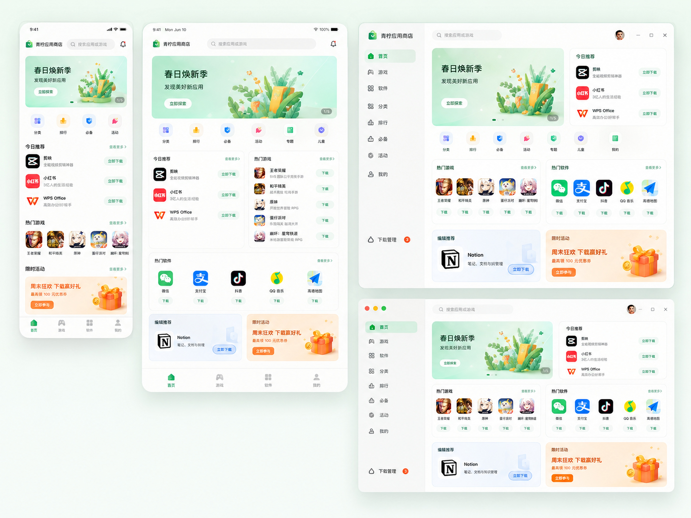
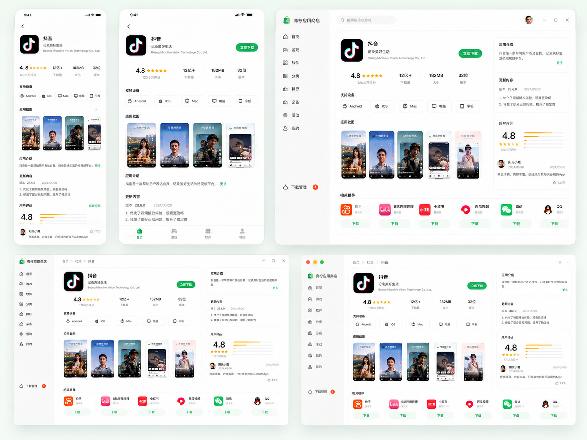
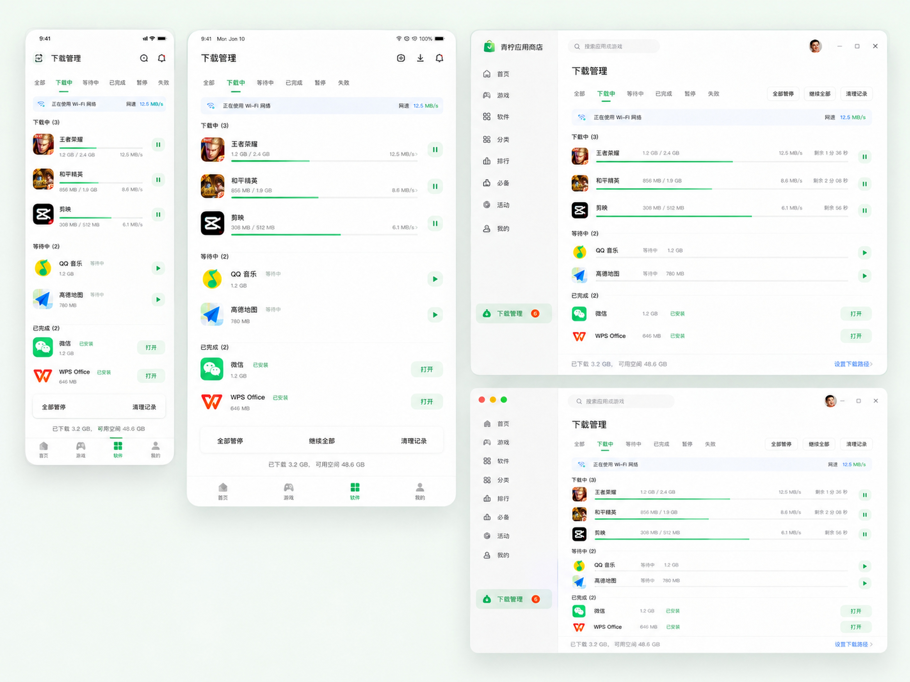
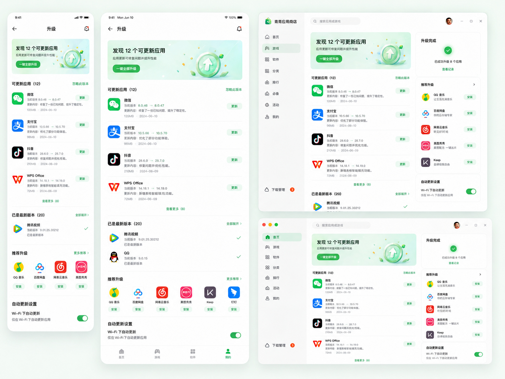

<p align="center">
  <h1 align="center">CarAppStore</h1>
  <p align="center">
    <b>车载应用商店 Android 工程</b><br/>
    面向车机场景的应用商店 UI、下载、安装、升级、策略和任务中心主链路工程
  </p>
</p>

<p align="center">
  
  
  
  
  
</p>

## 简介

CarAppStore 是一个多模块 Android/Kotlin 工程，用来沉淀车载应用商店的核心链路：应用目录、首页推荐、搜索、详情、我的应用、下载、安装、升级、状态归约、策略门控、应用管理和任务中心。

项目已经完成多端 UI 壳层和主要页面开发，不再只是静态 Demo。当前工程可生成 Debug/Release APK，页面可跑通目录、状态中心、策略门控、任务中心和下载/安装/升级主链路；真实联网目录、APK 下载源和生产环境验收仍是下一步接入重点。

## 当前同步基线

- 当前主分支：`main`
- 已同步远端：`origin/main`
- 当前工作区验证：2026-07-11 已在 JDK 17 下通过 `testDebugUnitTest`、`lintDebug`、`:app:assembleDebug` 与 `:app:assembleRelease`；当前包含未提交安全加固改动，提交基线请以 Git 历史为准。
- 换机接手总览：[docs/29-换机接手与当前进度总览.md](docs/29-换机接手与当前进度总览.md)

实际最新状态请以 `git status --short --branch` 和 `git log --oneline -5` 为准。

## 当前效果

| 多端 UI | 首页与应用卡片 |
| --- | --- |
|  |  |

| 下载管理 | 升级管理 |
| --- | --- |
|  |  |

完整设计参考见 [docs/设计](docs/设计)，多端布局说明见 [docs/27-多端UI框架设计.md](docs/27-多端UI框架设计.md)。

## 架构图

| 图 | 说明 |
| --- | --- |
| [项目模块架构图](docs/architecture-project-modules.svg) | `app / feature-* / business / data / core / common` 分层与依赖方向 |
| [七个业务模块关系图](docs/architecture-business-modules.svg) | 下载、安装、升级、应用管理、状态中心、策略中心、Repository 的关系 |
| [主链路流程图](docs/architecture-main-flow.svg) | 从页面事件到策略判断、状态更新、Repository 和 core 执行能力的闭环 |

PNG 版本位于同名 `.png` 文件，见 [架构图索引](docs/architecture-diagrams.md)。

## 核心设计

- **MVVM + 单向数据流**：`View -> Event -> ViewModel -> State -> View`
- **手动依赖装配**：使用 `AppContainer`，不引入 Hilt/Dagger
- **固定页面导航**：使用 `Activity + FragmentManager`，不引入 Navigation
- **业务边界清晰**：下载、安装、升级、应用管理、状态中心、策略中心、Repository 各自收口职责
- **车机安全优先**：策略门控、任务恢复、失败可见性和 OEM 接缝优先于运营功能
- **多端 UI 适配**：手机、平板、车机/桌面三套壳层，共享同一组页面和业务状态

## 模块一览

| 模块 | 职责 |
| --- | --- |
| `app` | Application、MainActivity、Fragment 导航、AppContainer 依赖装配和系统桥接 |
| `common` | 基类、共享 UI、导航接口、通用结果类型和共享资源 |
| `core` | 真实文件下载器、系统安装会话、JSON 存储、日志与打点基础能力 |
| `data` | Repository、远端目录、本地结构化存储、系统数据源和模型映射 |
| `business` | 七个业务域的流程编排、策略拦截、状态归约和页面聚合 |
| `feature-*` | 首页、详情、搜索、我的应用、下载中心、安装中心、升级中心、开发者设置 |

## 已具备能力

- HTTP 下载、Range 断点续传、分片下载、合并校验、暂停/取消和失败恢复
- `PackageInstaller.Session` 安装链路、用户确认页分发、安装会话持久化
- `VersionedJsonStore` 统一 JSON 存储，支持 schema 版本、迁移、并发写锁和原子写
- 远端目录 `HTTP -> 本地缓存 -> 资源目录` 回退链路，支持 ETag / Last-Modified 条件请求
- `DefaultStateCenter` 统一维护下载、安装、升级运行态，并推导页面主按钮和状态文案
- `DefaultPolicyCenter` 统一处理 Wi-Fi、存储、驻车/车况等策略门控
- 首页、搜索、详情、我的应用、下载中心、安装中心、升级中心和开发者设置页面
- 手机、平板、车机/桌面响应式壳层，车机/桌面侧边任务摘要栏
- 应用图标、详情头图和详情截图加载能力，支持 `asset://`、`file://`、`http(s)://`，失败时回退文本兜底
- 本地事件打点落盘、生产配置自检提示、Release 签名环境变量入口
- 目录运营治理字段：灰度、黑白名单、隐藏/下架和回滚版本本地过滤
- APK 安装前包名、`versionCode`、签名证书 SHA-256 校验，以及安装后 PackageManager 事实核对
- 目录 `appId` / `packageName` 白名单、重复项拒绝和下载任务 canonical path containment

## 外部接入状态

仓库内已经预留真实接入点，但发布到实际车机前仍需要替换外部资源：

| 接入项 | 当前状态 |
| --- | --- |
| 远端目录 API | 客户端链路、缓存回退、鉴权头和 Gradle/环境变量注入已完成；生产目录还必须提供 APK `versionCode` 和 `signerCertificateSha256` |
| APK 联网下载源 | 下载器、任务状态、断点续传、checksum 和安装前身份校验链路已具备；真实 APK CDN、签名摘要和灰度策略下一步接入 |
| OEM 车况信号 | 已定义 `VehicleStateSignalProvider` 接口，并支持广播型 OEM 接入；未接真实协议时按安全默认值处理 |
| 真机安装行为 | 已接 Android `PackageInstaller`，并在创建会话前检查“允许安装未知应用”权限；不同车机 ROM 的确认页、回调码和权限行为仍需实机验证 |
| 运营观测 | 本地事件落盘已接入；上传服务、告警看板和隐私合规字段需要接生产平台 |

## 环境要求

- Android Studio 或命令行 Android Gradle 环境
- JDK/JBR 17
- Android Gradle Plugin 8.13.2
- Kotlin 2.0.0
- compileSdk 34，minSdk 26

## 构建与测试

Windows PowerShell:

```powershell
$env:JAVA_HOME="<your-jdk-17-path>"
.\gradlew.bat testDebugUnitTest --no-daemon
.\gradlew.bat compileDebugKotlin --no-daemon
.\gradlew.bat :app:assembleDebug --no-daemon
.\gradlew.bat lintDebug --no-daemon
.\gradlew.bat :app:assembleRelease --no-daemon
```

macOS / Linux / Git Bash:

```bash
./gradlew testDebugUnitTest --no-daemon
./gradlew compileDebugKotlin --no-daemon
./gradlew :app:assembleDebug --no-daemon
./gradlew lintDebug --no-daemon
./gradlew :app:assembleRelease --no-daemon
```

## 项目结构

```text
CarAppStore/
├── app/                        # 壳层：AppContainer、MainActivity
├── common/                     # 基类、通用 UI、共享资源
├── core/                       # 下载器、安装器、存储等基础能力
├── data/                       # Repository、DataSource、本地存储和模型
├── business/                   # 下载/安装/升级/应用管理/状态/策略等业务层
├── feature-home/               # 首页
├── feature-detail/             # 详情页
├── feature-myapp/              # 我的应用
├── feature-search/             # 搜索页
├── feature-downloadmanager/    # 下载中心
├── feature-installcenter/      # 安装中心
├── feature-upgrade/            # 升级中心
├── feature-debug/              # 开发者设置
├── docs/                       # 架构、流程、联调和验收文档
├── AGENTS.md                   # Codex 说明
├── CLAUDE.md                   # 项目编码规范
├── build.gradle.kts            # 根构建文件
└── settings.gradle.kts         # 模块声明
```

## 推荐阅读

| 文档 | 说明 |
| --- | --- |
| [换机接手与当前进度总览](docs/29-换机接手与当前进度总览.md) | 换电脑、重新 clone、交给新 Agent 时先确认的同步基线 |
| [当前项目状态与接手指南](docs/21-当前项目状态与接手指南.md) | 当前阶段、测试覆盖、风险和接手顺序 |
| [架构总览](docs/01-架构总览.md) | 整体分层与依赖方向 |
| [七个业务模块详解](docs/03-七个业务模块详解.md) | 业务模块边界和职责 |
| [整体业务主链路总流程](docs/16-整体业务主链路总流程.md) | 下载、安装、升级主链路流程 |
| [远端目录与车况信号接入约定](docs/23-远端目录与车况信号接入约定.md) | 后端和 OEM 接入约定 |
| [真机回归测试清单](docs/25-真机回归测试清单.md) | 设备验证清单 |
| [后端与 OEM 验收标准](docs/26-后端与OEM验收标准.md) | 对接验收标准 |
| [多端 UI 框架设计](docs/27-多端UI框架设计.md) | 手机、平板、车机/桌面 UI 壳层与页面改造顺序 |
| [商用化剩余事项](docs/28-商用化剩余事项.md) | 已补齐能力、外部配置入口和下一步验收顺序 |

## 发布说明

本仓库已经具备车载应用商店的主体 UI、工程分层、下载/安装/升级主链路、本地事件源、APK 身份校验和 release 构建入口。下一步重点是接入携带 `versionCode` 与签名摘要的真实目录和 APK 下载源，并在目标车机上完成 OEM 车况、包可见性、安装权限、生产签名、埋点上传和真机回归。
