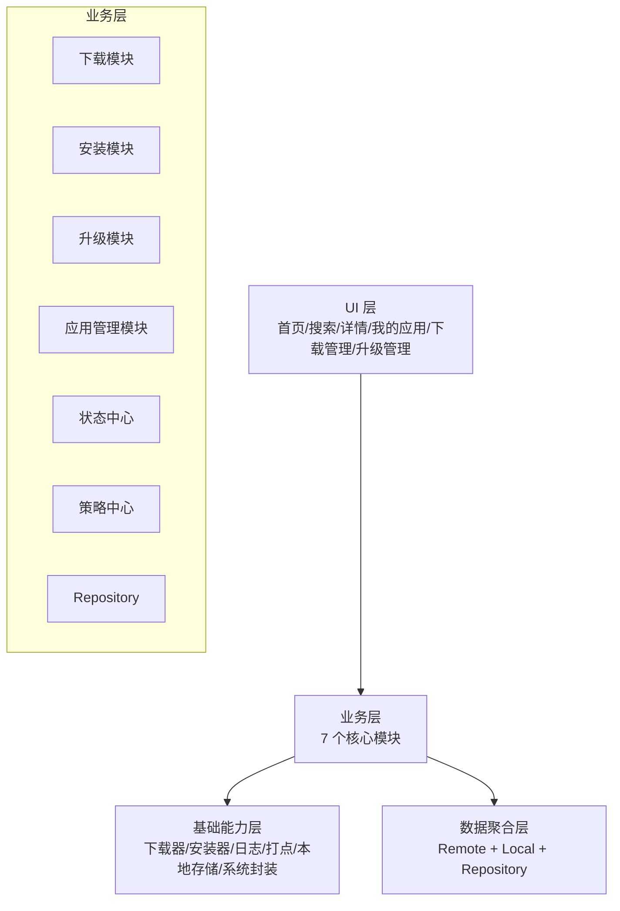
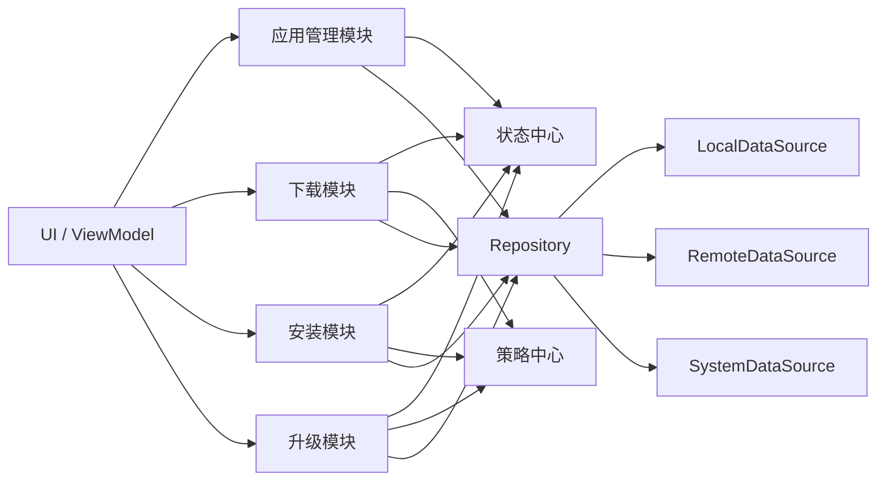

# 01. 架构总览

## 1. 项目目标

本项目是一个 **车载应用商店 Android 项目**，采用 **MVVM + 三层模块化架构**，目标是在车机场景下提供：

- 应用发现与浏览
- 应用下载与安装
- 应用升级与版本管理
- 任务中心化管理
- 车机场景策略控制

## 2. 总体架构图

## 3. 三层职责说明

### UI 层
只负责：
- 页面展示
- 用户交互
- 状态订阅
- UiState 组织

不负责：
- 网络请求实现
- 下载执行细节
- 安装执行细节
- 复杂业务编排

### 业务层
核心职责：
- 管理下载、安装、升级等核心业务流程
- 聚合应用视图模型
- 统一状态和策略
- 对 UI 暴露稳定的业务接口

### 基础能力层
负责承接底层能力：
- 文件下载抽象
- 安装器抽象
- 本地持久化
- 日志 / 打点
- 系统能力封装

## 4. 七个模块关系图

## 5. 当前技术约束

- 架构：**MVVM**
- 依赖注入：**AppContainer 手动注入**
- 页面切换：**FragmentManager**
- 明确不使用：
  - **Hilt**
  - **Navigation**

## 6. 当前工程演进位置

当前工程已经完成：
- A：车机风格 UI
- A2：统一按钮和状态标签体系
- C1 ~ C13：任务中心、下载/安装/升级链路、失败码、自动续传、任务统计、统一任务中心基座等

当前可以继续演进的方向：
- 更真实的网络下载器
- 更真实的系统安装器
- 进一步统一任务中心基座
