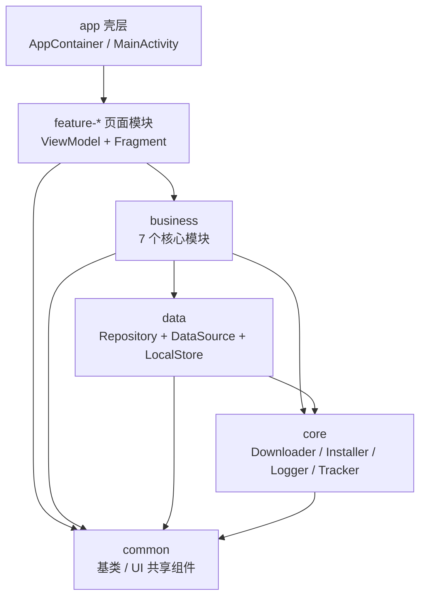
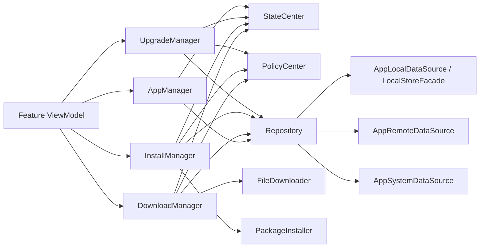

# 01. 架构总览

## 1. 项目定位

本项目是一个车载应用商店 Android 工程，当前目标不是只演示页面，而是把下载、安装、升级、状态、策略、应用管理这条主链路持续做成可运行、可恢复、可治理的工程。

当前已经具备：

- 首页、详情页、我的应用、下载中心、安装中心、升级中心、开发设置页
- `AppContainer` 手动装配
- 真实下载器接入与模拟兜底
- 系统安装会话接入、系统确认拉起与模拟兜底
- 统一本地结构化存储入口
- 下载、安装、升级三条任务链路的基础恢复能力

## 2. 当前总体架构

## 3. 分层职责

### app 壳层

负责：

- Application 与主 Activity 入口
- `AppContainer` 装配依赖
- 跨页面共享服务暴露
- 系统安装确认 Intent 的统一拉起

不负责：

- 下载、安装、升级业务决策
- 页面数据拼装

### feature 页面层

负责：

- Fragment / ViewModel / ViewBinding
- 用户交互事件分发
- 订阅 `AppManager`、`DownloadManager`、`InstallManager`、`UpgradeManager`
- 渲染任务中心和页面态

不负责：

- 直接访问数据源
- 直接操作下载器或安装器

### business 业务层

固定由 7 个核心模块组成：

- 下载模块
- 安装模块
- 升级模块
- 应用管理模块
- 状态中心
- 策略中心
- Repository

它负责流程编排、状态推进、策略拦截、页面聚合。

### data 与 core 基础能力层

`data` 负责 remote / local / system 聚合、结构化落盘、实体与映射。  
`core` 负责真正的文件下载、系统安装会话、日志、打点等底层能力。

## 4. 七个模块关系

## 5. 当前关键约束

- 架构模式固定为 MVVM
- 页面导航使用 `Activity + FragmentManager`
- 依赖注入使用 `AppContainer` 手动装配
- 不使用 Hilt
- 不使用 Navigation
- 当前工程分层固定为 `app / feature-* / business / data / core / common`

## 6. 当前阶段判断

当前工程已经不是“原型骨架阶段”，而是：

**主链路可运行 + 多模块已收敛 + 真实能力已接入一部分**

更具体地说：

- 下载链路已经具备真实 HTTP、Range、分片、校验、恢复元数据
- 安装链路已经具备系统 `PackageInstaller.Session` 接入和系统确认闭环
- 升级链路已经能编排下载与安装，但仍偏业务编排层
- 本地存储已经有统一 facade，但还不是最终数据库方案

## 7. 当前主要边界

- 下载暂停/取消还不是下载协程级硬中断
- 下载任务并发控制还可以继续加强
- 安装链路还缺更强的 OEM 差异适配与系统侧联调验证
- Repository 仍是 fake/real 混合形态，远端和部分系统能力还没完全替换为真实实现
- 自动化测试覆盖了核心存储与部分链路，但还没覆盖全部主流程
