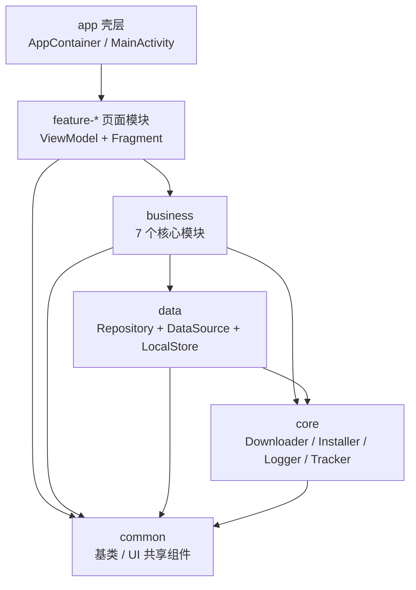
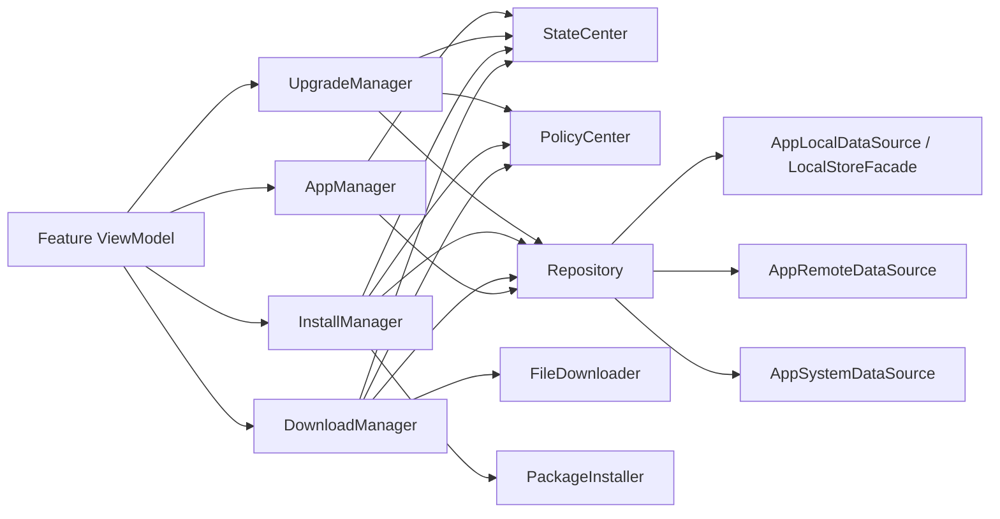

# 01. 架构总览

## 1. 项目定位

CarAppStore 是跨平台应用分发与管理 App；当前仓库是它的 Android/Kotlin 客户端实现。目标不是只演示页面，而是把下载、安装、升级、状态、策略、应用管理这条跨终端主链路持续做成可运行、可恢复、可治理的工程。平台定位和适配边界见 `docs/00-产品定位与平台边界.md`。

当前已经具备：

- 首页、详情页、我的应用、下载中心、安装中心、升级中心、开发设置页
- `AppContainer` 手动装配
- 真实下载器接入与模拟兜底
- 系统安装会话接入、系统确认拉起与模拟兜底
- 统一本地结构化存储入口
- 下载、安装、升级三条任务链路的基础恢复能力

## 2. 当前总体架构

```mermaid
flowchart TD
    APP[app 壳层\nAppContainer / MainActivity] --> FEATURE[feature-* 页面模块\nViewModel + Fragment]
    FEATURE --> BUSINESS[business\n7 个核心模块]
    BUSINESS --> DATA[data\nRepository + DataSource + LocalStore]
    BUSINESS --> CORE[core\nDownloader / Installer / Logger / Tracker]
    DATA --> CORE
    FEATURE --> COMMON[common\n基类 / UI 共享组件]
    BUSINESS --> COMMON
    DATA --> COMMON
    CORE --> COMMON
```

## 3. 分层职责

### app 壳层

负责：

- Application 与主 Activity 入口
- `AppContainer` 装配依赖
- 跨页面共享服务暴露
- 系统安装确认 Intent 的统一拉起

不负责：

- 下载、安装、升级业务决策
- 页面数据拼装

### feature 页面层

负责：

- Fragment / ViewModel / ViewBinding
- 用户交互事件分发
- 订阅 `AppManager`、`DownloadManager`、`InstallManager`、`UpgradeManager`
- 渲染任务中心和页面态

不负责：

- 直接访问数据源
- 直接操作下载器或安装器

### business 业务层

固定由 7 个核心模块组成：

- 下载模块
- 安装模块
- 升级模块
- 应用管理模块
- 状态中心
- 策略中心
- Repository

它负责流程编排、状态推进、策略拦截、页面聚合。

### data 与 core 基础能力层

`data` 负责 remote / local / system 聚合、目录结构校验、结构化落盘、实体与映射。

`core` 负责真正的文件下载、下载路径边界、APK 身份校验、系统安装会话、日志、打点等底层能力。

## 4. 七个模块关系

```mermaid
flowchart LR
    UI[Feature ViewModel] --> AM[AppManager]
    UI --> DM[DownloadManager]
    UI --> IM[InstallManager]
    UI --> UM[UpgradeManager]

    DM --> SC[StateCenter]
    IM --> SC
    UM --> SC
    AM --> SC

    DM --> PC[PolicyCenter]
    IM --> PC
    UM --> PC
    AM --> REPO[Repository]
    DM --> REPO
    IM --> REPO
    UM --> REPO

    DM --> FD[FileDownloader]
    IM --> PI[PackageInstaller]

    REPO --> LOCAL[AppLocalDataSource / LocalStoreFacade]
    REPO --> REMOTE[AppRemoteDataSource]
    REPO --> SYSTEM[AppSystemDataSource]
```

## 5. 当前关键约束

- 架构模式固定为 MVVM
- 页面导航使用 `Activity + FragmentManager`
- 依赖注入使用 `AppContainer` 手动装配
- 不使用 Hilt
- 不使用 Navigation
- 当前工程分层固定为 `app / feature-* / business / data / core / common`
- 目录入口必须校验 `appId`、`packageName`、版本和签名摘要，任一条目非法时整份目录回退
- 下载任务目录必须同时通过任务 ID 白名单和 canonical path containment
- APK 必须先通过包名、版本和签名校验才能创建 `PackageInstaller.Session`，成功回调后还要以 PackageManager 事实核对

## 6. 当前阶段判断

当前工程已经不是“原型骨架阶段”，而是：

**主链路可运行 + 多模块已收敛 + 本地可闭环能力已完成 + 外部接入待实机验收**

更具体地说：

- 下载链路已经具备真实 HTTP、Range、分片、校验、恢复元数据
- 下载存储已经对任务标识和 canonical path 做双层越界防护
- 安装链路已经具备 APK 包名/版本/签名预检、系统 `PackageInstaller.Session` 接入、系统确认和安装后事实核对
- 升级链路已经能编排下载与安装，并支持批量检测、串行升级、策略门控和失败重试
- 本地存储已经有统一 facade、版本化 JSON 存储、迁移、并发保护和原子写
- 远端目录已经具备 HTTP、条件请求缓存、本地缓存和资源回退链路

## 7. 当前主要边界

- 下载暂停/取消还不是下载协程级硬中断
- 下载任务并发控制还可以继续加强
- 安装链路还缺 Android 版本/ROM 设备矩阵验证，以及其他目标平台的安装器适配；OEM 差异只属于可选车载专项
- Repository 生产入口为 `RealAppRepository`，`FakeAppRepository` 仅保留在测试中使用
- 远端目录默认值仍是示例/回退数据，需要替换为携带 `versionCode` 和 `signerCertificateSha256` 的真实后端 API
- 自动化测试覆盖核心存储、下载、安装、升级、策略、Repository 与页面 ViewModel；真实 API、Android 设备矩阵仍需外部验收，可选车载发行还需单独验收 OEM/车载 ROM 行为
