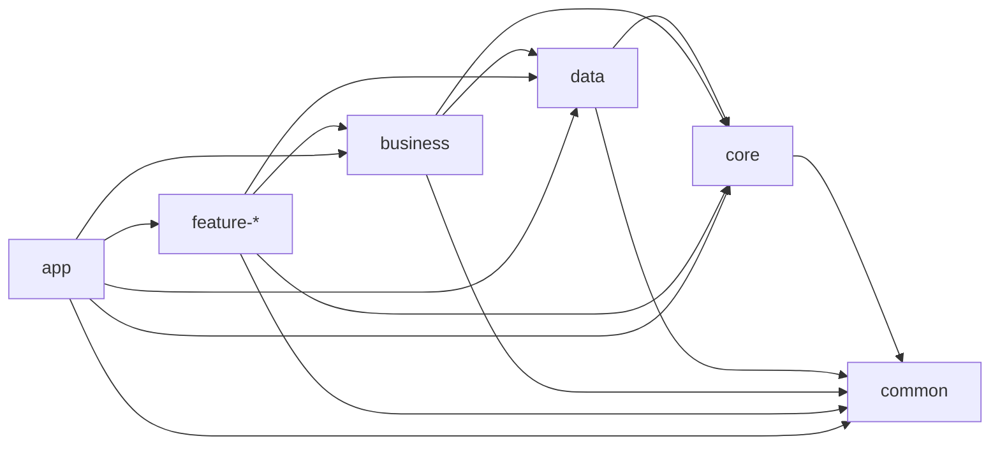

# 02. 项目目录结构与模块说明

## 1. 当前工程目录

```text
CarAppStore_work/
├── app/
├── business/
├── common/
├── core/
├── data/
├── feature-debug/
├── feature-detail/
├── feature-downloadmanager/
├── feature-home/
├── feature-installcenter/
├── feature-myapp/
├── feature-search/
├── feature-upgrade/
├── docs/
├── gradle/
├── gradlew
└── README.md
```

## 2. 各 module 职责

### `:app`

壳层模块，负责：

- `MainActivity`
- `AppContainer`
- `AppContainerProvider`
- 顶层导航和 shared services 暴露

### `:common`

公共基础设施，负责：

- base 类
- 通用 UI 组件
- 共享资源
- `AppServices` 等跨模块公共协议

### `:core`

底层执行能力，负责：

- `RealFileDownloader` / `SimulatedFileDownloader`
- `RealPackageInstaller` / `SimulatedPackageInstaller`
- `DownloadStore`
- `InstallSessionStore`
- `InstallUserActionDispatcher`
- 日志与打点

### `:data`

数据层，负责：

- `AppRemoteDataSource`
- `AppLocalDataSource`
- `AppSystemDataSource`
- `FakeAppRepository`
- `LocalStoreFacade` 与结构化实体
- 下载环境配置与本地偏好

### `:business`

业务编排层，固定承载 7 个核心模块：

- `appmanager`
- `download`
- `install`
- `upgrade`
- `state`
- `policy`
- repository 业务使用边界

### `:feature-*`

页面级模块，当前包括：

- `feature-home`
- `feature-detail`
- `feature-myapp`
- `feature-search`
- `feature-downloadmanager`
- `feature-installcenter`
- `feature-upgrade`
- `feature-debug`

## 3. 当前依赖方向



## 4. 页面与模块对应关系

| 页面 | 主要依赖模块 | 主要职责 |
|---|---|---|
| 首页 | `AppManager`、`StateCenter`、`PolicyCenter` | 应用卡片聚合、状态展示、策略提示 |
| 详情页 | `AppManager`、`DownloadManager`、`InstallManager`、`UpgradeManager` | 单应用下载/安装/升级主入口 |
| 我的应用 | `AppManager`、`StateCenter` | 已安装应用与运行态聚合 |
| 下载中心 | `AppManager`、`DownloadManager` | 下载任务管理、偏好与批量处理 |
| 安装中心 | `AppManager`、`InstallManager`、`InstallSessionStore` | 安装任务与安装会话观察 |
| 升级中心 | `AppManager`、`UpgradeManager` | 升级任务列表与执行 |
| 开发设置页 | 下载环境 provider | 环境切换与链路调试 |

## 5. 当前源码组织判断

当前工程已经从“单 app 大包结构”演进为“基础模块 + feature 模块”结构，旧文档里那套 `app/src/main/java/com/example/.../domain/usecase` 目录说明已经不再适用。

现在更准确的理解是：

- 页面代码主要在 `feature-*`
- 业务编排主要在 `business`
- 真实能力主要在 `core`
- 数据聚合与结构化存储主要在 `data`
- `app` 只做壳层装配和入口

## 6. 继续开发时的落点建议

- 新页面优先落到对应 `feature-*`
- 新业务流程优先加在 `business`
- 新的存储、数据映射、远端/本地数据接入优先落在 `data`
- 新的下载、安装、系统桥接能力优先落在 `core`
- 不要再把核心业务逻辑回填进 `app`
