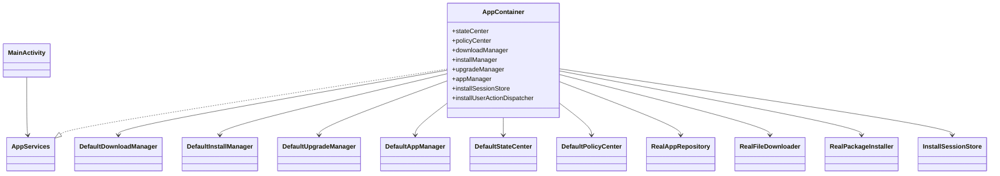
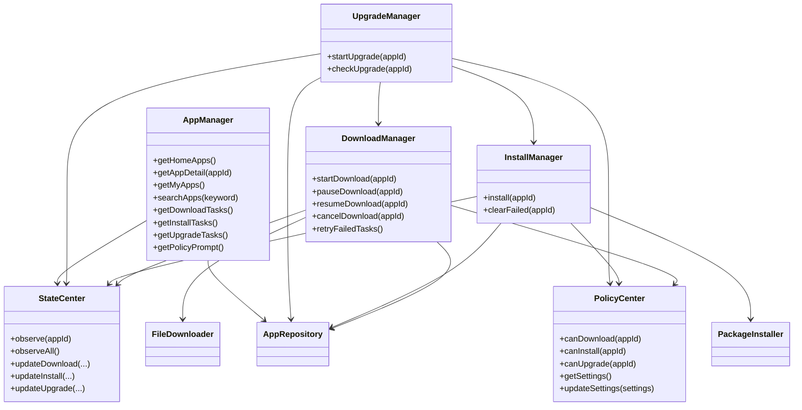
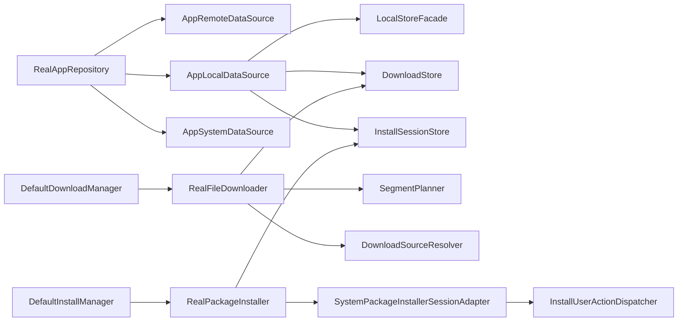
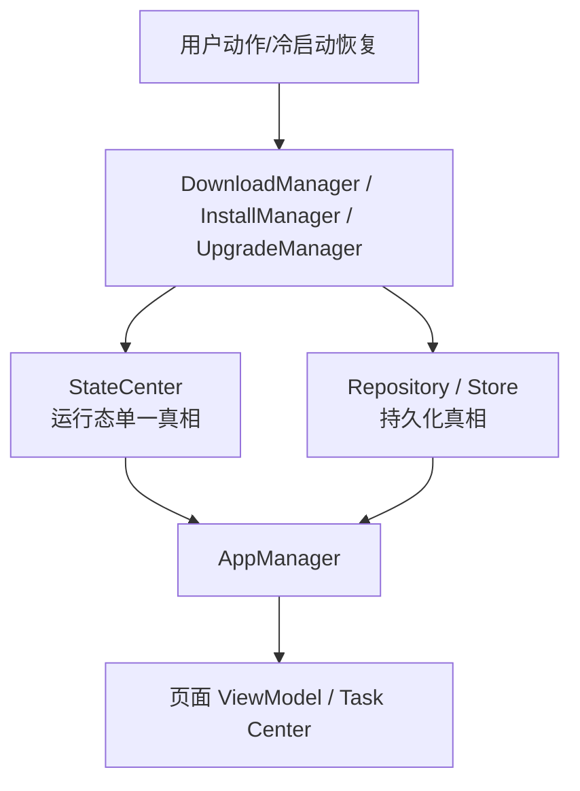

# 04. 类图与关系图

## 1. 壳层与核心对象关系

## 2. 七个业务模块关系

## 3. 数据与执行层关系

## 4. 运行态与持久态关系

当前需要特别区分：

- `StateCenter` 保存的是运行态快照
- `Repository`、`DownloadStore`、`InstallSessionStore`、`LocalStoreFacade` 保存的是可恢复的持久态
- 页面看到的数据多数由 `AppManager` 二次聚合后输出
