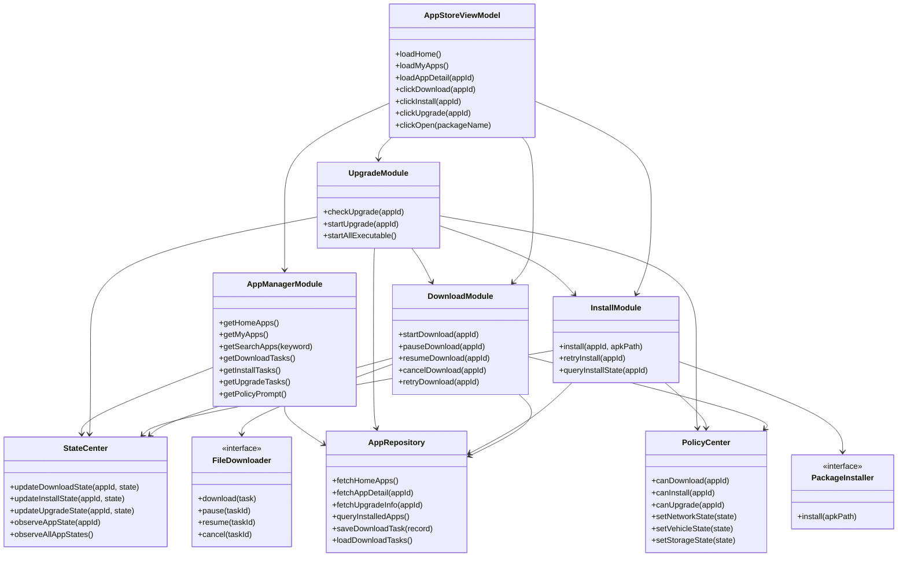
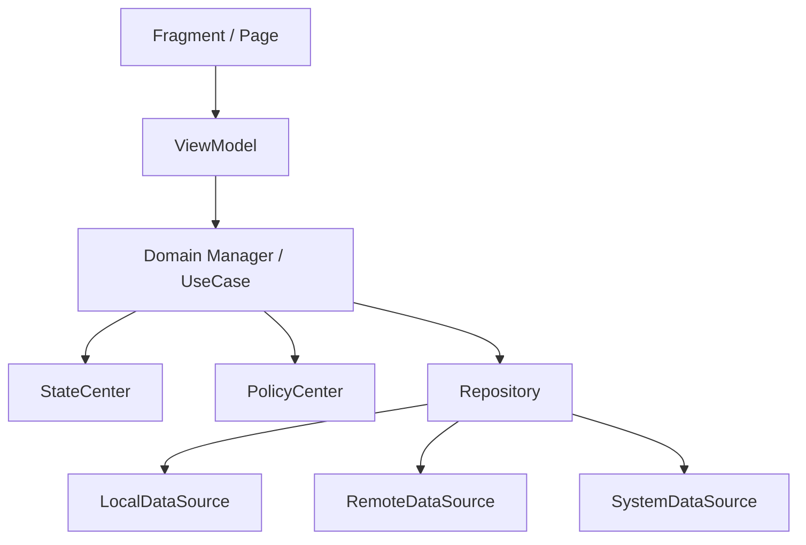
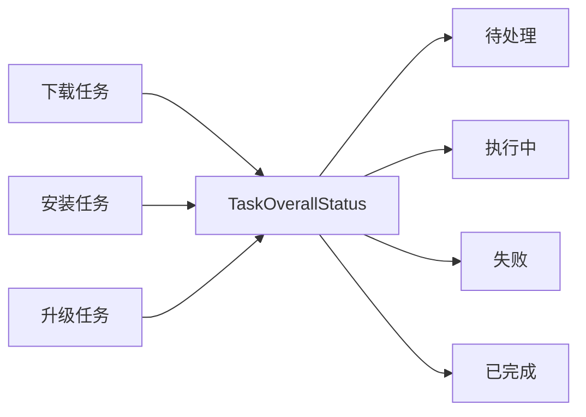

# 04. 类图与关系图

## 1. 7 个模块类图

```mermaid
classDiagram

class AppStoreViewModel {
  +loadHome()
  +loadMyApps()
  +loadAppDetail(appId)
  +clickDownload(appId)
  +clickInstall(appId)
  +clickUpgrade(appId)
  +clickOpen(packageName)
}

class DownloadModule {
  +startDownload(appId)
  +pauseDownload(appId)
  +resumeDownload(appId)
  +cancelDownload(appId)
  +retryDownload(appId)
}

class InstallModule {
  +install(appId, apkPath)
  +retryInstall(appId)
  +queryInstallState(appId)
}

class UpgradeModule {
  +checkUpgrade(appId)
  +startUpgrade(appId)
  +startAllExecutable()
}

class AppManagerModule {
  +getHomeApps()
  +getMyApps()
  +getSearchApps(keyword)
  +getDownloadTasks()
  +getInstallTasks()
  +getUpgradeTasks()
  +getPolicyPrompt()
}

class StateCenter {
  +updateDownloadState(appId, state)
  +updateInstallState(appId, state)
  +updateUpgradeState(appId, state)
  +observeAppState(appId)
  +observeAllAppStates()
}

class PolicyCenter {
  +canDownload(appId)
  +canInstall(appId)
  +canUpgrade(appId)
  +setNetworkState(state)
  +setVehicleState(state)
  +setStorageState(state)
}

class AppRepository {
  +fetchHomeApps()
  +fetchAppDetail(appId)
  +fetchUpgradeInfo(appId)
  +queryInstalledApps()
  +saveDownloadTask(record)
  +loadDownloadTasks()
}

class FileDownloader {
  <<interface>>
  +download(task)
  +pause(taskId)
  +resume(taskId)
  +cancel(taskId)
}

class PackageInstaller {
  <<interface>>
  +install(apkPath)
}

AppStoreViewModel --> AppManagerModule
AppStoreViewModel --> DownloadModule
AppStoreViewModel --> InstallModule
AppStoreViewModel --> UpgradeModule

DownloadModule --> StateCenter
DownloadModule --> PolicyCenter
DownloadModule --> AppRepository
DownloadModule --> FileDownloader

InstallModule --> StateCenter
InstallModule --> PolicyCenter
InstallModule --> AppRepository
InstallModule --> PackageInstaller

UpgradeModule --> DownloadModule
UpgradeModule --> InstallModule
UpgradeModule --> StateCenter
UpgradeModule --> PolicyCenter
UpgradeModule --> AppRepository

AppManagerModule --> StateCenter
AppManagerModule --> AppRepository
```

## 2. MVVM 调用关系图

```mermaid
flowchart TD
    Fragment[Fragment / Page] --> VM[ViewModel]
    VM --> UseCase[Domain Manager / UseCase]
    UseCase --> StateCenter
    UseCase --> PolicyCenter
    UseCase --> Repository
    Repository --> Local[LocalDataSource]
    Repository --> Remote[RemoteDataSource]
    Repository --> System[SystemDataSource]
```

## 3. 任务中心统一抽象图

```mermaid
flowchart LR
    DownloadTask[下载任务] --> TaskOverallStatus
    InstallTask[安装任务] --> TaskOverallStatus
    UpgradeTask[升级任务] --> TaskOverallStatus

    TaskOverallStatus --> PENDING[待处理]
    TaskOverallStatus --> ACTIVE[执行中]
    TaskOverallStatus --> FAILED[失败]
    TaskOverallStatus --> COMPLETED[已完成]
```
