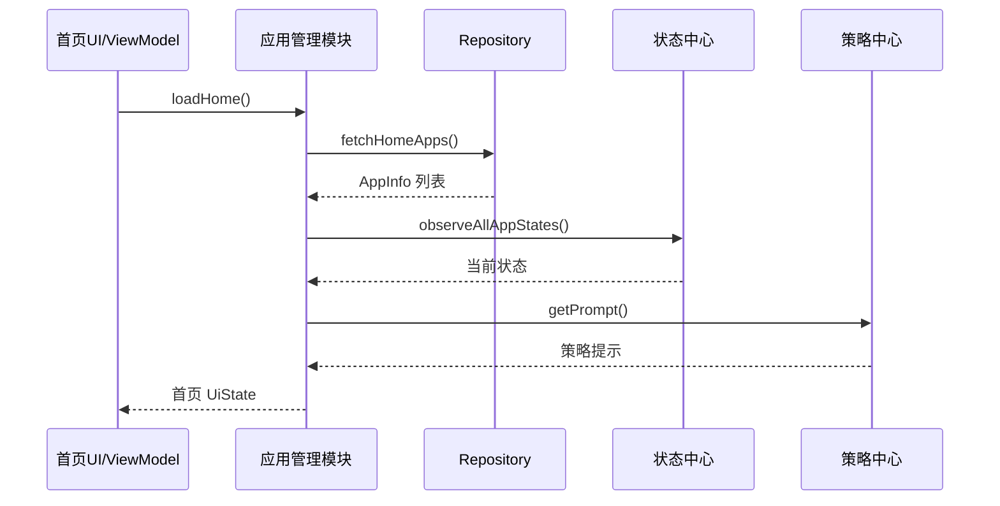
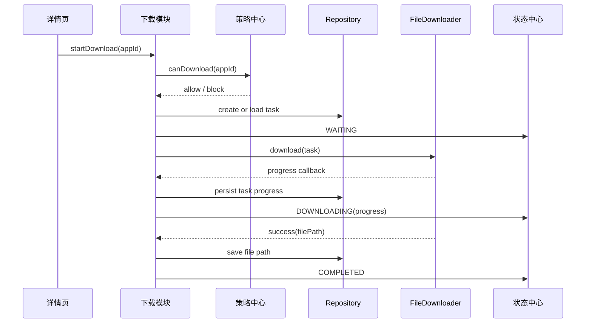
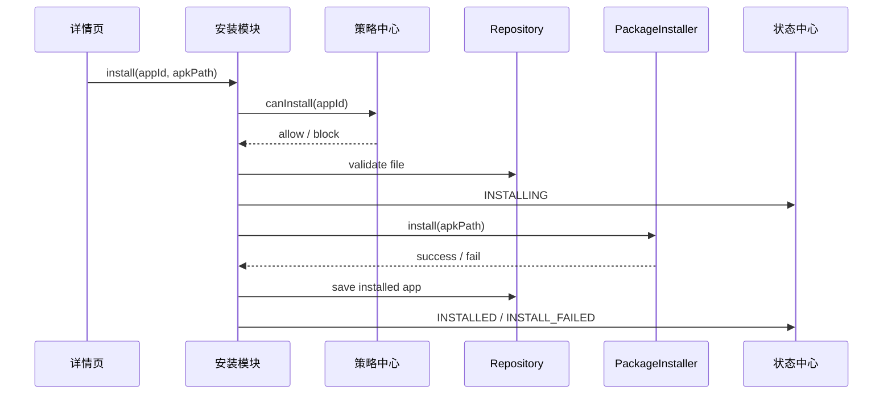
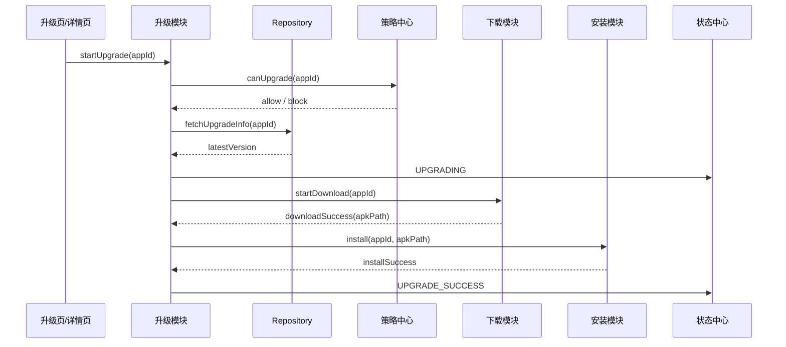
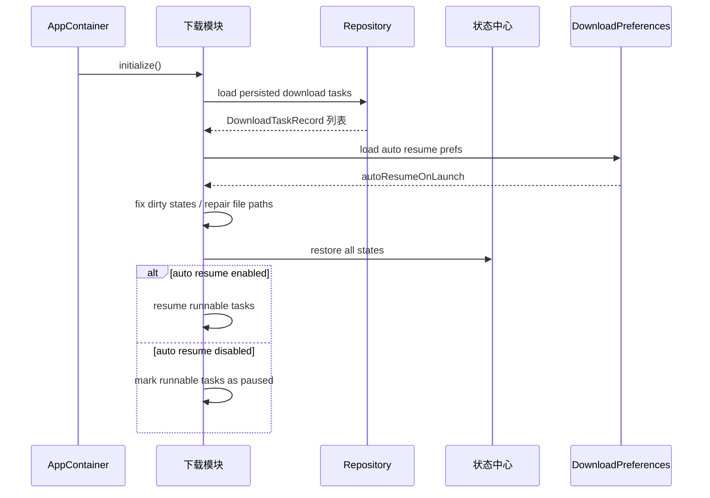
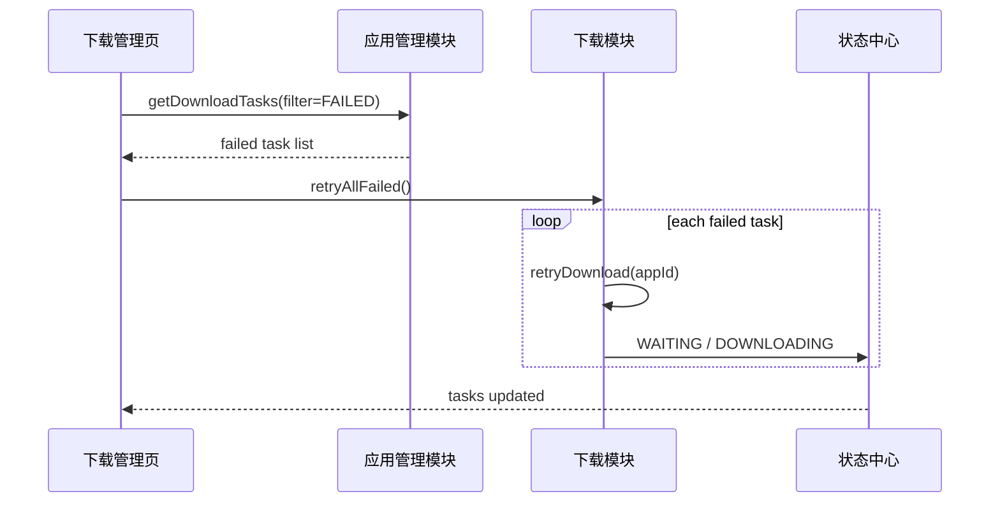

# 05. 核心时序图

## 1. 首页加载时序图

```mermaid
sequenceDiagram
participant UI as 首页UI/ViewModel
participant AM as 应用管理模块
participant Repo as Repository
participant State as 状态中心
participant Policy as 策略中心

UI->>AM: loadHome()
AM->>Repo: fetchHomeApps()
Repo-->>AM: AppInfo 列表
AM->>State: observeAllAppStates()
State-->>AM: 当前状态
AM->>Policy: getPrompt()
Policy-->>AM: 策略提示
AM-->>UI: 首页 UiState
```

## 2. 详情页点击下载时序图

```mermaid
sequenceDiagram
participant UI as 详情页
participant DM as 下载模块
participant Policy as 策略中心
participant Repo as Repository
participant Downloader as FileDownloader
participant State as 状态中心

UI->>DM: startDownload(appId)
DM->>Policy: canDownload(appId)
Policy-->>DM: allow / block
DM->>Repo: create or load task
DM->>State: WAITING
DM->>Downloader: download(task)
Downloader-->>DM: progress callback
DM->>Repo: persist task progress
DM->>State: DOWNLOADING(progress)
Downloader-->>DM: success(filePath)
DM->>Repo: save file path
DM->>State: COMPLETED
```

## 3. 下载完成后安装时序图

```mermaid
sequenceDiagram
participant UI as 详情页
participant IM as 安装模块
participant Policy as 策略中心
participant Repo as Repository
participant Installer as PackageInstaller
participant State as 状态中心

UI->>IM: install(appId, apkPath)
IM->>Policy: canInstall(appId)
Policy-->>IM: allow / block
IM->>Repo: validate file
IM->>State: INSTALLING
IM->>Installer: install(apkPath)
Installer-->>IM: success / fail
IM->>Repo: save installed app
IM->>State: INSTALLED / INSTALL_FAILED
```

## 4. 点击升级时序图

```mermaid
sequenceDiagram
participant UI as 升级页/详情页
participant UM as 升级模块
participant Repo as Repository
participant Policy as 策略中心
participant DM as 下载模块
participant IM as 安装模块
participant State as 状态中心

UI->>UM: startUpgrade(appId)
UM->>Policy: canUpgrade(appId)
Policy-->>UM: allow / block
UM->>Repo: fetchUpgradeInfo(appId)
Repo-->>UM: latestVersion
UM->>State: UPGRADING
UM->>DM: startDownload(appId)
DM-->>UM: downloadSuccess(apkPath)
UM->>IM: install(appId, apkPath)
IM-->>UM: installSuccess
UM->>State: UPGRADE_SUCCESS
```

## 5. 冷启动恢复任务时序图

```mermaid
sequenceDiagram
participant App as AppContainer
participant DM as 下载模块
participant Repo as Repository
participant State as 状态中心
participant Pref as DownloadPreferences

App->>DM: initialize()
DM->>Repo: load persisted download tasks
Repo-->>DM: DownloadTaskRecord 列表
DM->>Pref: load auto resume prefs
Pref-->>DM: autoResumeOnLaunch
DM->>DM: fix dirty states / repair file paths
DM->>State: restore all states
alt auto resume enabled
  DM->>DM: resume runnable tasks
else auto resume disabled
  DM->>DM: mark runnable tasks as paused
end
```

## 6. 下载管理页批量重试时序图

```mermaid
sequenceDiagram
participant UI as 下载管理页
participant AM as 应用管理模块
participant DM as 下载模块
participant State as 状态中心

UI->>AM: getDownloadTasks(filter=FAILED)
AM-->>UI: failed task list
UI->>DM: retryAllFailed()
loop each failed task
  DM->>DM: retryDownload(appId)
  DM->>State: WAITING / DOWNLOADING
end
State-->>UI: tasks updated
```
