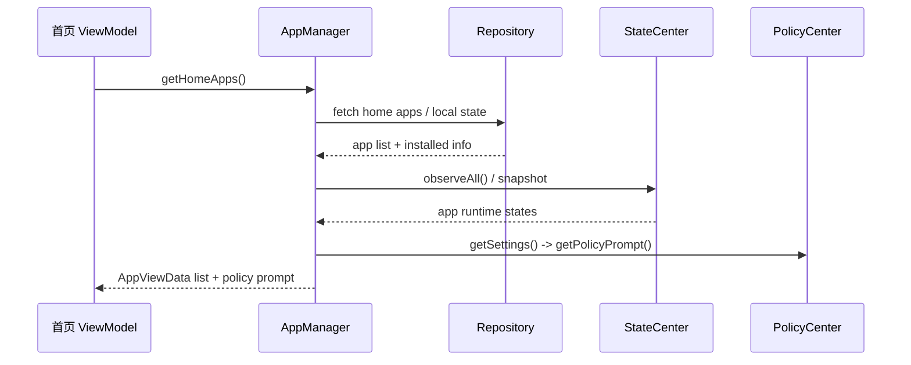
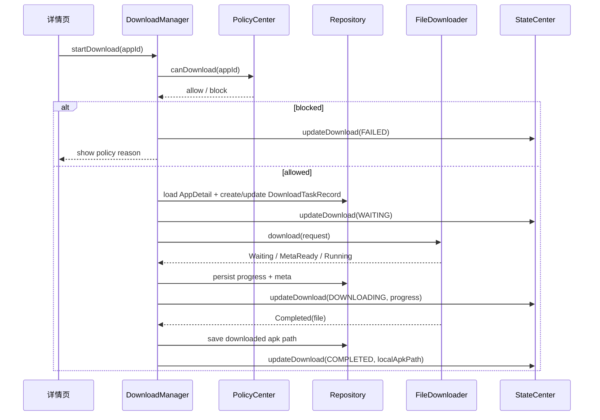
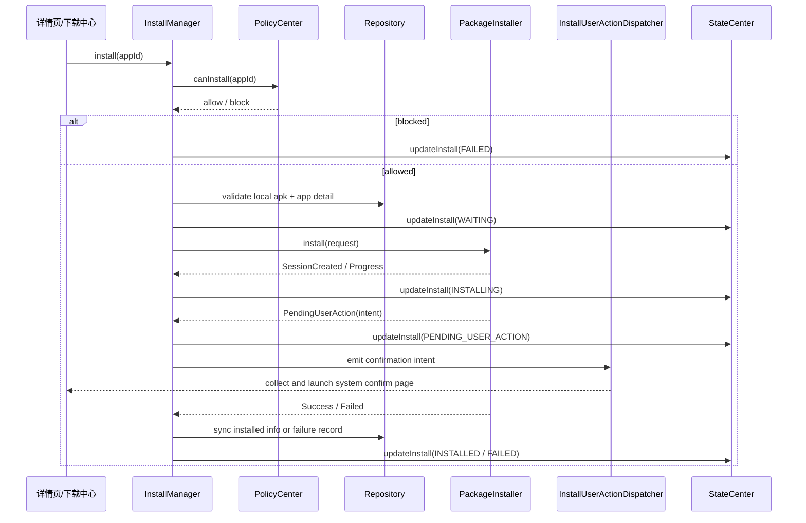
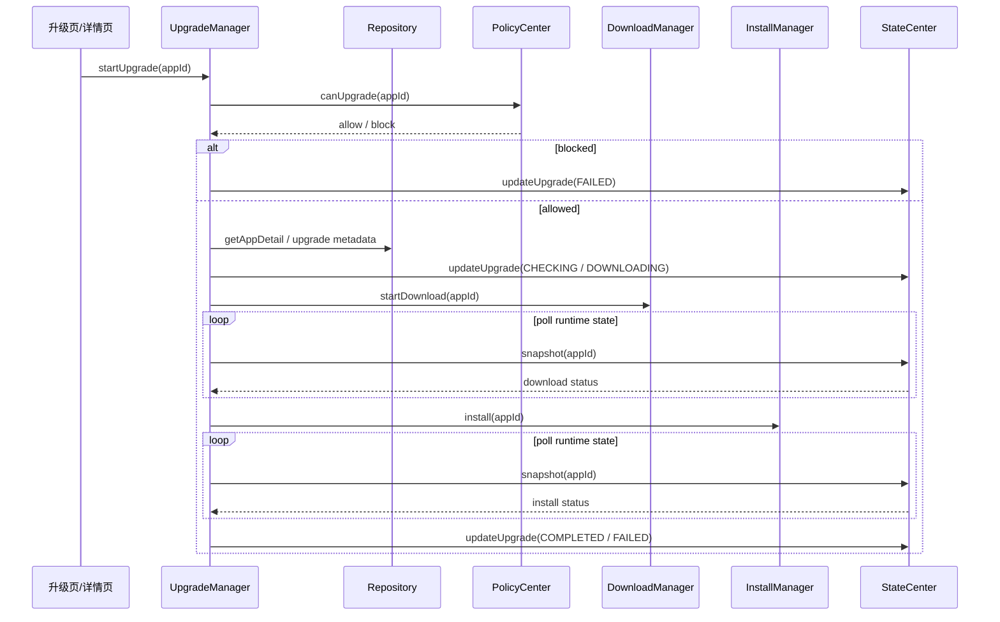
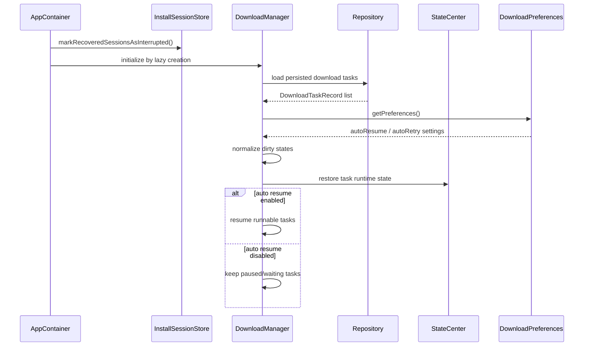
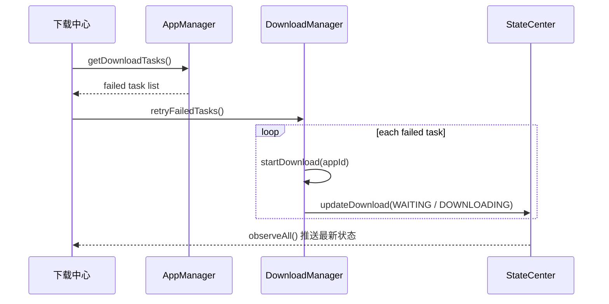

# 05. 核心时序图

## 1. 首页加载

```mermaid
sequenceDiagram
participant UI as 首页 ViewModel
participant AM as AppManager
participant Repo as Repository
participant State as StateCenter
participant Policy as PolicyCenter

UI->>AM: getHomeApps()
AM->>Repo: fetch home apps / local state
Repo-->>AM: app list + installed info
AM->>State: observeAll() / snapshot
State-->>AM: app runtime states
AM->>Policy: getSettings() -> getPolicyPrompt()
AM-->>UI: AppViewData list + policy prompt
```

## 2. 详情页点击下载

```mermaid
sequenceDiagram
participant UI as 详情页
participant DM as DownloadManager
participant Policy as PolicyCenter
participant Repo as Repository
participant Downloader as FileDownloader
participant State as StateCenter

UI->>DM: startDownload(appId)
DM->>Policy: canDownload(appId)
Policy-->>DM: allow / block
alt blocked
  DM->>State: updateDownload(FAILED)
  DM-->>UI: show policy reason
else allowed
  DM->>Repo: load AppDetail + create/update DownloadTaskRecord
  DM->>State: updateDownload(WAITING)
  DM->>Downloader: download(request)
  Downloader-->>DM: Waiting / MetaReady / Running
  DM->>Repo: persist progress + meta
  DM->>State: updateDownload(DOWNLOADING, progress)
  Downloader-->>DM: Completed(file)
  DM->>Repo: save downloaded apk path
  DM->>State: updateDownload(COMPLETED, localApkPath)
end
```

## 3. 下载完成后安装

```mermaid
sequenceDiagram
participant UI as 详情页/下载中心
participant IM as InstallManager
participant Policy as PolicyCenter
participant Repo as Repository
participant Installer as PackageInstaller
participant Dispatcher as InstallUserActionDispatcher
participant State as StateCenter

UI->>IM: install(appId)
IM->>Policy: canInstall(appId)
Policy-->>IM: allow / block
alt blocked
  IM->>State: updateInstall(FAILED)
else allowed
  IM->>Repo: validate local apk + app detail
  IM->>State: updateInstall(WAITING)
  IM->>Installer: install(request)
  Installer-->>IM: SessionCreated / Progress
  IM->>State: updateInstall(INSTALLING)
  Installer-->>IM: PendingUserAction(intent)
  IM->>State: updateInstall(PENDING_USER_ACTION)
  IM->>Dispatcher: emit confirmation intent
  Dispatcher-->>UI: collect and launch system confirm page
  Installer-->>IM: Success / Failed
  IM->>Repo: sync installed info or failure record
  IM->>State: updateInstall(INSTALLED / FAILED)
end
```

## 4. 点击升级

```mermaid
sequenceDiagram
participant UI as 升级页/详情页
participant UM as UpgradeManager
participant Repo as Repository
participant Policy as PolicyCenter
participant DM as DownloadManager
participant IM as InstallManager
participant State as StateCenter

UI->>UM: startUpgrade(appId)
UM->>Policy: canUpgrade(appId)
Policy-->>UM: allow / block
alt blocked
  UM->>State: updateUpgrade(FAILED)
else allowed
  UM->>Repo: getAppDetail / upgrade metadata
  UM->>State: updateUpgrade(CHECKING / DOWNLOADING)
  UM->>DM: startDownload(appId)
  loop poll runtime state
    UM->>State: snapshot(appId)
    State-->>UM: download status
  end
  UM->>IM: install(appId)
  loop poll runtime state
    UM->>State: snapshot(appId)
    State-->>UM: install status
  end
  UM->>State: updateUpgrade(COMPLETED / FAILED)
end
```

## 5. 冷启动恢复

```mermaid
sequenceDiagram
participant App as AppContainer
participant InstallStore as InstallSessionStore
participant DM as DownloadManager
participant Repo as Repository
participant State as StateCenter
participant Pref as DownloadPreferences

App->>InstallStore: markRecoveredSessionsAsInterrupted()
App->>DM: initialize by lazy creation
DM->>Repo: load persisted download tasks
Repo-->>DM: DownloadTaskRecord list
DM->>Pref: getPreferences()
Pref-->>DM: autoResume / autoRetry settings
DM->>DM: normalize dirty states
DM->>State: restore task runtime state
alt auto resume enabled
  DM->>DM: resume runnable tasks
else auto resume disabled
  DM->>DM: keep paused/waiting tasks
end
```

## 6. 下载中心批量重试

```mermaid
sequenceDiagram
participant UI as 下载中心
participant AM as AppManager
participant DM as DownloadManager
participant State as StateCenter

UI->>AM: getDownloadTasks()
AM-->>UI: failed task list
UI->>DM: retryFailedTasks()
loop each failed task
  DM->>DM: startDownload(appId)
  DM->>State: updateDownload(WAITING / DOWNLOADING)
end
State-->>UI: observeAll() 推送最新状态
```
