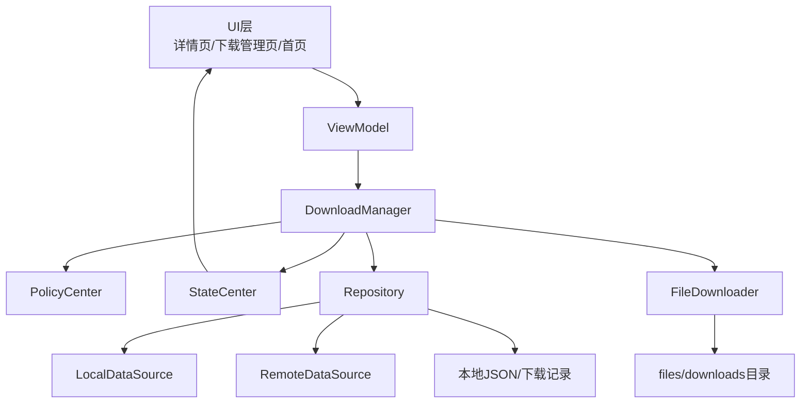
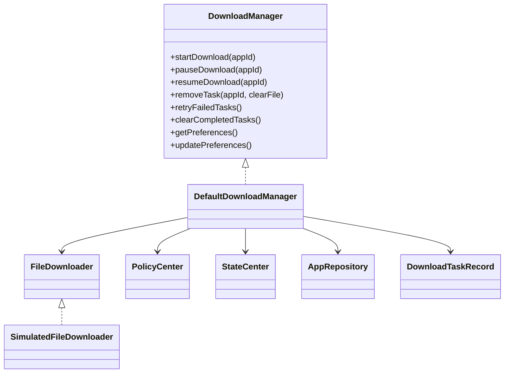
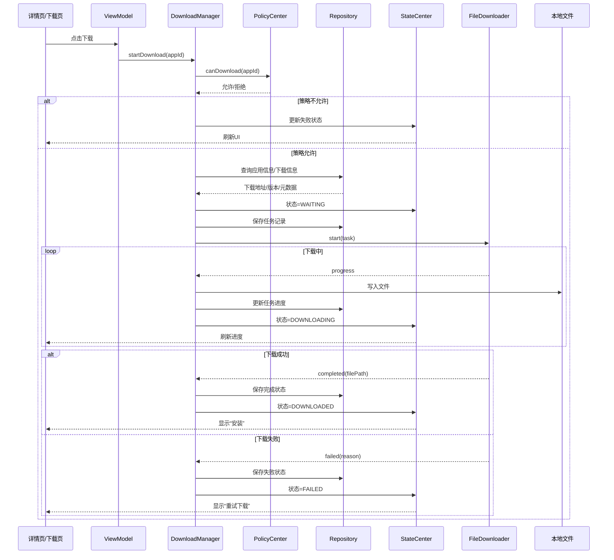
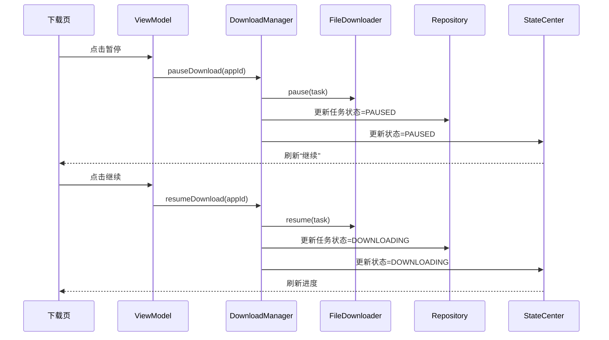
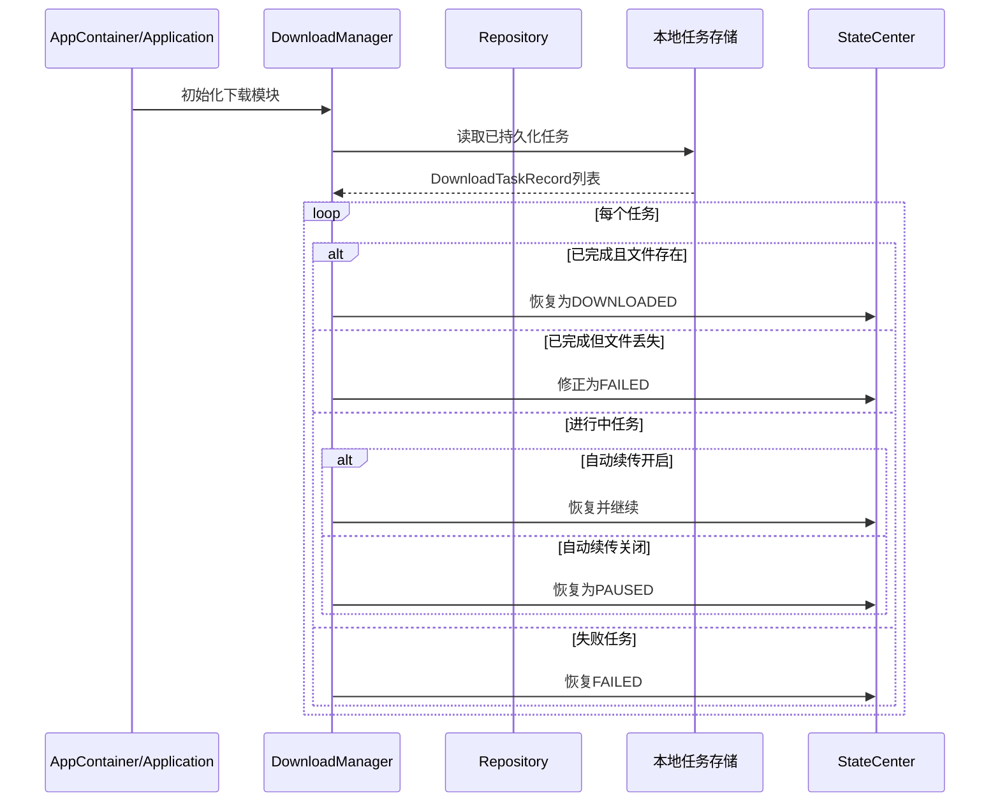
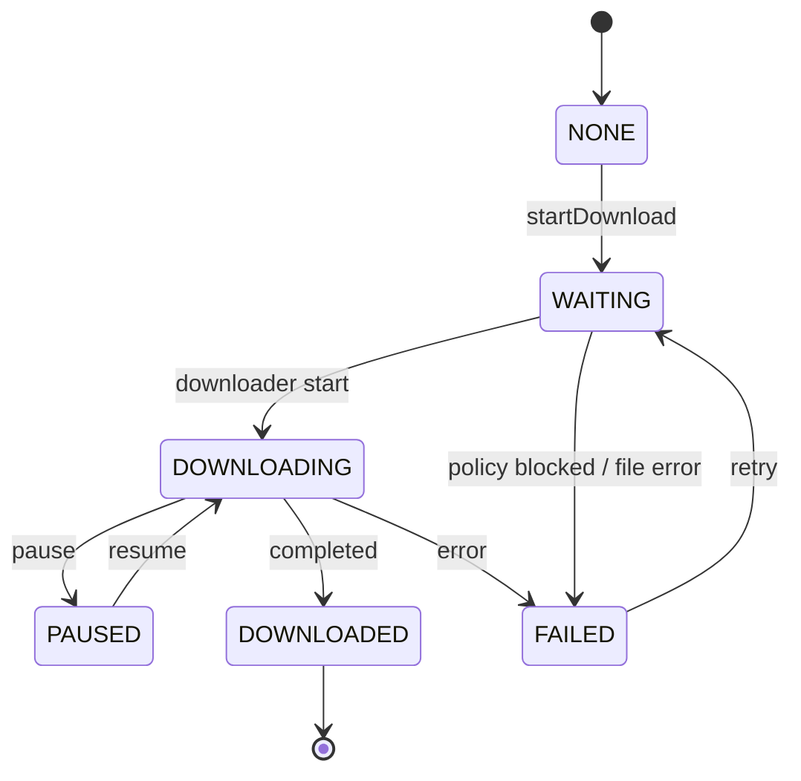

# 下载模块架构与流程

## 1. 当前结论
当前项目中的下载模块已经具备：

- 下载任务对象化
- 暂停 / 恢复
- 自动重试
- 自动续传
- 本地文件落盘
- 任务持久化
- 冷启动恢复
- 失败码与错误信息
- 与状态中心联动
- 与安装模块联动

当前**还没有真正实现**：

- HTTP Range 断点续传
- 多线程 / 多分段下载
- 分片合并
- ETag / Last-Modified 校验
- 真正网络层断点恢复

也就是说，现在的“续传”更准确地说是：

**任务级恢复 / 流程级恢复**

不是严格意义上的：

**网络层断点续传 / 分段下载**

---

## 2. 下载模块架构图

---

## 3. 下载模块核心关系图

---

## 4. 下载主流程图

---

## 5. 暂停 / 恢复流程图

---

## 6. 冷启动恢复流程图

---

## 7. 下载状态流转图

---

## 8. 下载模块职责说明

### 8.1 下载管理器（DownloadManager）
负责：

- 创建下载任务
- 查询并恢复任务
- 暂停 / 恢复 / 删除
- 自动重试
- 自动续传
- 更新状态中心
- 调用下载器执行下载

### 8.2 下载器（FileDownloader）
当前通过抽象层驱动下载执行。

当前实现：
- `SimulatedFileDownloader`

后续可替换为：
- 真实网络下载器
- 支持 Range 的断点下载器
- 支持分段下载的下载器

### 8.3 Repository
负责：

- 提供应用下载信息
- 保存任务记录
- 保存文件路径
- 保存下载偏好
- 恢复历史任务

### 8.4 PolicyCenter
负责：

- Wi-Fi 限制
- 存储不足拦截
- 车机场景限制
- 下载前置判断

### 8.5 StateCenter
负责：

- 输出页面可订阅的下载状态
- 同步按钮态
- 同步错误信息和进度

---

## 9. 当前下载模块的限制

当前版本仍属于“工程化下载骨架”，不是完整商用下载器。

### 当前已具备
- 任务中心化
- 状态流转
- 本地落盘
- 失败恢复
- 冷启动恢复

### 当前未具备
- 真正分段下载
- 断点续传的网络层实现
- CDN / 镜像源切换
- 文件校验链（ETag / 分段 hash / 合并校验）
- 后台前台下载服务拆分
- 系统下载服务集成

---

## 10. 后续演进建议

如果要把下载模块进一步做成真实能力，建议下一步补：

1. `RealFileDownloader`
2. HTTP Range 断点续传
3. 分段任务模型
4. 分片文件管理与合并
5. 下载校验链
6. 下载服务与任务调度进一步解耦
