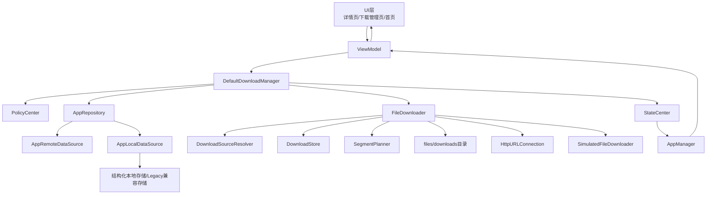
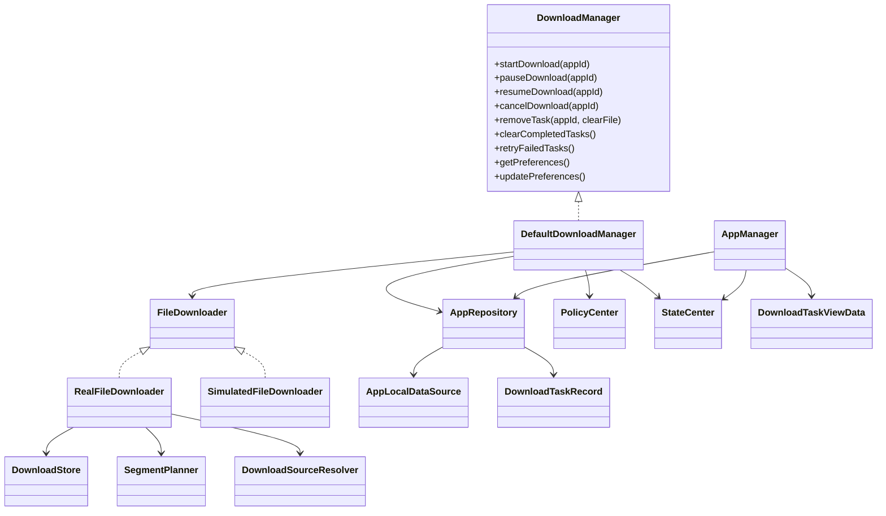
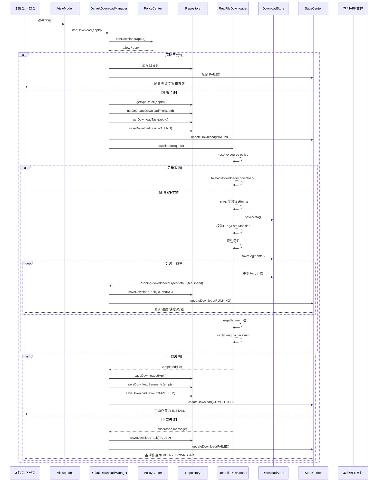
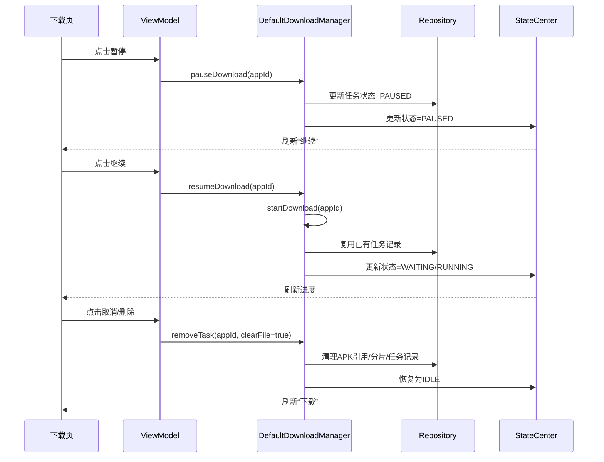
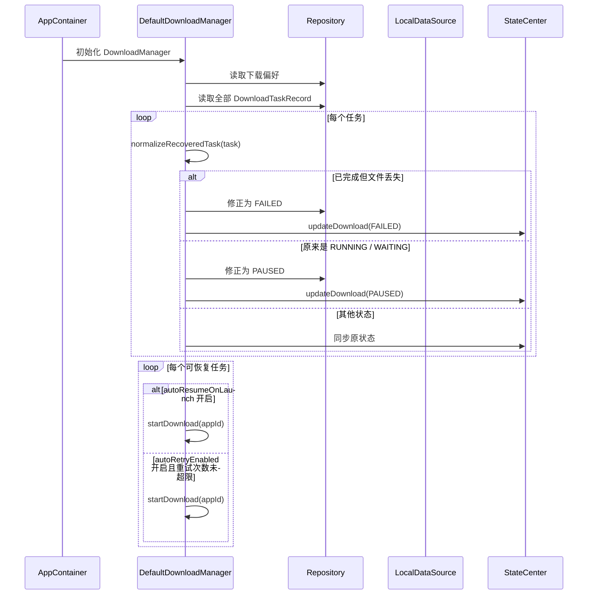
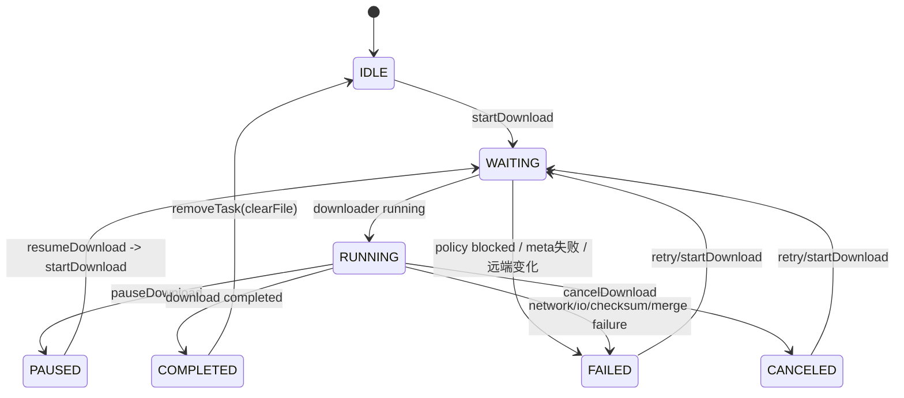

# 下载模块架构与流程

## 1. 当前结论
当前项目中的下载模块已经不是“纯模拟下载骨架”，而是一个具备分层编排、任务持久化和真实文件下载能力的模块。

当前已经具备：

- 下载任务对象化
- 下载任务持久化
- APK 文件落盘
- 冷启动恢复
- 自动恢复 / 自动重试
- 失败码与错误信息归一化
- 与状态中心联动
- 与安装模块联动
- 真实 HTTP 下载能力
- HEAD 探测远端元数据
- Range 续传能力
- 分片规划与分片落盘
- 分片合并
- ETag / Last-Modified 变更检测
- 文件长度校验
- Checksum 校验
- 下载源策略切换
- 模拟下载兜底

当前仍然存在的边界：

- `pauseDownload()` / `cancelDownload()` 目前主要修改任务状态和本地记录，没有真正管理底层活跃下载协程的取消
- 下载任务缺少按 `appId` 的运行中 Job 管理，重复触发下载存在并发启动风险
- 分片规划能力已经存在，但策略还比较简单，未做到复杂调度
- 没有接入前后台下载服务、通知、系统下载服务
- 没有做 CDN / 镜像源动态切换与更复杂的下载治理

也就是说，当前下载模块的准确定位是：

**业务编排完整、文件下载真实、任务恢复可用，但还不是成熟商用下载引擎。**

---

## 2. 下载模块架构图

这个架构里有两个关键点：

1. `DefaultDownloadManager` 负责业务编排，不负责网络读写。
2. `RealFileDownloader` 负责文件下载，不负责页面状态和业务策略。

---

## 3. 下载模块核心关系图

核心职责分工可以概括为：

- `DownloadManager`：业务入口
- `Repository`：数据入口与持久化入口
- `FileDownloader`：底层下载执行器
- `StateCenter`：运行态状态中心
- `AppManager`：面向页面的任务视图聚合器

---

## 4. 下载主流程图

---

## 5. 暂停 / 恢复 / 取消流程图

这里要特别注意：

- `pauseDownload()` 当前是**状态级暂停**
- `resumeDownload()` 当前本质上是**重新发起 startDownload()**
- `cancelDownload()` / `removeTask()` 会清理记录，但当前没有看到下载协程级的硬中断管理

所以这套暂停恢复能力更准确地说是：

**任务级暂停恢复 + 持久化恢复**

而不是严格意义上的：

**下载线程级取消控制器**

---

## 6. 冷启动恢复流程图

对应实现见：

- [DefaultDownloadManager.restorePersistedTasks()](/home/didi/AI/CarAppStore_work/business/src/main/java/com/nio/appstore/domain/download/DefaultDownloadManager.kt#L297)
- [DefaultDownloadManager.normalizeRecoveredTask()](/home/didi/AI/CarAppStore_work/business/src/main/java/com/nio/appstore/domain/download/DefaultDownloadManager.kt#L388)

---

## 7. 下载状态流转图

同时，状态中心还会把这些底层状态继续归约成页面动作：

- `RUNNING` -> `PAUSE`
- `PAUSED` -> `RESUME`
- `COMPLETED` -> `INSTALL`
- `FAILED/CANCELED` -> `RETRY_DOWNLOAD`
- 其他 -> `DOWNLOAD`

参考 [StateReducer.kt](/home/didi/AI/CarAppStore_work/business/src/main/java/com/nio/appstore/domain/state/StateReducer.kt#L26)。

---

## 8. 下载模块职责说明

### 8.1 `DownloadManager` / `DefaultDownloadManager`
负责：

- 下载流程编排
- 下载前策略检查
- 创建和更新 `DownloadTaskRecord`
- 调用 `FileDownloader`
- 将下载事件同步到 `Repository`
- 将运行态同步到 `StateCenter`
- 冷启动恢复
- 自动续传 / 自动重试
- 与安装流程衔接

关键实现：

- [DownloadManager.kt](/home/didi/AI/CarAppStore_work/business/src/main/java/com/nio/appstore/domain/download/DownloadManager.kt#L5)
- [DefaultDownloadManager.kt](/home/didi/AI/CarAppStore_work/business/src/main/java/com/nio/appstore/domain/download/DefaultDownloadManager.kt#L24)

### 8.2 `FileDownloader`
负责：

- 底层下载协议抽象
- 对上抛出统一 `DownloadEvent`

关键实现：

- [FileDownloader.kt](/home/didi/AI/CarAppStore_work/core/src/main/java/com/nio/appstore/core/downloader/FileDownloader.kt#L5)

### 8.3 `RealFileDownloader`
负责：

- 解析下载源策略
- 探测远端元数据
- ETag / Last-Modified 变化检测
- 分片规划
- 分片并行下载
- 分片级重试
- 分片元数据落盘
- 分片合并
- 文件长度校验
- Checksum 校验
- 对上抛统一下载事件

关键实现：

- [RealFileDownloader.kt](/home/didi/AI/CarAppStore_work/core/src/main/java/com/nio/appstore/core/downloader/RealFileDownloader.kt#L17)

### 8.4 `DownloadStore`
负责：

- 保存每个任务的下载元数据
- 保存分片进度
- 为真实下载器提供断点恢复依据
- 对旧格式 `meta.json` 做版本迁移兼容

关键实现：

- [DownloadStore.kt](/home/didi/AI/CarAppStore_work/core/src/main/java/com/nio/appstore/core/downloader/DownloadStore.kt#L8)

### 8.5 `SegmentPlanner`
负责：

- 根据文件大小规划分片数
- 生成每个分片的字节区间和临时文件路径
- 在已有分片存在时直接复用历史规划

关键实现：

- [SegmentPlanner.kt](/home/didi/AI/CarAppStore_work/core/src/main/java/com/nio/appstore/core/downloader/SegmentPlanner.kt#L5)

### 8.6 `DownloadSourceResolver`
负责：

- 根据 `AppDetail.sourcePolicy` 和当前环境配置决定走哪种下载源
- 在真实 HTTP 和模拟下载之间做选择

关键实现：

- [DownloadSourceResolver.kt](/home/didi/AI/CarAppStore_work/core/src/main/java/com/nio/appstore/core/downloader/DownloadSourceResolver.kt#L12)
- [DownloadSourcePolicy.kt](/home/didi/AI/CarAppStore_work/core/src/main/java/com/nio/appstore/core/downloader/DownloadSourcePolicy.kt#L3)

### 8.7 `Repository` / `AppLocalDataSource`
负责：

- 提供应用详情中的下载信息
- 提供/保存下载任务记录
- 提供/保存 APK 本地路径
- 提供/保存下载分片记录
- 提供/保存下载偏好
- 为冷启动恢复提供持久化真相

关键实现：

- [FakeAppRepository.kt](/home/didi/AI/CarAppStore_work/data/src/main/java/com/nio/appstore/data/repository/FakeAppRepository.kt#L14)
- [AppLocalDataSource.kt](/home/didi/AI/CarAppStore_work/data/src/main/java/com/nio/appstore/data/datasource/local/AppLocalDataSource.kt#L23)

### 8.8 `PolicyCenter`
负责：

- Wi‑Fi 限制
- 低存储模式限制
- 设备可用空间检查
- 输出下载是否允许及原因

关键实现：

- [DefaultPolicyCenter.kt](/home/didi/AI/CarAppStore_work/business/src/main/java/com/nio/appstore/domain/policy/DefaultPolicyCenter.kt#L8)

### 8.9 `StateCenter`
负责：

- 保存每个 app 的运行态下载状态
- 统一输出页面使用的状态文本和主动作
- 作为 ViewModel 的观察源

关键实现：

- [DefaultStateCenter.kt](/home/didi/AI/CarAppStore_work/business/src/main/java/com/nio/appstore/domain/state/DefaultStateCenter.kt#L7)
- [StateReducer.kt](/home/didi/AI/CarAppStore_work/business/src/main/java/com/nio/appstore/domain/state/StateReducer.kt#L5)

### 8.10 `AppManager`
负责：

- 把底层 `DownloadTaskRecord + AppState + AppInfo` 聚合成页面任务项
- 生成下载中心真正渲染的 `DownloadTaskViewData`
- 统一计算任务统计信息、排序和状态分组

关键实现：

- [DefaultAppManager.kt](/home/didi/AI/CarAppStore_work/business/src/main/java/com/nio/appstore/domain/appmanager/DefaultAppManager.kt#L119)

---

## 9. 当前下载模块的限制

当前版本已经具备真实下载能力，但仍有明显边界。

### 9.1 已具备

- 真实 HTTP 下载
- HEAD 探测远端 meta
- Range 续传请求
- 分片下载
- 分片重试
- 分片合并
- 下载任务持久化
- 分片持久化
- 冷启动恢复
- 自动恢复 / 自动重试
- 状态中心联动
- 安装链路衔接
- 模拟下载兜底

### 9.2 当前不足

- 缺少任务级下载协程取消器
- 暂停 / 取消不是真正意义上的网络中断控制
- 没有下载服务化
- 没有通知栏/后台前台服务
- 没有复杂的源调度、CDN、镜像切换
- 分片调度策略还偏简单
- 没有更完整的下载自动化测试覆盖

### 9.3 一个容易误解的点

现在的下载模块已经支持：

- Range 请求
- 分片文件
- 分片合并
- 远端变更检测

所以它已经不是“只有任务级恢复”的阶段。

但它还没有做到：

- 下载任务运行时的强控制
- 完整后台下载体系
- 商用级调度和治理能力

因此准确说法应该是：

**它已经是“真实下载实现”，但还不是“成熟下载平台”。**

---

## 10. 后续演进建议

如果要把下载模块继续做深，建议优先补这几项：

1. 为每个下载任务引入运行中 Job 管理，真正实现暂停/取消
2. 把下载执行从当前直接协程调用升级为更稳定的任务调度器或服务层
3. 增强分片调度策略，支持更合理的并发、分片数和失败恢复策略
4. 增加下载链路测试，覆盖策略拒绝、远端文件变化、Range 失败、分片恢复、校验失败等场景
5. 引入更完整的下载源治理，支持 CDN / 镜像 / 环境切换与动态降级
6. 细化下载状态与安装状态联动，避免下载删除、安装中、已安装之间的边界混乱

---

## 11. 一句话总结

下载模块当前的真实形态可以总结为：

**`DefaultDownloadManager` 做业务编排，`RealFileDownloader` 做真实文件下载，`AppLocalDataSource + DownloadStore` 做持久化，`StateCenter + AppManager` 做页面态输出，`PolicyCenter` 做下载前拦截。**
