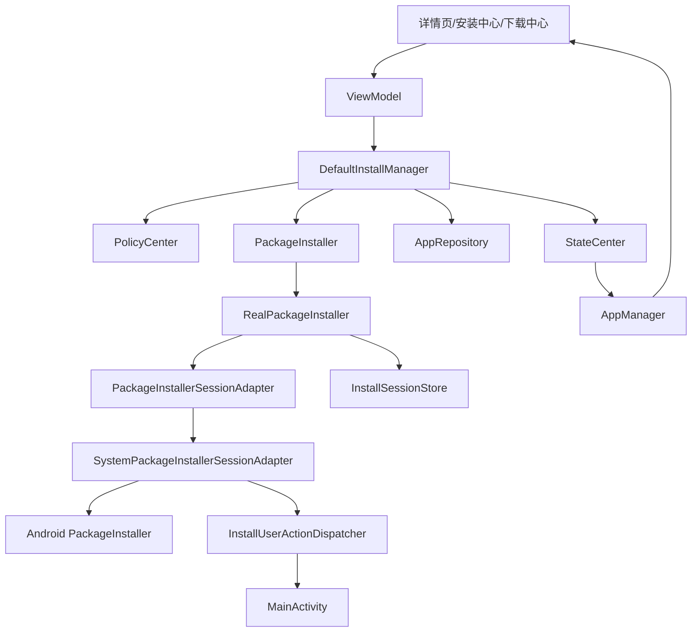
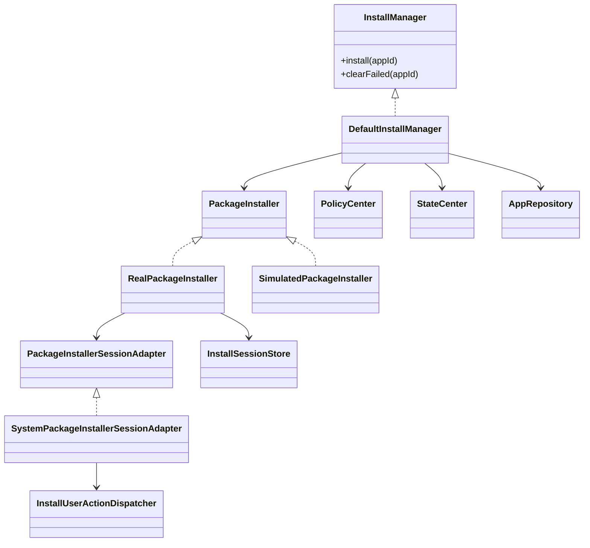
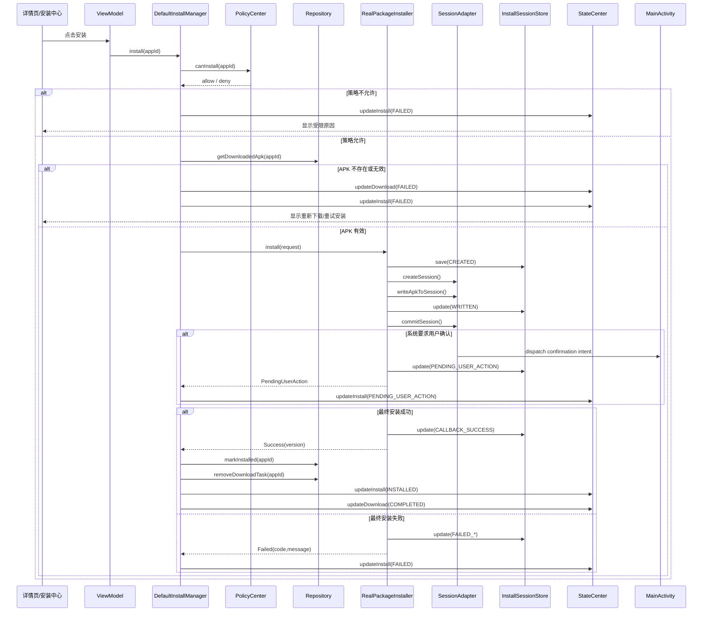
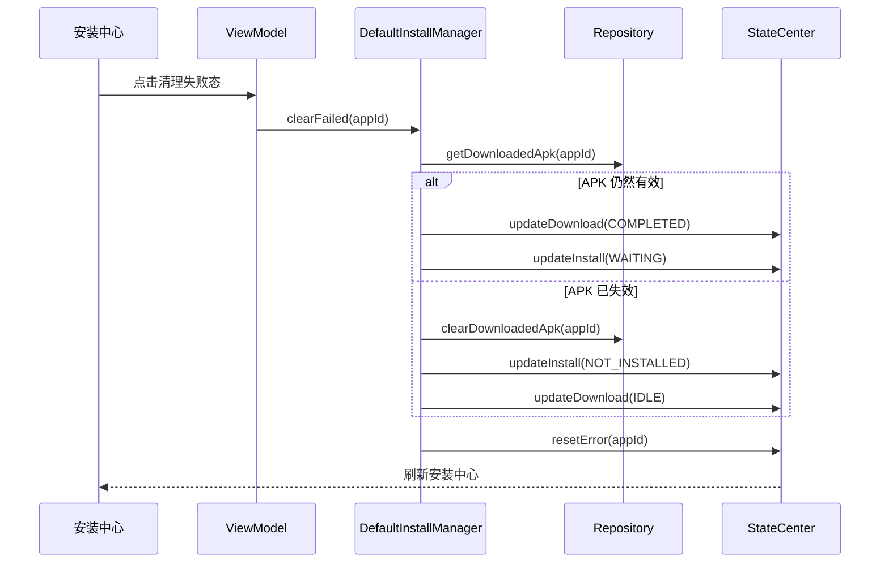
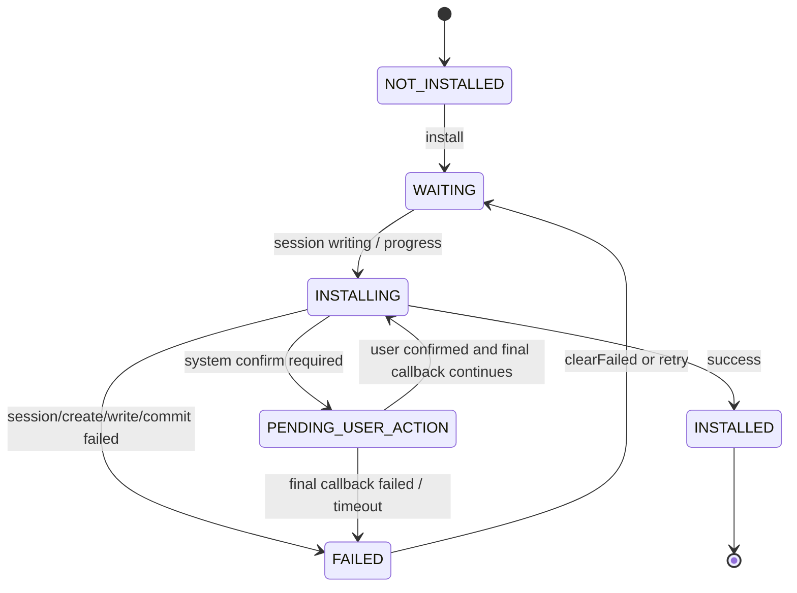

# 安装模块架构与流程

## 1. 当前结论
当前项目中的安装模块已经不是“纯模拟安装骨架”，而是一个具备真实系统安装会话接入、安装 Session 持久化、安装中心任务视图和壳层确认动作分发的模块。

当前已经具备：

- 安装前策略校验
- 安装包存在性与有效性校验
- `PackageInstaller.Session` 真实接入
- Session 创建 / 写入 / 提交
- 系统安装确认页分发
- 安装 Session 本地持久化
- 冷启动后可恢复 Session 标记
- 安装中心任务聚合
- 安装失败清理
- 与下载模块联动
- 与升级模块联动
- 与状态中心联动
- 模拟安装兜底

当前仍然存在的边界：

- 没有静默安装
- 没有 OEM 安装服务适配
- 没有系统级更细粒度安装进度来源，只是会话阶段和业务进度映射
- 安装结果仍主要靠当前会话广播回调闭环，没有做更复杂的系统安装对账

准确定位应该是：

**业务编排完整、系统 Session 已接入、壳层确认闭环已打通，但还不是平台级安装服务。**

---

## 2. 安装模块架构图

这里有三个关键点：

1. `DefaultInstallManager` 负责业务安装编排，不直接操作系统 Session。
2. `RealPackageInstaller` 负责真实安装 Session 生命周期。
3. 壳层 `MainActivity` 统一消费 `InstallUserActionDispatcher`，拉起系统确认页。

---

## 3. 安装模块核心关系图

---

## 4. 安装主流程图

---

## 5. 安装失败清理与恢复流程图

同时，`InstallSessionStore` 在冷启动时会把可恢复 Session 标记成 `RECOVERED_INTERRUPTED`，供安装中心继续展示和重试。

---

## 6. 安装状态流转图

对应页面动作由状态中心统一归约：

- `WAITING` / `INSTALLING` / `PENDING_USER_ACTION` -> `DISABLED`
- `FAILED` -> `RETRY_INSTALL`
- `INSTALLED` -> `OPEN`

---

## 7. 安装模块职责说明

### 7.1 `InstallManager` / `DefaultInstallManager`
负责：

- 安装前策略判断
- APK 存在性和有效性校验
- 发起安装链路
- 接收安装事件并同步到状态中心
- 安装成功后写入已安装信息
- 安装失败清理
- 与下载 / 升级链路协作

关键实现：

- [InstallManager.kt](/home/didi/AI/CarAppStore_work/business/src/main/java/com/nio/appstore/domain/install/InstallManager.kt)
- [DefaultInstallManager.kt](/home/didi/AI/CarAppStore_work/business/src/main/java/com/nio/appstore/domain/install/DefaultInstallManager.kt)

### 7.2 `PackageInstaller`
负责：

- 对业务层暴露统一安装器接口
- 向业务层抛出标准化安装事件

关键实现：

- [PackageInstaller.kt](/home/didi/AI/CarAppStore_work/core/src/main/java/com/nio/appstore/core/installer/PackageInstaller.kt)

### 7.3 `RealPackageInstaller`
负责：

- 真实安装 Session 生命周期驱动
- 会话创建、写入、提交
- 会话阶段持久化
- 安装确认中间态输出
- 成功 / 失败 / 可恢复状态写回 `InstallSessionStore`

关键实现：

- [RealPackageInstaller.kt](/home/didi/AI/CarAppStore_work/core/src/main/java/com/nio/appstore/core/installer/RealPackageInstaller.kt)

### 7.4 `SystemPackageInstallerSessionAdapter`
负责：

- 调 Android `PackageInstaller` 创建 Session
- 将 APK 写入 Session
- 提交 Session 并等待广播结果
- 解析 `PENDING_USER_ACTION`
- 将确认 Intent 分发到壳层

关键实现：

- [PackageInstallerSessionAdapter.kt](/home/didi/AI/CarAppStore_work/core/src/main/java/com/nio/appstore/core/installer/PackageInstallerSessionAdapter.kt)

### 7.5 `InstallSessionStore`
负责：

- 持久化安装 Session 记录
- 保存会话状态、进度、失败信息
- 冷启动恢复可恢复会话
- 输出安装中心视图所需的 Session 真相

关键实现：

- [InstallSessionStore.kt](/home/didi/AI/CarAppStore_work/core/src/main/java/com/nio/appstore/core/installer/InstallSessionStore.kt)
- [InstallSessionStatus.kt](/home/didi/AI/CarAppStore_work/core/src/main/java/com/nio/appstore/core/installer/InstallSessionStatus.kt)

### 7.6 `InstallUserActionDispatcher`
负责：

- 把 `core` 层的系统确认 Intent 分发给壳层
- 避免业务层直接依赖 `Activity`

关键实现：

- [InstallUserActionDispatcher.kt](/home/didi/AI/CarAppStore_work/core/src/main/java/com/nio/appstore/core/installer/InstallUserActionDispatcher.kt)
- [MainActivity.kt](/home/didi/AI/CarAppStore_work/app/src/main/java/com/nio/appstore/app/MainActivity.kt)

---

## 8. 当前安装模块的限制

### 8.1 已具备

- 真实 `PackageInstaller.Session` 接入
- 壳层确认页拉起
- 安装 Session 持久化
- 冷启动可恢复安装 Session 标记
- 安装中心任务视图
- 模拟安装兜底

### 8.2 当前不足

- 没有静默安装
- 没有 OEM 安装服务兼容层
- 没有平台级更细安装阶段事件
- 没有额外的系统安装对账机制
- 没有更复杂的安装权限适配策略

---

## 9. 后续演进建议

1. 引入更完整的系统安装结果对账
2. 增加 OEM / 车机安装服务适配层
3. 增加更细粒度 Session 阶段与错误模型
4. 为安装中心补更多自动化测试
5. 继续清理安装链路与升级链路之间的边界状态

---

## 10. 一句话总结

安装模块当前的真实形态可以总结为：

**`DefaultInstallManager` 做业务编排，`RealPackageInstaller + SystemPackageInstallerSessionAdapter` 做真实系统安装 Session，`InstallSessionStore` 做会话持久化，`InstallUserActionDispatcher + MainActivity` 做系统确认页闭环。**
