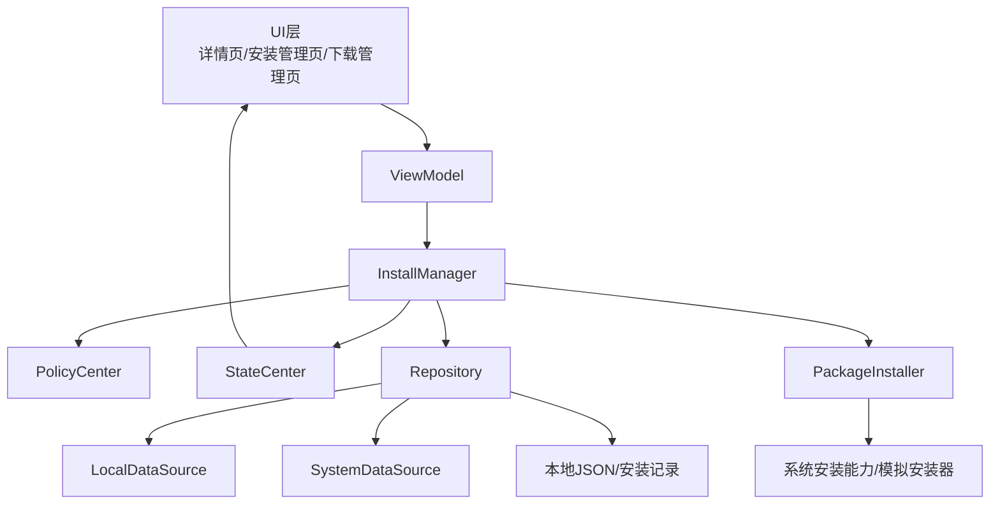
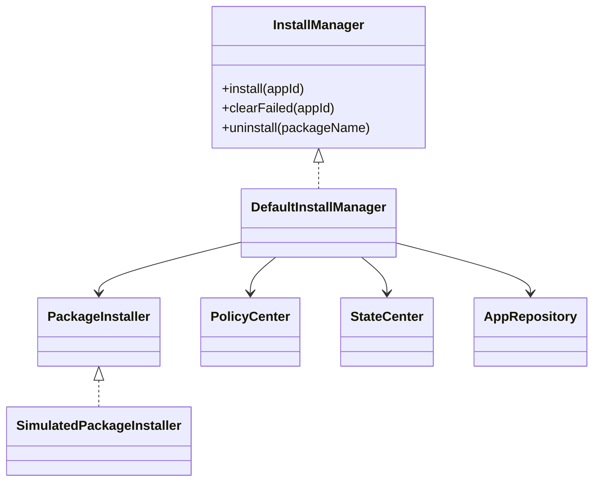
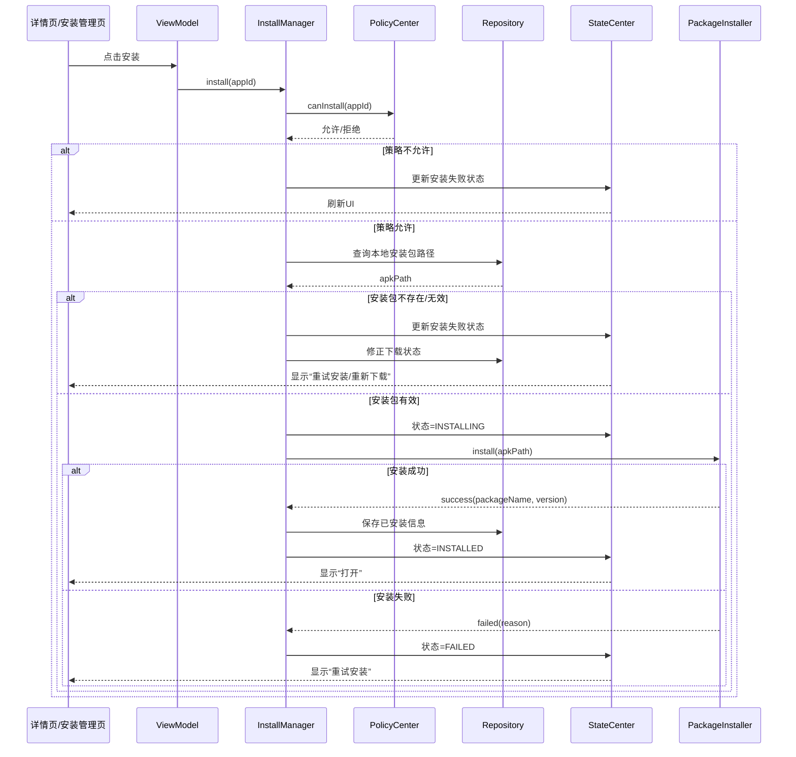
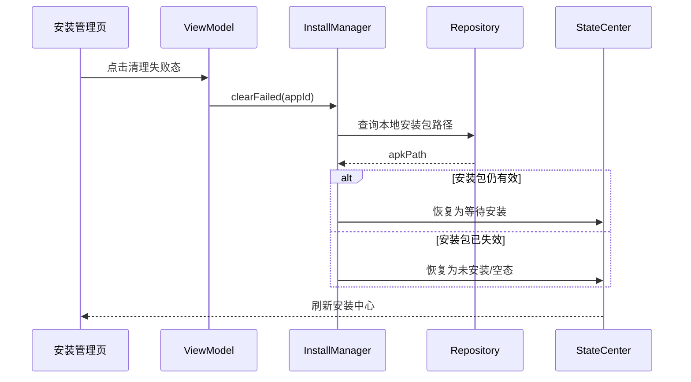
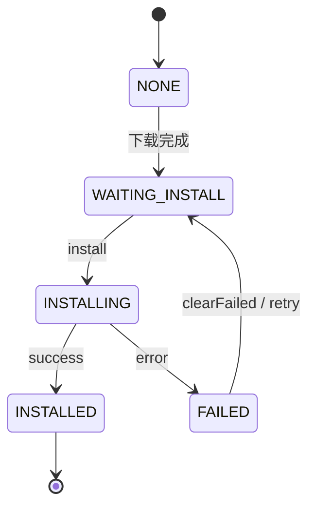

# 安装模块架构与流程

## 1. 当前结论
当前项目中的安装模块已经具备：

- 安装任务对象化视角
- 安装前文件存在性校验
- 安装失败码
- 安装失败清理
- 与下载模块联动
- 与升级模块联动
- 与状态中心联动
- 安装管理中心页面
- 批量开始安装 / 批量重试失败 / 清理失败态

当前**还没有真正实现**：

- 系统级 PackageInstaller 会话
- 静默安装
- 安装进度回调的真实系统接入
- 安装权限与系统签名差异处理
- OEM 安装服务适配

也就是说，现在的安装链路更准确地说是：

**业务流程级安装骨架**

不是严格意义上的：

**系统级真实安装实现**

---

## 2. 安装模块架构图

---

## 3. 安装模块核心关系图

---

## 4. 安装主流程图

---

## 5. 安装失败清理流程图

---

## 6. 安装状态流转图

---

## 7. 安装模块职责说明

### 7.1 InstallManager
负责：

- 安装前校验
- 发起安装
- 接收安装结果
- 更新状态中心
- 安装失败清理
- 与下载/升级流程对接

### 7.2 PackageInstaller
当前通过抽象层驱动安装执行。

当前实现：
- `SimulatedPackageInstaller`

后续可替换为：
- 真实 PackageInstaller 适配层
- 系统安装服务适配层
- OEM 安装服务适配层

### 7.3 Repository
负责：

- 提供安装包路径
- 保存已安装结果
- 保存安装记录
- 同步本地安装信息

### 7.4 PolicyCenter
负责：

- 行车/驻车安装限制
- 存储不足安装拦截
- 其他安装前置判断

### 7.5 StateCenter
负责：

- 输出安装状态
- 统一按钮态
- 同步错误信息和错误码

---

## 8. 当前安装模块的限制

### 当前已具备
- 安装流程编排
- 安装前校验
- 安装失败恢复
- 安装管理中心
- 与下载/升级链路打通

### 当前未具备
- 真实系统安装
- 会话级安装进度
- 系统安装广播接入
- 不同设备安装能力兼容层
- 静默安装/权限差异处理

---

## 9. 后续演进建议

1. `RealPackageInstaller`
2. PackageInstaller Session 接入
3. 安装进度真实回调
4. 系统安装结果广播接入
5. OEM 安装服务兼容层
