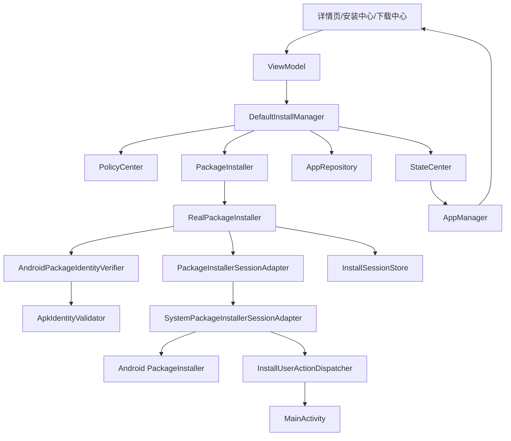
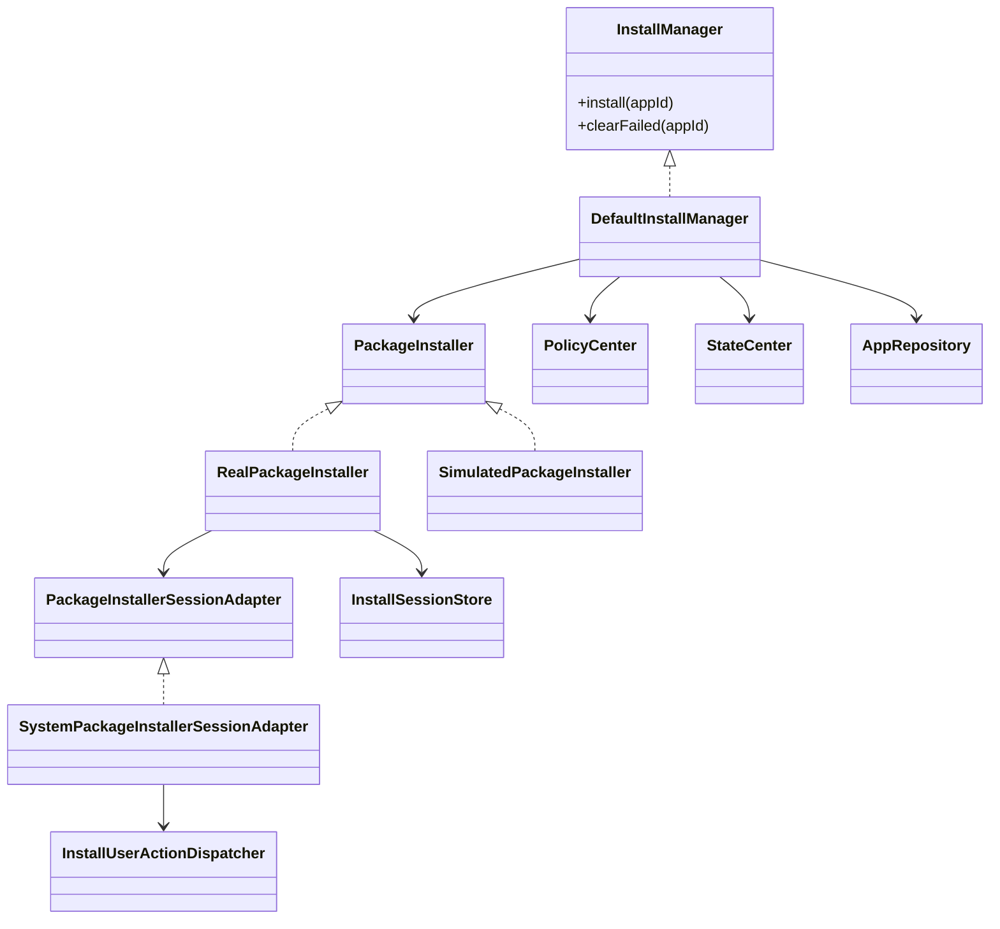
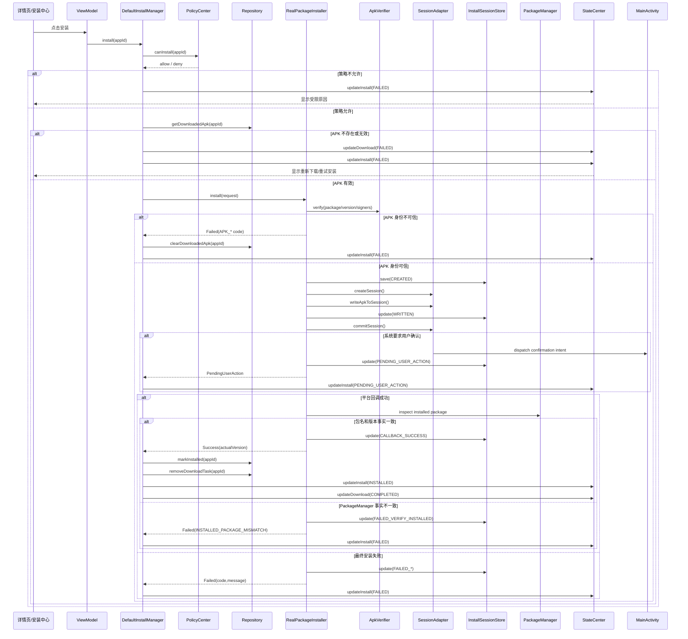
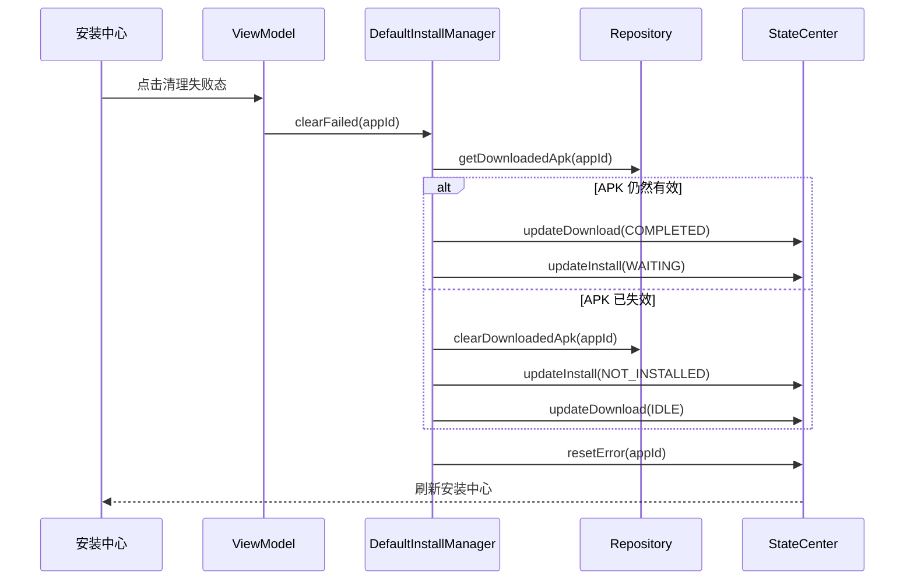
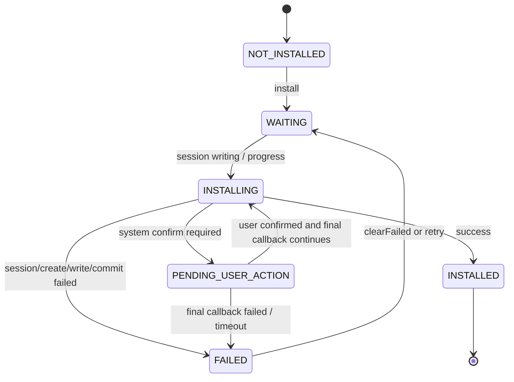

# 安装模块架构与流程

## 1. 当前结论
当前项目中的安装模块已经不是“纯模拟安装骨架”，而是一个具备真实系统安装会话接入、安装 Session 持久化、安装中心任务视图和壳层确认动作分发的模块。

当前已经具备：

- 安装前策略校验
- 安装包存在性、包名、版本代码和签名证书 SHA-256 校验
- `PackageInstaller.Session` 真实接入
- Session 创建 / 写入 / 提交
- 系统安装确认页分发
- 安装 Session 本地持久化
- 冷启动后可恢复 Session 标记
- 安装中心任务聚合
- 安装失败清理
- 安装成功回调后的 PackageManager 包名/版本事实核对
- 与下载模块联动
- 与升级模块联动
- 与状态中心联动
- 模拟安装兜底

当前仍然存在的边界：

- 没有静默安装
- 没有 OEM 安装服务适配
- 没有系统级更细粒度安装进度来源，只是会话阶段和业务进度映射
- 已对当前成功回调做 PackageManager 事实核对，但还没有跨进程长周期、定时式的系统安装对账

准确定位应该是：

**业务编排完整、系统 Session 已接入、壳层确认闭环已打通，但还不是平台级安装服务。**

---

## 2. 安装模块架构图

```mermaid
flowchart TD

UI[详情页/安装中心/下载中心] --> VM[ViewModel]
VM --> IM[DefaultInstallManager]

IM --> PC[PolicyCenter]
IM --> SC[StateCenter]
IM --> REPO[AppRepository]
IM --> PI[PackageInstaller]

PI --> RPI[RealPackageInstaller]
RPI --> SA[PackageInstallerSessionAdapter]
RPI --> AV[AndroidPackageIdentityVerifier]
AV --> AIV[ApkIdentityValidator]
SA --> SPI[SystemPackageInstallerSessionAdapter]
SPI --> ANDROID[Android PackageInstaller]
RPI --> SS[InstallSessionStore]
SPI --> DISPATCHER[InstallUserActionDispatcher]

DISPATCHER --> ACT[MainActivity]
SC --> AM[AppManager]
AM --> UI
```

这里有五个关键点：

1. `DefaultInstallManager` 负责业务安装编排，不直接操作系统 Session。
2. `RealPackageInstaller` 负责真实安装 Session 生命周期。
3. 壳层 `MainActivity` 统一消费 `InstallUserActionDispatcher`，拉起系统确认页。
4. `AndroidPackageIdentityVerifier` 在创建 Session 前读取 APK archive，严格核对包名、版本和签名摘要。
5. 成功回调后再次查询 PackageManager，只有实际包名和版本与已验证 APK 一致才收口为成功。

---

## 3. 安装模块核心关系图

```mermaid
classDiagram

class InstallManager {
  +install(appId)
  +clearFailed(appId)
}

class DefaultInstallManager
class PackageInstaller
class RealPackageInstaller
class SimulatedPackageInstaller
class PackageInstallerSessionAdapter
class SystemPackageInstallerSessionAdapter
class InstallSessionStore
class InstallUserActionDispatcher
class PolicyCenter
class StateCenter
class AppRepository

InstallManager <|.. DefaultInstallManager
PackageInstaller <|.. RealPackageInstaller
PackageInstaller <|.. SimulatedPackageInstaller
PackageInstallerSessionAdapter <|.. SystemPackageInstallerSessionAdapter

DefaultInstallManager --> PolicyCenter
DefaultInstallManager --> StateCenter
DefaultInstallManager --> AppRepository
DefaultInstallManager --> PackageInstaller

RealPackageInstaller --> PackageInstallerSessionAdapter
RealPackageInstaller --> InstallSessionStore
SystemPackageInstallerSessionAdapter --> InstallUserActionDispatcher
```

---

## 4. 安装主流程图

```mermaid
sequenceDiagram
participant UI as 详情页/安装中心
participant VM as ViewModel
participant IM as DefaultInstallManager
participant PC as PolicyCenter
participant REPO as Repository
participant PI as RealPackageInstaller
participant AV as ApkVerifier
participant SA as SessionAdapter
participant SS as InstallSessionStore
participant PM as PackageManager
participant SC as StateCenter
participant ACT as MainActivity

UI->>VM: 点击安装
VM->>IM: install(appId)

IM->>PC: canInstall(appId)
PC-->>IM: allow / deny

alt 策略不允许
    IM->>SC: updateInstall(FAILED)
    SC-->>UI: 显示受限原因
else 策略允许
    IM->>REPO: getDownloadedApk(appId)

    alt APK 不存在或无效
        IM->>SC: updateDownload(FAILED)
        IM->>SC: updateInstall(FAILED)
        SC-->>UI: 显示重新下载/重试安装
    else APK 有效
        IM->>PI: install(request)
        PI->>AV: verify(package/version/signers)

        alt APK 身份不可信
            PI-->>IM: Failed(APK_* code)
            IM->>REPO: clearDownloadedApk(appId)
            IM->>SC: updateInstall(FAILED)
        else APK 身份可信
            PI->>SS: save(CREATED)
            PI->>SA: createSession()
            PI->>SA: writeApkToSession()
            PI->>SS: update(WRITTEN)
            PI->>SA: commitSession()

            alt 系统要求用户确认
                SA->>ACT: dispatch confirmation intent
                PI->>SS: update(PENDING_USER_ACTION)
                PI-->>IM: PendingUserAction
                IM->>SC: updateInstall(PENDING_USER_ACTION)
            end

            alt 平台回调成功
                PI->>PM: inspect installed package
                alt 包名和版本事实一致
                    PI->>SS: update(CALLBACK_SUCCESS)
                    PI-->>IM: Success(actualVersion)
                    IM->>REPO: markInstalled(appId)
                    IM->>REPO: removeDownloadTask(appId)
                    IM->>SC: updateInstall(INSTALLED)
                    IM->>SC: updateDownload(COMPLETED)
                else PackageManager 事实不一致
                    PI->>SS: update(FAILED_VERIFY_INSTALLED)
                    PI-->>IM: Failed(INSTALLED_PACKAGE_MISMATCH)
                    IM->>SC: updateInstall(FAILED)
                end
            else 最终安装失败
                PI->>SS: update(FAILED_*)
                PI-->>IM: Failed(code,message)
                IM->>SC: updateInstall(FAILED)
            end
        end
    end
end
```

---

## 5. 安装失败清理与恢复流程图

```mermaid
sequenceDiagram
participant UI as 安装中心
participant VM as ViewModel
participant IM as DefaultInstallManager
participant REPO as Repository
participant SC as StateCenter

UI->>VM: 点击清理失败态
VM->>IM: clearFailed(appId)
IM->>REPO: getDownloadedApk(appId)

alt APK 仍然有效
    IM->>SC: updateDownload(COMPLETED)
    IM->>SC: updateInstall(WAITING)
else APK 已失效
    IM->>REPO: clearDownloadedApk(appId)
    IM->>SC: updateInstall(NOT_INSTALLED)
    IM->>SC: updateDownload(IDLE)
end

IM->>SC: resetError(appId)
SC-->>UI: 刷新安装中心
```

同时，`InstallSessionStore` 在冷启动时会把可恢复 Session 标记成 `RECOVERED_INTERRUPTED`，供安装中心继续展示和重试。

---

## 6. 安装状态流转图

```mermaid
stateDiagram-v2
    [*] --> NOT_INSTALLED
    NOT_INSTALLED --> WAITING: install
    WAITING --> INSTALLING: session writing / progress
    INSTALLING --> PENDING_USER_ACTION: system confirm required
    PENDING_USER_ACTION --> INSTALLING: user confirmed and final callback continues
    INSTALLING --> INSTALLED: success
    INSTALLING --> FAILED: session/create/write/commit failed
    PENDING_USER_ACTION --> FAILED: final callback failed / timeout
    FAILED --> WAITING: clearFailed or retry
    INSTALLED --> [*]
```

对应页面动作由状态中心统一归约：

- `WAITING` / `INSTALLING` / `PENDING_USER_ACTION` -> `DISABLED`
- `FAILED` -> `RETRY_INSTALL`
- `INSTALLED` -> `OPEN`

---

## 7. 安装模块职责说明

### 7.1 `InstallManager` / `DefaultInstallManager`
负责：

- 安装前策略判断
- APK 存在性检查和预期身份元数据组装
- 发起安装链路
- 接收安装事件并同步到状态中心
- 安装成功后写入已安装信息
- 安装失败清理
- APK 信任失败时清理不可复用下载产物
- 与下载 / 升级链路协作

关键实现：

- [InstallManager.kt](../business/src/main/java/com/xzq/appstore/domain/install/InstallManager.kt)
- [DefaultInstallManager.kt](../business/src/main/java/com/xzq/appstore/domain/install/DefaultInstallManager.kt)

### 7.2 `PackageInstaller`
负责：

- 对业务层暴露统一安装器接口
- 向业务层抛出标准化安装事件

关键实现：

- [PackageInstaller.kt](../core/src/main/java/com/xzq/appstore/core/installer/PackageInstaller.kt)

### 7.3 `RealPackageInstaller`
负责：

- 真实安装 Session 生命周期驱动
- 创建 Session 前调用 `ApkVerifier`，拒绝包名、版本或签名不匹配的 APK
- 会话创建、写入、提交
- 会话阶段持久化
- 安装确认中间态输出
- 成功 / 失败 / 可恢复状态写回 `InstallSessionStore`
- 成功回调后用 `InstalledPackageInspector` 核对系统实际包名与版本

关键实现：

- [RealPackageInstaller.kt](../core/src/main/java/com/xzq/appstore/core/installer/RealPackageInstaller.kt)

### 7.4 `SystemPackageInstallerSessionAdapter`
负责：

- 调 Android `PackageInstaller` 创建 Session
- 将 APK 写入 Session
- 提交 Session 并等待广播结果
- 解析 `PENDING_USER_ACTION`
- 将确认 Intent 分发到壳层

关键实现：

- [PackageInstallerSessionAdapter.kt](../core/src/main/java/com/xzq/appstore/core/installer/PackageInstallerSessionAdapter.kt)

### 7.5 `InstallSessionStore`
负责：

- 持久化安装 Session 记录
- 保存会话状态、进度、失败信息
- 冷启动恢复可恢复会话
- 输出安装中心视图所需的 Session 真相

关键实现：

- [InstallSessionStore.kt](../core/src/main/java/com/xzq/appstore/core/installer/InstallSessionStore.kt)
- [InstallSessionStatus.kt](../core/src/main/java/com/xzq/appstore/core/installer/InstallSessionStatus.kt)

### 7.6 `InstallUserActionDispatcher`
负责：

- 把 `core` 层的系统确认 Intent 分发给壳层
- 避免业务层直接依赖 `Activity`

关键实现：

- [InstallUserActionDispatcher.kt](../core/src/main/java/com/xzq/appstore/core/installer/InstallUserActionDispatcher.kt)
- [MainActivity.kt](../app/src/main/java/com/xzq/appstore/app/MainActivity.kt)

---

## 8. 当前安装模块的限制

### 8.1 已具备

- 真实 `PackageInstaller.Session` 接入
- 壳层确认页拉起
- 安装 Session 持久化
- 冷启动可恢复安装 Session 标记
- 安装中心任务视图
- 模拟安装兜底
- APK 身份预检和安装后事实核对

### 8.2 当前不足

- 没有静默安装
- 没有 OEM 安装服务兼容层
- 没有平台级更细安装阶段事件
- 没有跨进程长周期、定时式的系统安装对账机制
- 没有更复杂的安装权限适配策略

---

## 9. 后续演进建议

1. 在当前成功回调事实核对基础上，按产品需要增加跨进程长周期安装结果对账
2. 增加 OEM / 车机安装服务适配层
3. 增加更细粒度 Session 阶段与错误模型
4. 继续补 OEM 回调差异和长周期对账自动化测试
5. 继续清理安装链路与升级链路之间的边界状态

---

## 10. 一句话总结

安装模块当前的真实形态可以总结为：

**`DefaultInstallManager` 做业务编排，`AndroidPackageIdentityVerifier` 做 APK 信任预检，`RealPackageInstaller + SystemPackageInstallerSessionAdapter` 做真实系统安装 Session 和安装后事实核对，`InstallSessionStore` 做会话持久化，`InstallUserActionDispatcher + MainActivity` 做系统确认页闭环。**
