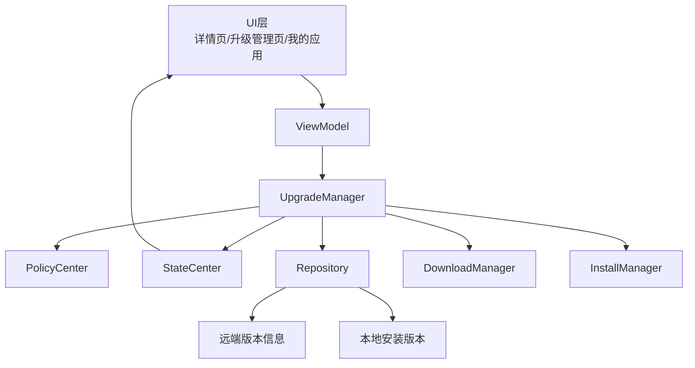
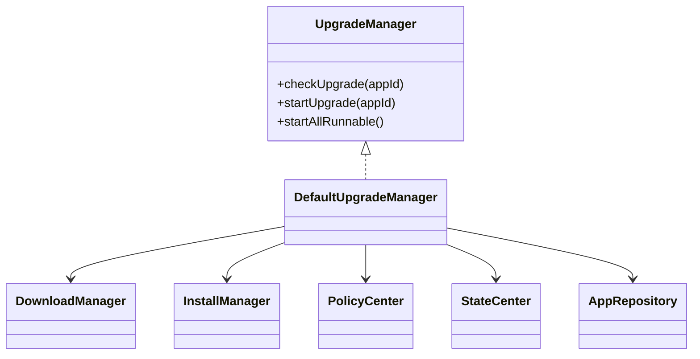
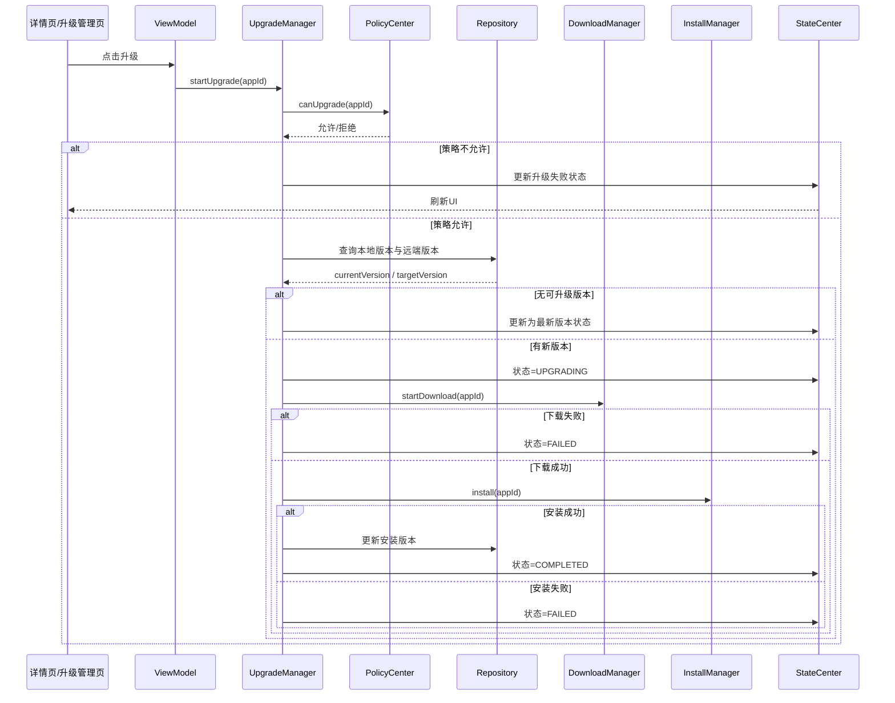
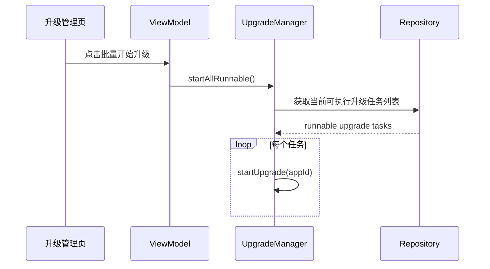
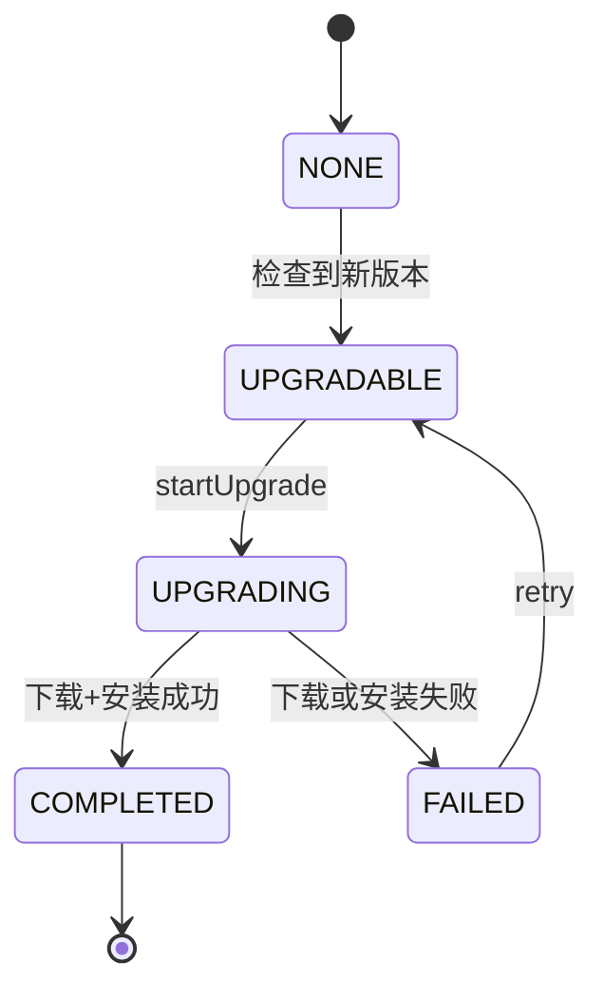

# 升级模块架构与流程

## 1. 当前结论
当前项目中的升级模块已经具备：

- 版本比较
- 可升级列表
- 单个升级
- 批量开始升级
- 升级失败重试
- 升级管理中心页面
- 与下载模块联动
- 与安装模块联动
- 与状态中心联动

当前**还没有真正实现**：

- 服务端差分包/增量升级
- 强制升级策略闭环
- 后台静默升级
- 升级窗口控制
- 多渠道包治理

也就是说，现在的升级链路更准确地说是：

**业务编排级升级实现**

不是严格意义上的：

**完整商用升级系统**

---

## 2. 升级模块架构图

---

## 3. 升级模块核心关系图

---

## 4. 升级主流程图

---

## 5. 一键升级流程图

---

## 6. 升级状态流转图

---

## 7. 升级模块职责说明

### 7.1 UpgradeManager
负责：

- 版本比较
- 升级资格判断
- 调策略中心做前置判断
- 编排下载模块
- 编排安装模块
- 汇总升级状态

### 7.2 Repository
负责：

- 提供远端版本信息
- 提供本地安装版本
- 保存 staged upgrade version
- 升级后同步目标版本

### 7.3 DownloadManager
负责：

- 下载升级包
- 保存下载产物
- 失败重试

### 7.4 InstallManager
负责：

- 安装升级包
- 失败恢复
- 同步安装结果

### 7.5 StateCenter
负责：

- 输出升级状态
- 同步页面按钮态
- 同步失败信息和错误码

---

## 8. 当前升级模块的限制

### 当前已具备
- 可升级判断
- 单个升级
- 批量升级
- 升级失败重试
- 升级任务中心

### 当前未具备
- 差分升级
- 强更策略
- 静默升级
- 夜间升级窗口
- 渠道治理
- 远端灰度升级控制

---

## 9. 后续演进建议

1. 差分包 / 全量包策略
2. 强制升级控制
3. 自动升级控制深化
4. 升级窗口（夜间/驻车）控制
5. 服务端灰度升级策略
