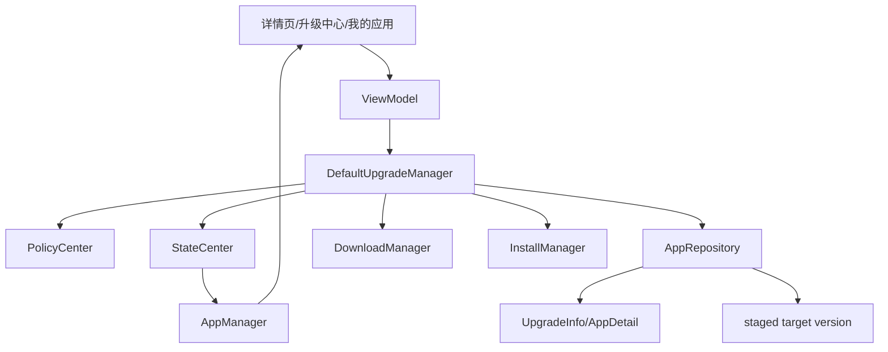
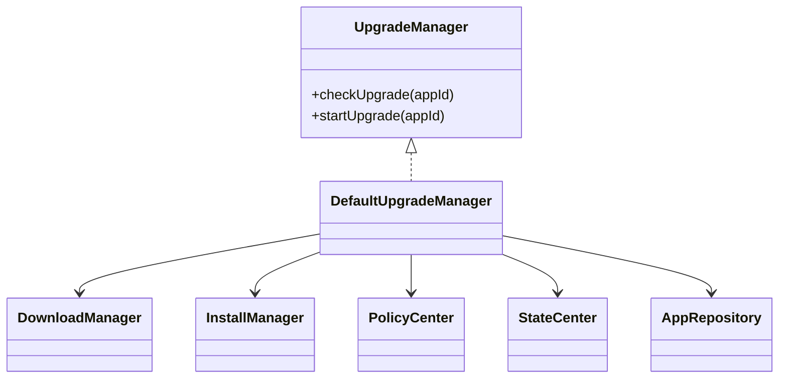
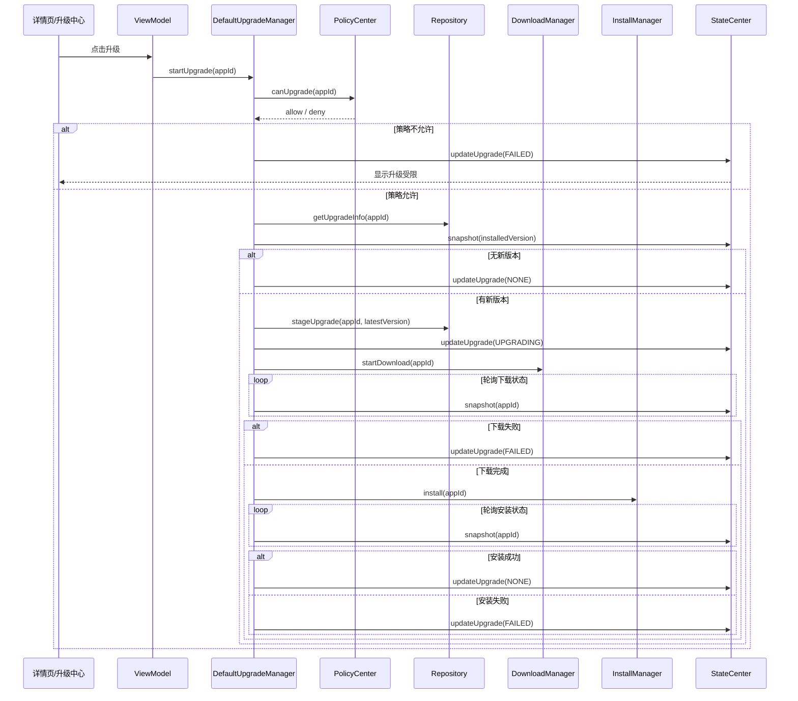
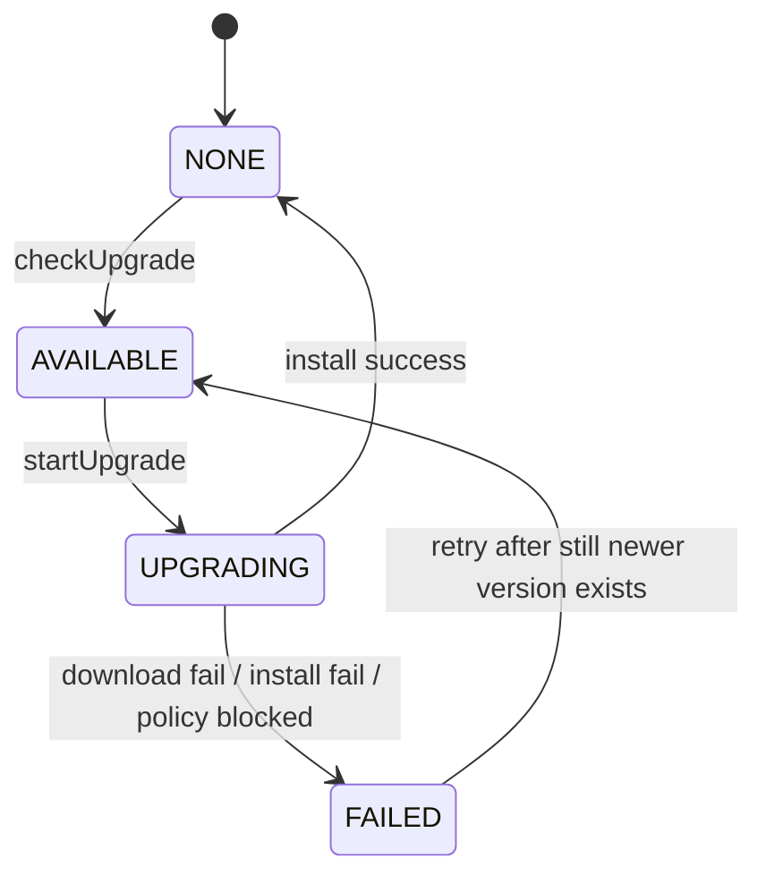

# 升级模块架构与流程

## 1. 当前结论
当前项目中的升级模块不是独立下载器或独立安装器，而是一个围绕“版本判断 + 下载编排 + 安装编排”的业务 orchestrator。

当前已经具备：

- 版本比较
- 可升级判断
- 单个升级
- 批量升级入口
- 升级失败重试入口
- 升级管理中心页面
- 与下载模块联动
- 与安装模块联动
- 与状态中心联动
- staged target version 持久化

当前仍然存在的边界：

- 升级流程采用轮询状态的方式等待下载和安装完成
- 没有差分包 / 增量升级
- 没有强制升级策略闭环
- 没有静默升级
- 没有升级窗口和调度系统
- 没有服务端灰度治理闭环

准确定位应该是：

**升级模块当前是业务编排层，不是独立升级平台。**

---

## 2. 升级模块架构图

---

## 3. 升级模块核心关系图

升级模块最核心的事实是：

- 它自己不下载
- 它自己不安装
- 它负责决定“是否能升、升到哪、何时串起下载和安装”

---

## 4. 升级主流程图

---

## 5. 升级状态流转图

页面动作不是升级模块自己直接定义的，而是通过状态中心最终推导：

- 已安装且有新版本 -> `UPGRADE`
- 升级中 -> `DISABLED`
- 安装成功后 -> 回到 `OPEN` 或常规态

---

## 6. 升级模块职责说明

### 6.1 `UpgradeManager` / `DefaultUpgradeManager`
负责：

- 判断是否存在新版本
- 校验升级策略
- 记录目标升级版本
- 编排下载模块
- 编排安装模块
- 汇总升级结果到状态中心

关键实现：

- [UpgradeManager.kt](/home/didi/AI/CarAppStore_work/business/src/main/java/com/nio/appstore/domain/upgrade/UpgradeManager.kt)
- [DefaultUpgradeManager.kt](/home/didi/AI/CarAppStore_work/business/src/main/java/com/nio/appstore/domain/upgrade/DefaultUpgradeManager.kt)

### 6.2 `Repository`
负责：

- 提供远端升级信息
- 提供当前应用详情
- 持久化 staged target version
- 在安装成功后由安装链路消费 staged version，写入最终 installed version

### 6.3 `DownloadManager`
负责：

- 下载升级包
- 维护升级过程中的下载状态
- 为安装提供 APK 产物

### 6.4 `InstallManager`
负责：

- 安装升级包
- 安装成功后把应用状态写为已安装目标版本

### 6.5 `StateCenter`
负责：

- 统一输出 `UpgradeStatus`
- 与下载 / 安装状态叠加后形成页面动作和状态文案

---

## 7. 当前升级模块的限制

### 7.1 已具备

- 单个升级
- 批量升级入口
- staged target version
- 下载安装主链路打通
- 升级中心任务视图

### 7.2 当前不足

- 没有差分升级
- 没有后台静默升级
- 没有升级窗口
- 没有灰度策略
- 没有事件驱动式完成通知，当前是轮询状态

---

## 8. 后续演进建议

1. 把升级编排从轮询改成更稳定的事件驱动
2. 引入差分包 / 全量包策略
3. 增加强制升级和升级窗口控制
4. 增加灰度升级与渠道治理
5. 为升级链路补更多自动化测试

---

## 9. 一句话总结

升级模块当前的真实形态可以总结为：

**`DefaultUpgradeManager` 不直接下载也不直接安装，而是负责判断是否可升、记录目标版本、编排下载和安装，再把最终结果写回状态中心。**
