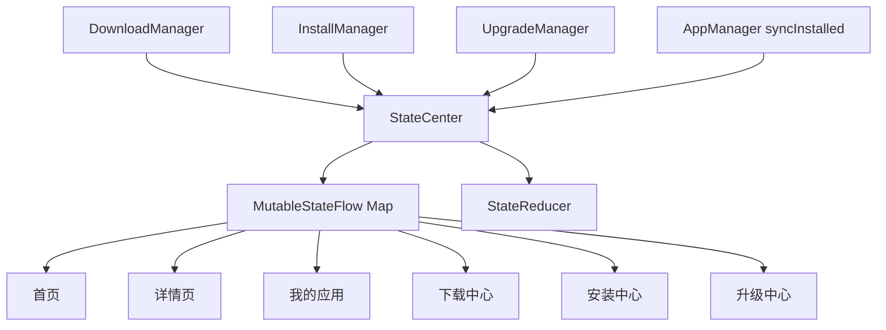
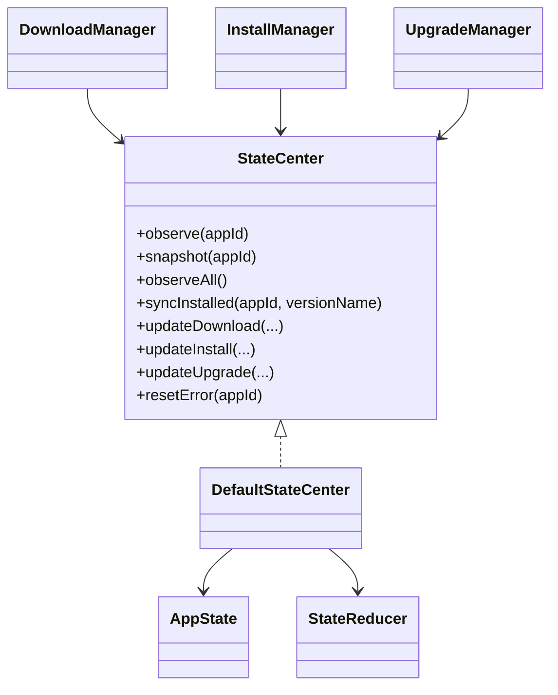
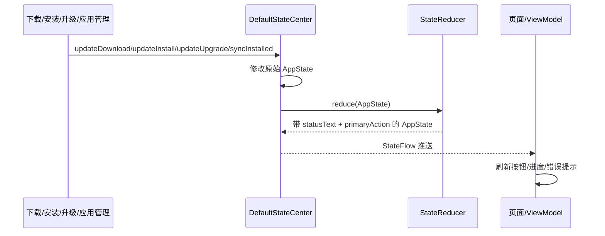
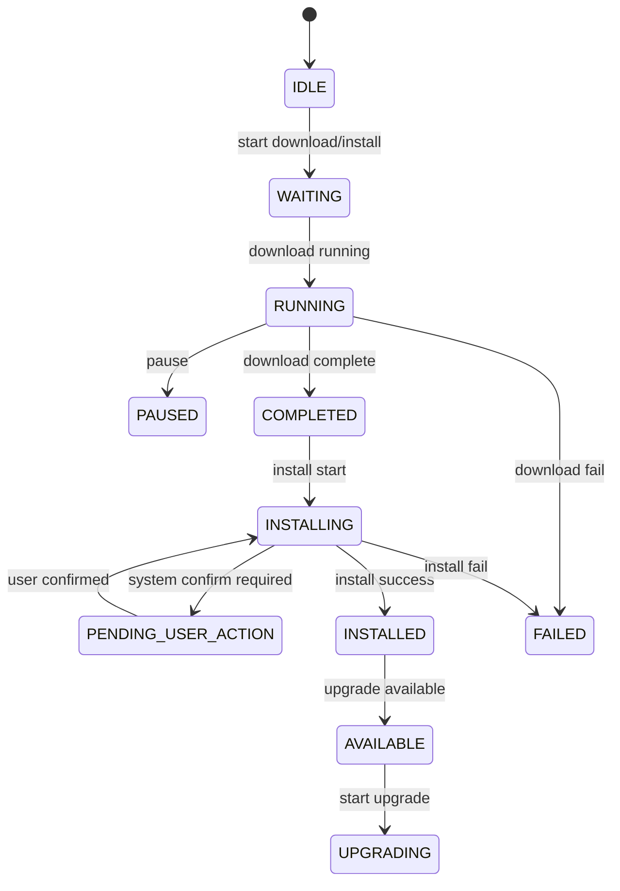

# 状态中心架构与流程

## 1. 当前结论
状态中心是当前工程里真正的“运行态单一真相入口”。

它已经具备：

- 下载状态统一管理
- 安装状态统一管理
- 升级状态统一管理
- 错误信息与错误码统一管理
- 页面主动作统一推导
- 页面状态文案统一推导
- 首页 / 详情 / 我的应用 / 各任务中心联动

状态中心不做的事情：

- 不负责持久化任务记录
- 不负责直接执行下载 / 安装 / 升级
- 不负责远端或本地数据查询

准确定位应该是：

**状态中心负责运行态，Repository 负责持久化真相。**

---

## 2. 状态中心架构图

---

## 3. 状态中心核心关系图

---

## 4. 状态更新流程图

---

## 5. `AppState` 结构说明

当前每个 `appId` 对应一份 `AppState`，核心字段包括：

- `downloadStatus`
- `installStatus`
- `upgradeStatus`
- `progress`
- `localApkPath`
- `installedVersion`
- `errorMessage`
- `errorCode`
- `primaryAction`
- `statusText`

这意味着页面不需要分别订阅下载状态、安装状态、升级状态，而是只看一个统一聚合后的页面态。

---

## 6. `StateReducer` 的作用

`StateReducer` 的职责不是“保存状态”，而是“把底层状态翻译成页面语言”。

它主要做两件事：

1. 生成 `statusText`
   例如下载中、等待安装、等待系统确认、安装失败、可升级等。
2. 生成 `primaryAction`
   例如下载、暂停、继续、安装、重试安装、升级、打开、禁用。

这层的价值是：

- 页面不用自己写复杂 if/else
- 各页面展示口径统一
- 文案收敛在业务层而不是散落在页面层

---

## 7. 状态流转示意图

注意这里是“跨模块聚合后的页面态示意”，不是单个模块的完整内部状态机。

---

## 8. 当前状态中心的价值

### 8.1 已具备

- 跨页面联动
- 跨模块聚合
- 统一按钮态来源
- 统一状态文案来源
- 统一错误态来源

### 8.2 当前不足

- 没有状态历史记录
- 没有状态变更流水
- 没有状态持久化版本机制
- 没有更细粒度的状态分析能力

---

## 9. 后续演进建议

1. 增加状态变化历史记录
2. 引入状态日志与埋点对账
3. 把复杂安装 Session 阶段和升级阶段映射得更细
4. 明确运行态与持久态的同步边界

---

## 10. 一句话总结

状态中心当前的真实形态可以总结为：

**它不是任务仓库，而是把下载、安装、升级多个业务模块的运行态归并成统一 `AppState`，再通过 `StateReducer` 输出页面可直接消费的状态文案和主动作。**
