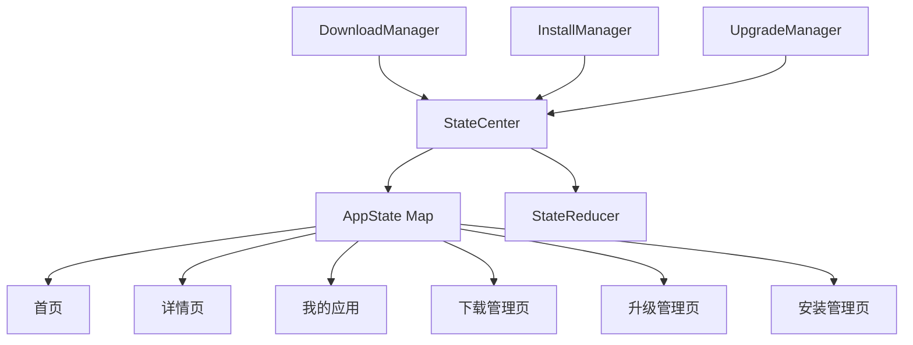
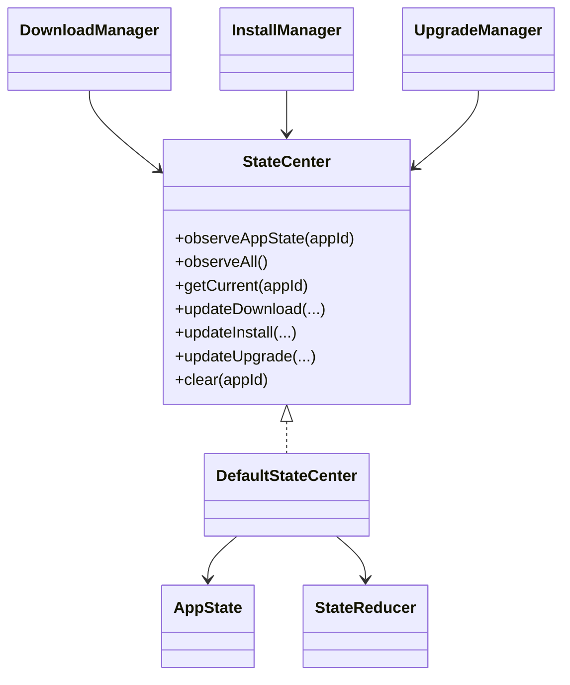
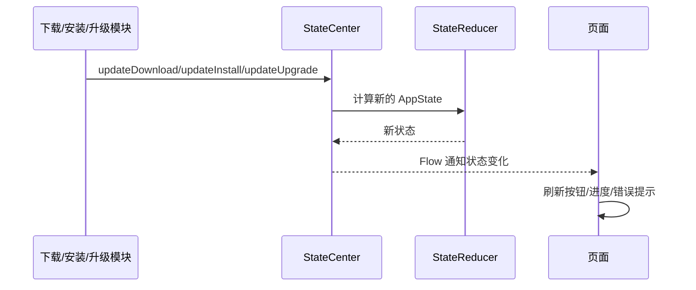
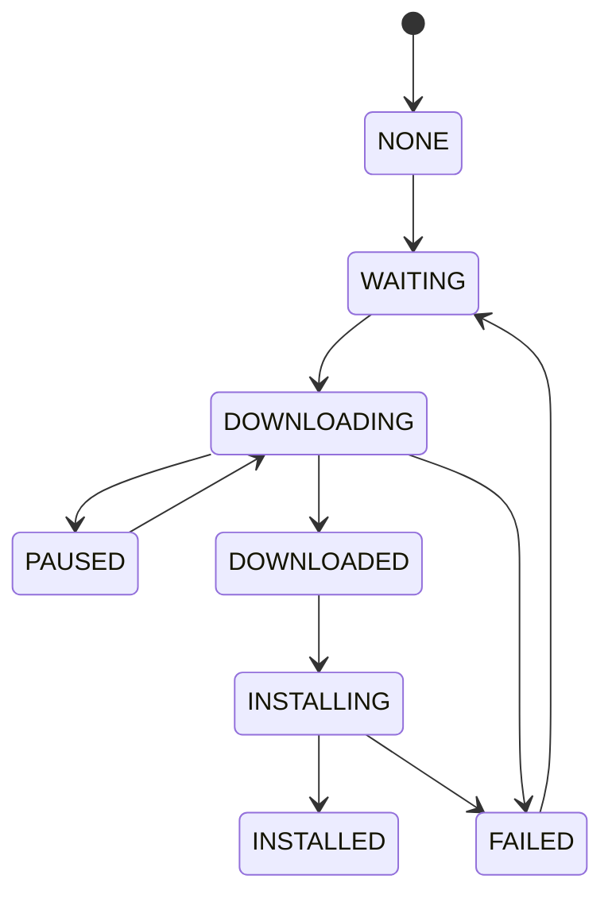

# 状态中心架构与流程

## 1. 当前结论
当前项目中的状态中心已经具备：

- 下载状态统一管理
- 安装状态统一管理
- 升级状态统一管理
- 统一按钮态来源
- 统一错误信息与错误码
- 首页 / 详情页 / 我的应用 / 下载管理 / 升级管理 / 安装管理 的状态联动
- 冷启动恢复后的状态修正承接

状态中心当前承担的是：

**全局统一状态源**

而不是让每个页面、每个模块各自保存一套业务状态。

---

## 2. 状态中心架构图

---

## 3. 状态中心核心关系图

---

## 4. 状态更新流程图

---

## 5. 状态中心职责说明

### 5.1 统一维护 AppState
每个 appId 对应一个 `AppState`，里面会聚合：

- DownloadStatus
- InstallStatus
- UpgradeStatus
- progress
- localApkPath
- installedVersion
- errorMessage
- errorCode
- primaryAction

### 5.2 对外提供统一订阅能力
页面只需要：
- `observeAppState(appId)`
- `observeAll()`

而不需要分别去订阅下载、安装、升级三个来源。

### 5.3 接住多个业务模块的状态写入
当前状态中心会接收来自：
- 下载模块
- 安装模块
- 升级模块

的统一写入。

### 5.4 配合 StateReducer 推导页面态
按钮显示什么、页面该显示“下载 / 安装 / 打开 / 重试”，不是页面自己算，而是通过状态中心 + reducer 统一推导。

---

## 6. 状态流转示意图

---

## 7. 当前状态中心的价值

### 当前已具备
- 跨页面联动
- 跨模块状态聚合
- 统一按钮态来源
- 统一错误态来源
- 冷启动恢复后的状态承接

### 当前未具备
- 更细粒度的状态历史
- 埋点级状态流水
- 多端状态同步
- 状态版本化/回溯

---

## 8. 后续演进建议

1. 增加状态历史记录
2. 增加状态变化日志
3. 增加更细的安装/升级阶段态
4. 增加更清晰的状态埋点能力
