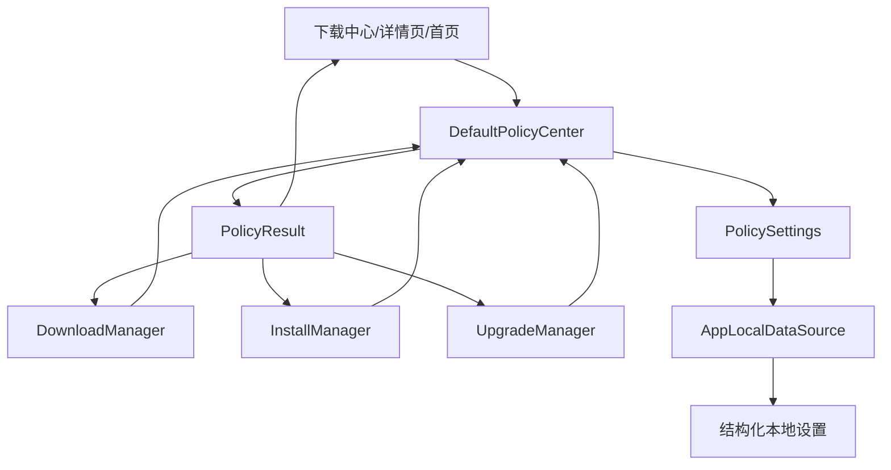
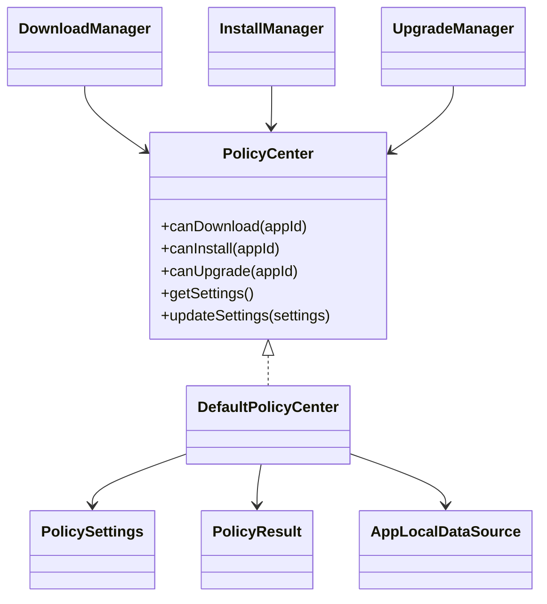
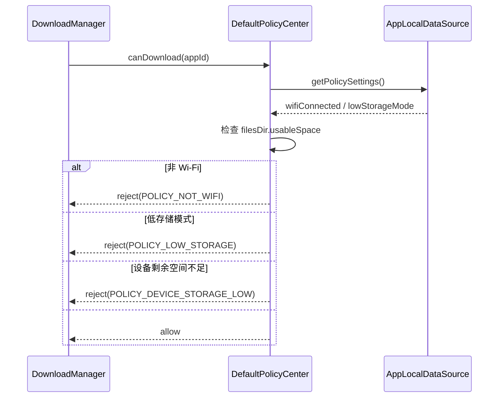
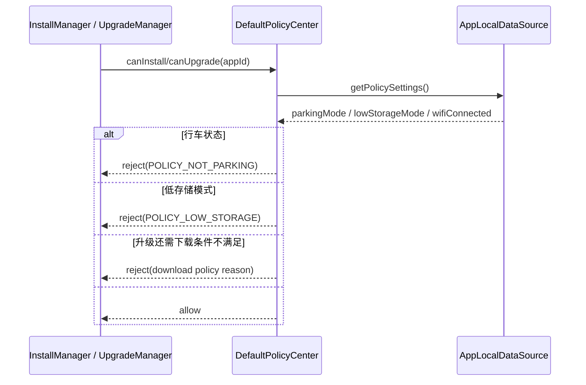

# 策略中心架构与流程

## 1. 当前结论
策略中心是当前工程的统一前置决策层。

它已经具备：

- 下载前策略判断
- 安装前策略判断
- 升级前策略判断
- Wi‑Fi 条件判断
- 驻车条件判断
- 低存储模式判断
- 设备可用空间判断
- 策略设置持久化
- 页面侧策略开关联动

当前策略中心的边界也很清楚：

- 策略源是本地 `PolicySettings`
- 规则仍然比较简单
- 没有服务端动态策略下发
- 没有车型、区域、账号等更复杂维度

准确定位应该是：

**统一规则入口，不是复杂规则引擎。**

---

## 2. 策略中心架构图

---

## 3. 策略中心核心关系图

---

## 4. 下载前策略判断流程图

---

## 5. 安装与升级策略判断流程图

升级的实际判断方式是：

- 先复用下载策略
- 再复用安装策略

所以 `canUpgrade()` 本质上是组合规则，而不是单独一套规则。

---

## 6. 当前策略项说明

### 6.1 网络策略

- `wifiConnected = false` 时，下载受限

### 6.2 车况策略

- `parkingMode = false` 时，安装受限

### 6.3 存储策略

- `lowStorageMode = true` 时，下载和安装都受限
- 同时下载还会再检查 `context.filesDir.usableSpace`

### 6.4 升级策略

- 升级没有单独独立规则
- 升级 = 下载规则 + 安装规则 的组合

---

## 7. 策略中心职责说明

### 7.1 `PolicyCenter` / `DefaultPolicyCenter`
负责：

- 对外提供统一判断入口
- 返回允许 / 拒绝以及原因文案
- 读取和更新本地策略设置

关键实现：

- [PolicyCenter.kt](/home/didi/AI/CarAppStore_work/business/src/main/java/com/nio/appstore/domain/policy/PolicyCenter.kt)
- [DefaultPolicyCenter.kt](/home/didi/AI/CarAppStore_work/business/src/main/java/com/nio/appstore/domain/policy/DefaultPolicyCenter.kt)

### 7.2 `PolicySettings`
当前策略设置主要包含：

- `wifiConnected`
- `parkingMode`
- `lowStorageMode`

### 7.3 `AppLocalDataSource`
负责：

- 持久化策略设置
- 为策略中心提供恢复后的设置真相

---

## 8. 当前策略中心的价值

### 8.1 已具备

- 统一规则入口
- 设置持久化
- 页面开关联动
- 业务模块不再散写 if/else

### 8.2 当前不足

- 规则维度少
- 没有远端动态策略
- 没有更复杂的优先级和规则组合
- 没有用户级差异化策略

---

## 9. 后续演进建议

1. 引入服务端动态策略下发
2. 增加车型 / 区域 / 用户级策略维度
3. 扩展升级窗口、夜间下载、驻车自动安装等规则
4. 为规则命中和拦截增加埋点和审计能力

---

## 10. 一句话总结

策略中心当前的真实形态可以总结为：

**它把下载、安装、升级的前置限制统一收口到 `DefaultPolicyCenter`，通过少量本地策略项和设备空间判断返回允许与否及原因文案。**
