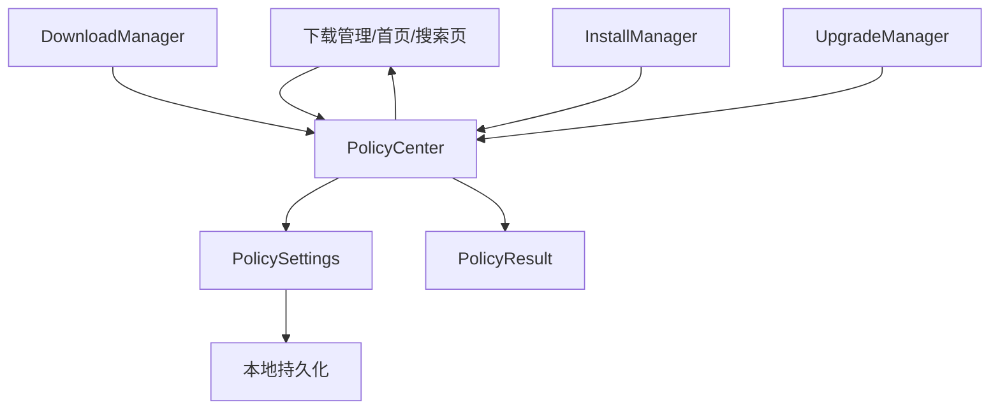
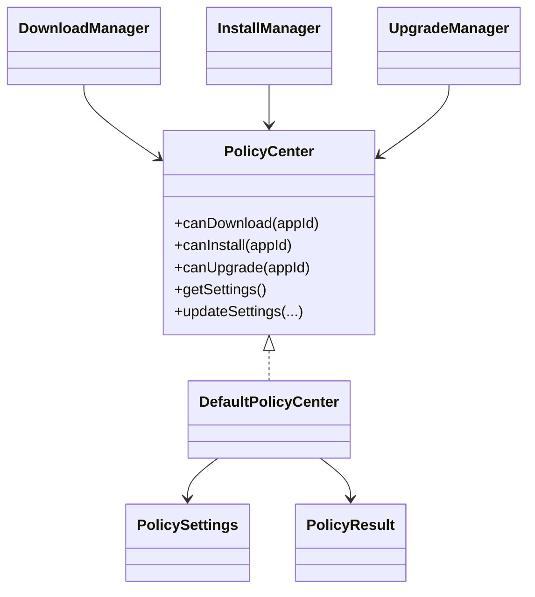
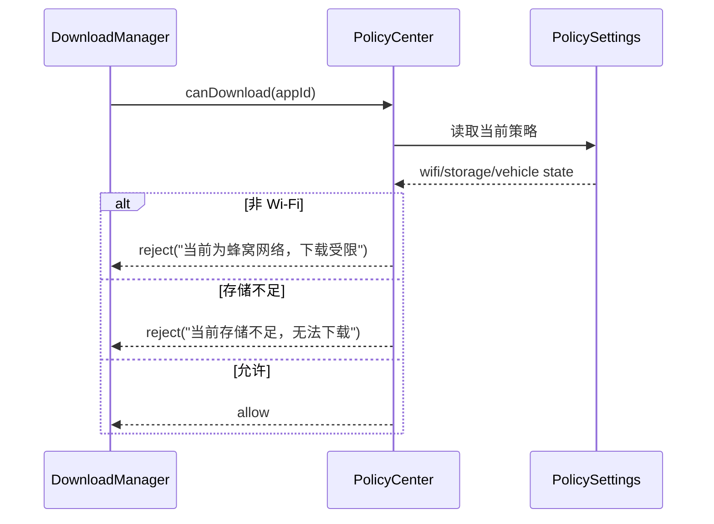
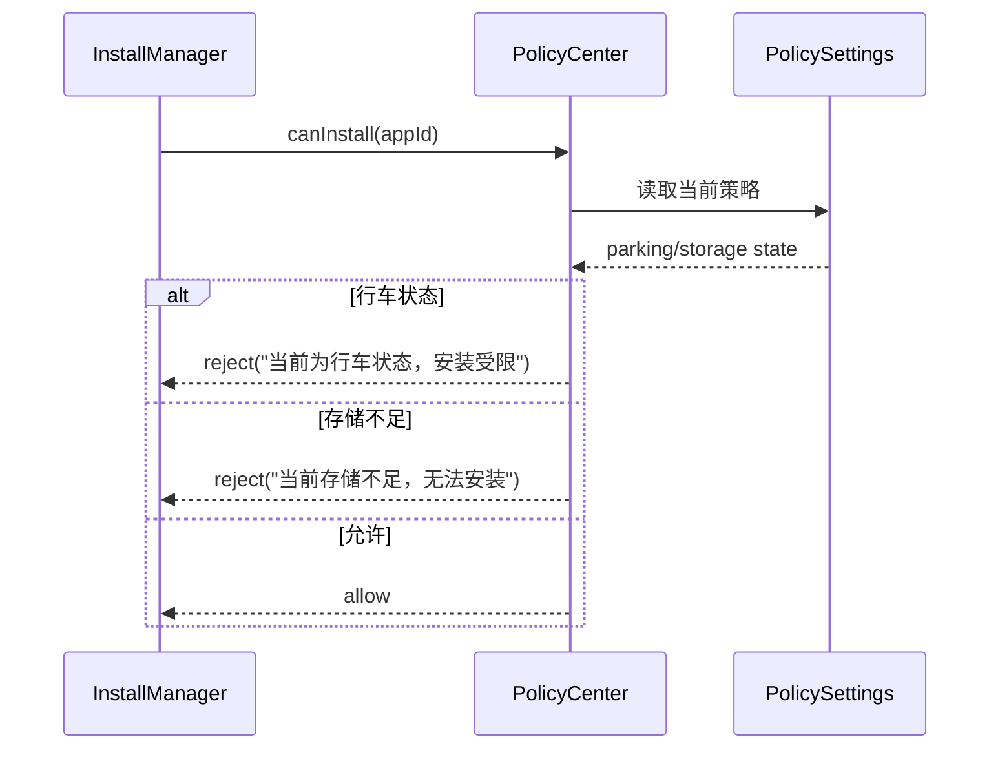

# 策略中心架构与流程

## 1. 当前结论
当前项目中的策略中心已经具备：

- Wi-Fi / 蜂窝限制
- 驻车 / 行车限制
- 存储正常 / 不足限制
- 下载前策略判断
- 安装前策略判断
- 升级前策略判断
- 策略设置持久化
- 页面策略提示联动

策略中心当前承担的是：

**统一前置决策层**

不是让下载、安装、升级模块各自写一套判断逻辑。

---

## 2. 策略中心架构图

---

## 3. 策略中心核心关系图

---

## 4. 下载前策略判断流程图

---

## 5. 安装前策略判断流程图

---

## 6. 当前策略项说明

### 6.1 网络策略
- Wi-Fi
- 蜂窝

当前逻辑：
- 非 Wi-Fi 时，下载受限

### 6.2 车况策略
- 驻车
- 行车

当前逻辑：
- 行车状态下，安装受限

### 6.3 存储策略
- 正常
- 不足

当前逻辑：
- 存储不足时，下载和安装受限

---

## 7. 策略中心职责说明

### 7.1 提供统一判断入口
对外提供：
- `canDownload()`
- `canInstall()`
- `canUpgrade()`

### 7.2 持久化策略设置
当前策略切换会持久化，重启后仍可恢复。

### 7.3 给页面提供策略提示
首页、搜索页、下载管理页等会显示：
- 当前为蜂窝网络
- 当前为行车状态
- 当前存储不足

### 7.4 避免业务模块散写判断
下载、安装、升级模块都不应该各自写 if/else 判断，而是统一走策略中心。

---

## 8. 当前策略中心的价值

### 当前已具备
- Wi-Fi 限制
- 行车限制
- 空间限制
- 页面提示
- 设置持久化

### 当前未具备
- 自动升级窗口控制深化
- 夜间升级
- 驾驶中不同等级限制
- 区域/车型差异策略
- 用户级策略偏好

---

## 9. 后续演进建议

1. 自动升级策略深化
2. 夜间/驻车升级窗口
3. 区域/车型策略分层
4. 更细粒度的下载/安装权限规则
5. 服务端动态策略下发
