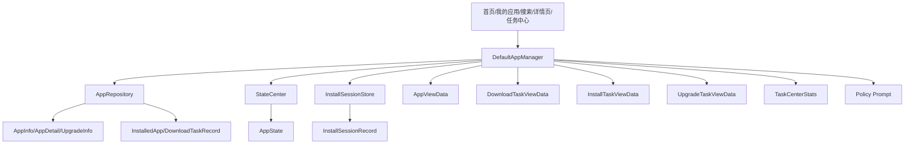
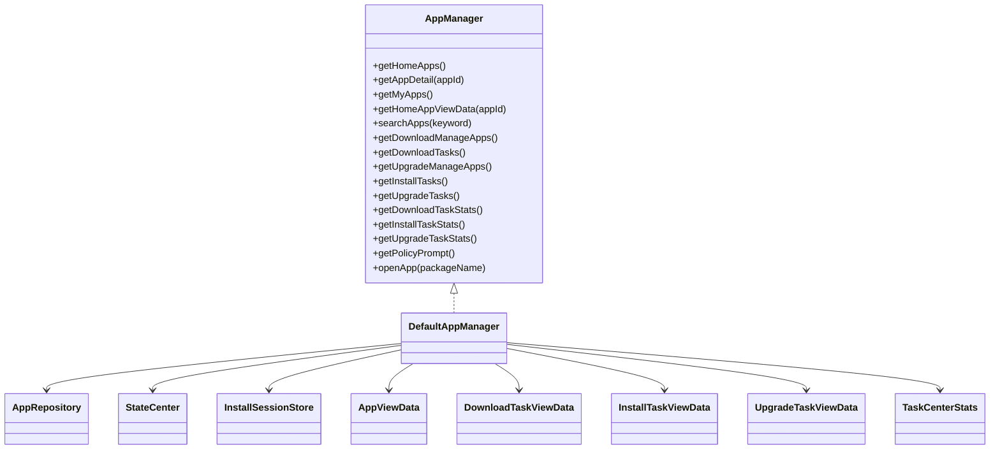
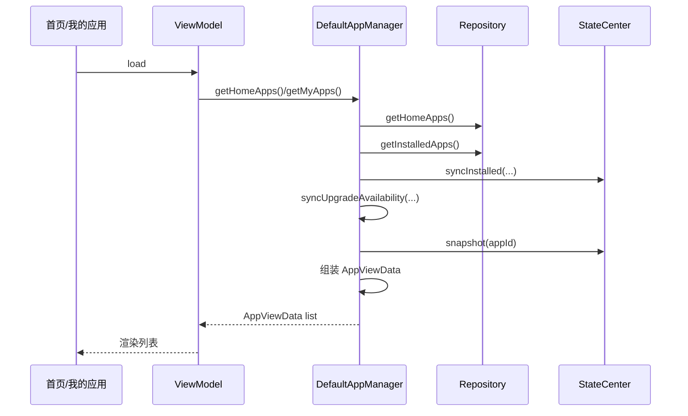
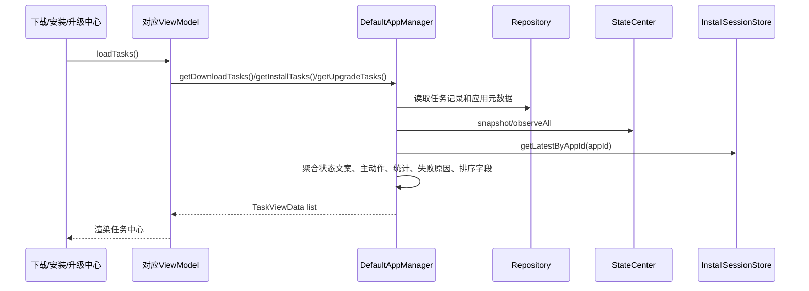

# 应用管理模块架构与流程

## 1. 当前结论
应用管理模块不是执行器，而是当前工程里专门面向 UI 的聚合层。

它已经具备：

- 首页应用列表聚合
- 我的应用列表聚合
- 搜索结果聚合
- 下载任务聚合
- 安装任务聚合
- 升级任务聚合
- 任务统计聚合
- 策略提示聚合
- 详情页展示数据辅助
- 打开应用入口

当前边界也很明确：

- 不负责下载、安装、升级执行
- 不直接持久化数据
- 不直接操作系统安装 Session
- 主要职责是把 Repository 和 StateCenter 的结果翻译成页面模型

准确定位应该是：

**它是 ViewData 聚合层，不是业务执行层。**

---

## 2. 应用管理模块架构图

---

## 3. 应用管理模块核心关系图

旧文档里把 `SystemDataSource` 写成 `AppManager` 的直接依赖，这已经不准确了。

当前真实依赖是：

- `AppRepository`
- `StateCenter`
- `InstallSessionStore`

---

## 4. 首页 / 我的应用聚合流程图

---

## 5. 任务中心聚合流程图

---

## 6. 应用管理模块职责说明

### 6.1 `AppManager` / `DefaultAppManager`
负责：

- 聚合首页、我的应用、搜索结果
- 聚合下载、安装、升级任务中心
- 生成页面直接可用的 ViewData
- 输出任务统计
- 输出策略提示文案
- 对外暴露统一 `openApp()` 入口

关键实现：

- [AppManager.kt](/home/didi/AI/CarAppStore_work/business/src/main/java/com/nio/appstore/domain/appmanager/AppManager.kt)
- [DefaultAppManager.kt](/home/didi/AI/CarAppStore_work/business/src/main/java/com/nio/appstore/domain/appmanager/DefaultAppManager.kt)

### 6.2 聚合来源

当前主要组合这些来源：

- Repository 的 `AppInfo / AppDetail / UpgradeInfo`
- Repository 的 `InstalledApp / DownloadTaskRecord`
- StateCenter 的 `AppState`
- InstallSessionStore 的 `InstallSessionRecord`

### 6.3 输出模型

当前主要输出：

- `AppViewData`
- `DownloadTaskViewData`
- `InstallTaskViewData`
- `UpgradeTaskViewData`
- `TaskCenterStats`

### 6.4 一个关键设计点

页面看到的按钮和文案不是 `AppManager` 自己拍脑袋决定的，而是复用 `StateCenter + StateReducer` 的结果，再附加任务中心特有的统计、排序和文本。

---

## 7. 当前应用管理模块的价值

### 7.1 已具备

- 多页面统一聚合
- 任务中心统一视图模型
- 统计统一出口
- 页面与业务执行层解耦
- 安装 Session 视图与业务状态拼接

### 7.2 当前不足

- 没有推荐系统
- 没有运营位聚合
- 没有多用户多设备视图能力
- `openApp()` 当前底层仍是 stub 级实现

---

## 8. 后续演进建议

1. 增加推荐、收藏、最近使用等更丰富视图聚合
2. 增加更细任务排序和筛选维度
3. 强化 `openApp()` 的系统真实能力
4. 将页面视图模型与业务文案进一步规范化

---

## 9. 一句话总结

应用管理模块当前的真实形态可以总结为：

**它通过 `Repository + StateCenter + InstallSessionStore` 把底层原始数据翻译成首页、我的应用和各任务中心可以直接消费的视图模型。**
