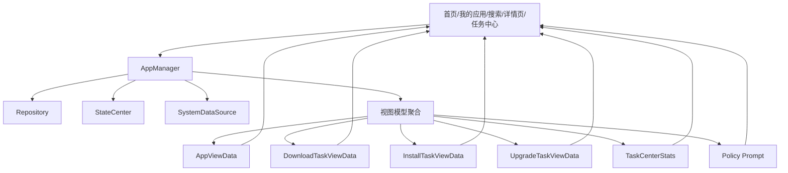
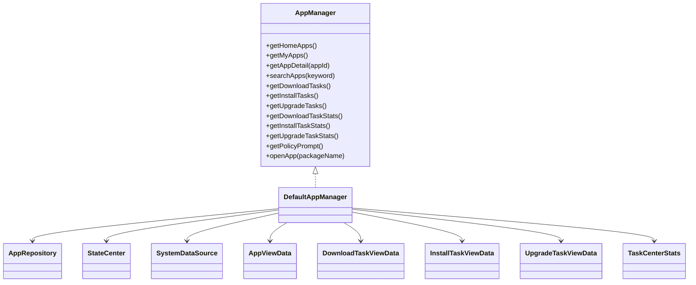
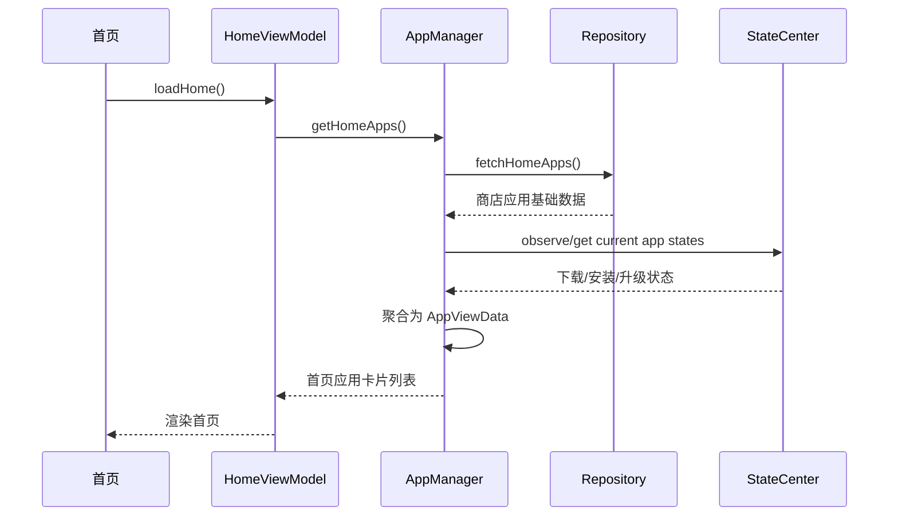
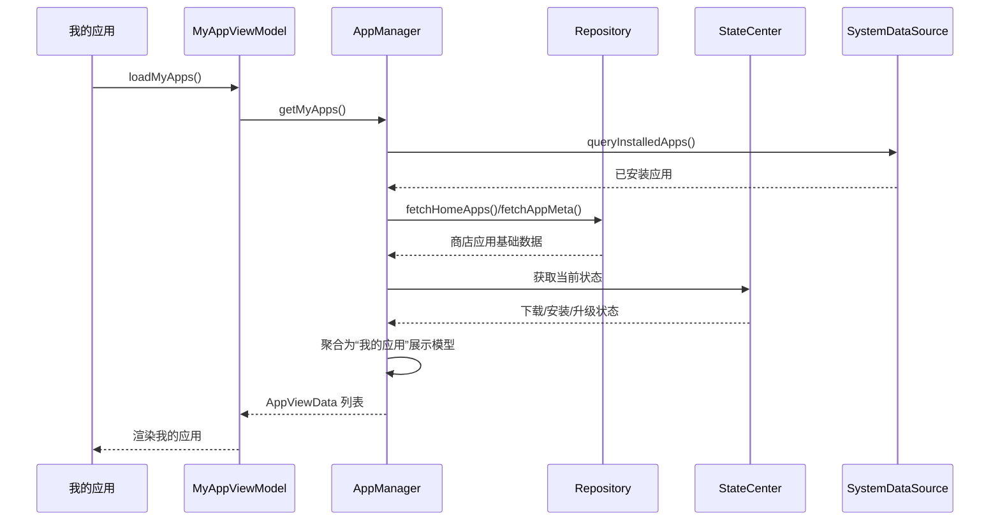
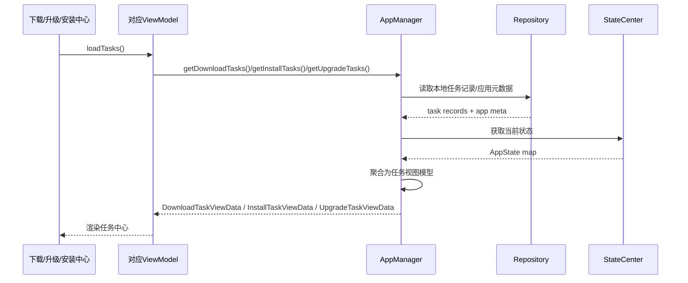

# 应用管理模块架构与流程

## 1. 当前结论
当前项目中的应用管理模块已经具备：

- 首页应用列表聚合
- 我的应用列表聚合
- 搜索结果聚合
- 下载管理页任务聚合
- 升级管理页任务聚合
- 安装管理页任务聚合
- 任务统计聚合
- 策略提示聚合
- 应用详情聚合
- 打开应用能力

应用管理模块当前承担的是：

**面向“应用实体”和“任务视图”的统一聚合层**

不是简单的数据仓库，也不是下载/安装/升级执行器。

---

## 2. 应用管理模块架构图

---

## 3. 应用管理模块核心关系图

---

## 4. 首页应用聚合流程图

---

## 5. 我的应用聚合流程图

---

## 6. 任务中心聚合流程图

---

## 7. 应用管理模块职责说明

### 7.1 面向 UI 提供统一展示模型
应用管理模块不是把数据原样透传给页面，而是把底层数据源、状态中心结果、系统安装信息统一聚合成 UI 可直接消费的视图模型。

### 7.2 聚合不同来源的数据
当前会组合这些来源：

- Repository 的远端/本地应用数据
- StateCenter 的任务状态
- SystemDataSource 的已安装应用信息
- PolicyCenter/Repository 提供的策略提示信息

### 7.3 生成不同页面所需的不同模型
例如：

- 首页：`AppViewData`
- 下载中心：`DownloadTaskViewData`
- 安装中心：`InstallTaskViewData`
- 升级中心：`UpgradeTaskViewData`
- 顶部统计：`TaskCenterStats`

### 7.4 统一“打开应用”入口
页面不直接依赖系统层启动能力，而是通过 `AppManager.openApp()` 统一触发。

---

## 8. 当前应用管理模块的价值

### 当前已具备
- 多页面统一聚合
- 任务中心统一视图模型
- 顶部统计聚合
- 策略提示聚合
- 页面和业务模块解耦

### 当前未具备
- 更复杂的推荐聚合
- 服务端运营位聚合
- 用户画像驱动推荐
- 多账号/多设备应用视图同步

---

## 9. 后续演进建议

1. 增加推荐/运营位聚合能力
2. 增加最近使用/收藏/历史聚合
3. 增加用户态视图模型
4. 增加跨端同步能力
