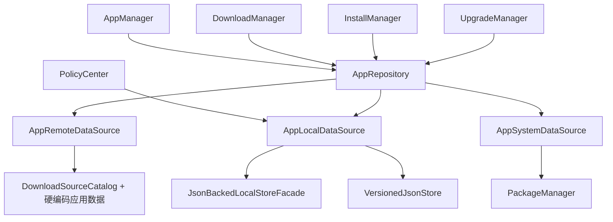
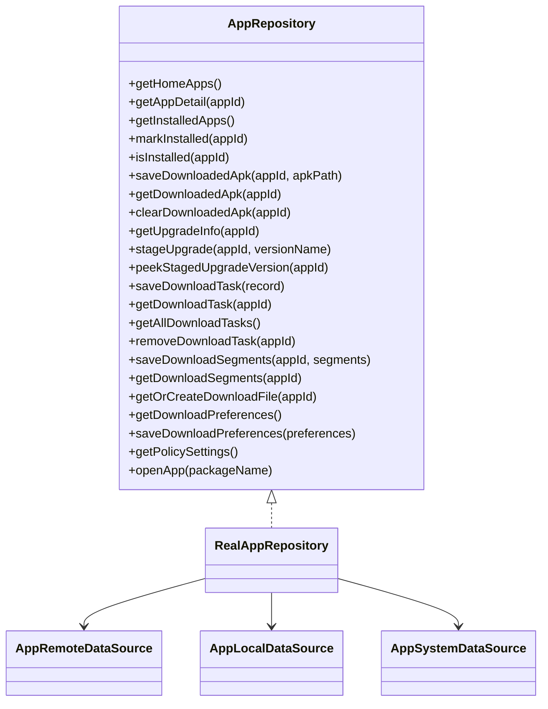
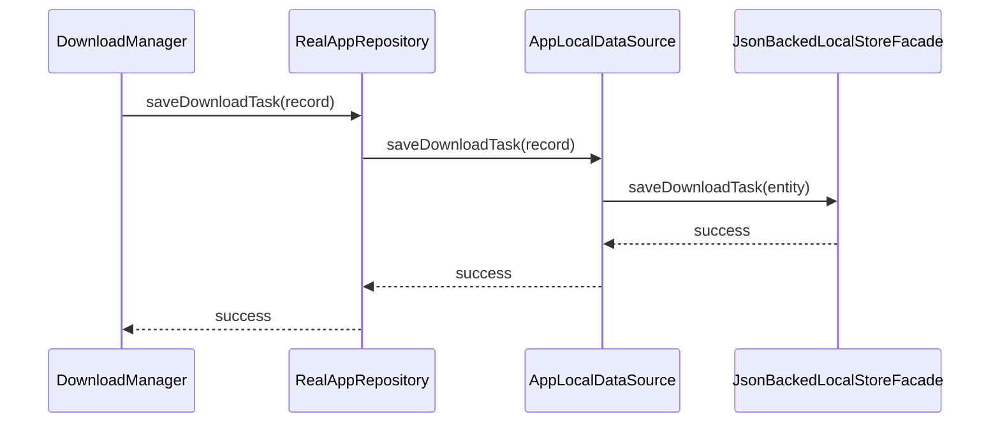
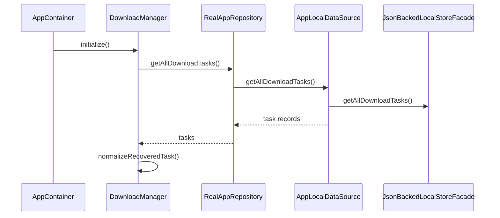

# 15. Repository 架构与流程

## 1. 当前结论

Repository 是当前工程的数据聚合入口：

- 接口名是 `AppRepository`
- 生产实现是 `RealAppRepository`，代理到 3 个 DataSource（remote / local / system）
- `FakeAppRepository` 仅用于测试环境，提供可控延迟

**统一数据入口已经成立，远端数据仍为硬编码，待接入真实 API。**

---

## 2. Repository 架构图

---

## 3. Repository 核心关系图

---

## 4. 下载任务持久化流程图

---

## 5. 冷启动恢复读取流程图

---

## 6. Repository 职责说明

### 6.1 `AppRepository`

负责：

- 对业务模块提供统一数据入口
- 屏蔽 remote / local / system 三类来源差异

### 6.2 `RealAppRepository`（生产实现）

负责：

- 聚合远端、本地、系统数据源
- 用统一接口向业务层提供应用、任务、偏好、策略、升级信息
- 无额外延迟，直接代理到各 DataSource

### 6.3 `FakeAppRepository`（测试专用）

负责：

- 与 RealAppRepository 相同的接口
- 通过模拟延迟提供可控的测试行为
- 不再被 AppContainer 使用

### 6.4 `AppSystemDataSource`（已真实化）

负责：

- `openApp()` — 通过 PackageManager.getLaunchIntentForPackage 启动应用
- `isPackageInstalled()` — 查询包是否已安装
- `getInstalledVersion()` — 获取已安装版本号
- `queryInstalledApps()` — 批量查询已安装应用

### 6.5 `AppRemoteDataSource`

负责：

- 提供首页应用列表、应用详情、升级信息
- 当前数据仍为硬编码，待接入真实 API

---

## 7. 后续演进建议

1. 从硬编码 remote 演进到真实 API
2. 增加 Repository 层缓存策略
3. 评估 Room / SQLite 替代 JSON 存储
4. 增加同步和冲突策略
