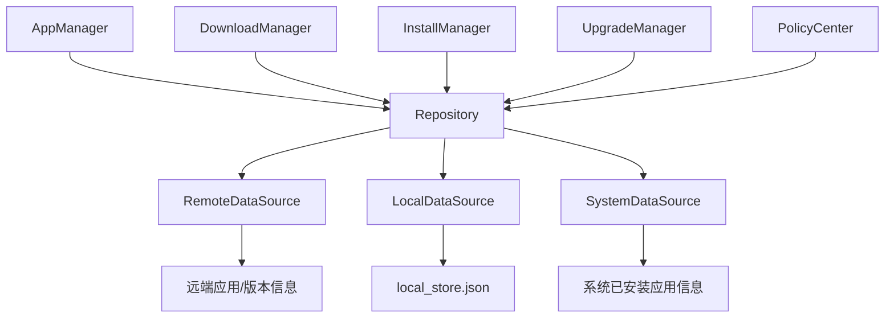
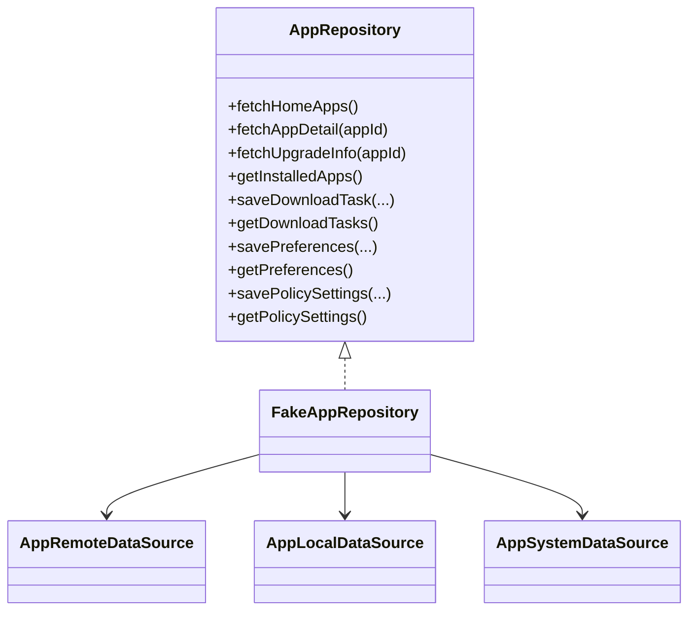
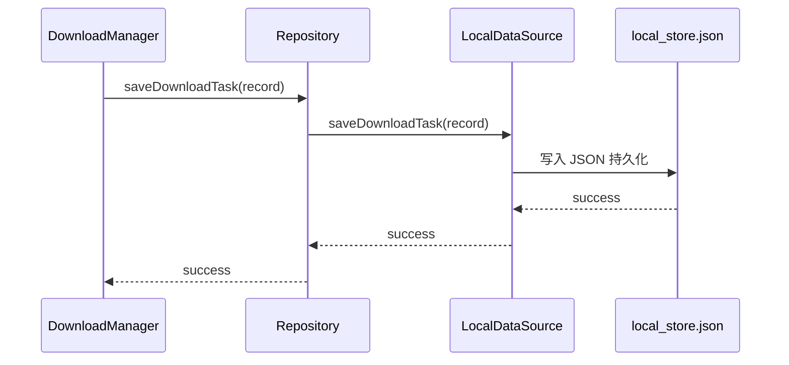
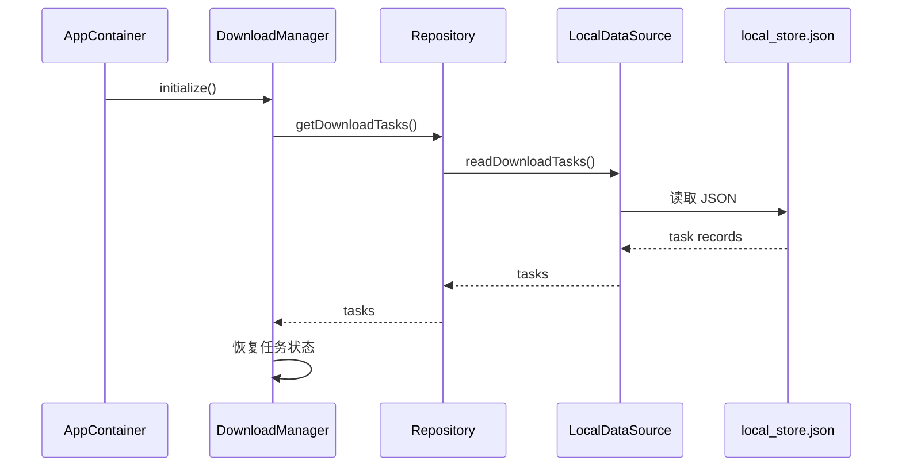

# Repository 架构与流程

## 1. 当前结论
当前项目中的 Repository 已经具备：

- 远端应用数据入口
- 本地应用元数据与任务记录入口
- 已安装应用信息聚合入口
- 下载任务持久化
- 下载偏好持久化
- 策略设置持久化
- staged upgrade version 管理
- 安装包路径记录

Repository 当前承担的是：

**统一数据聚合入口**

不是页面层直接访问的数据源集合，也不是业务决策层。

---

## 2. Repository 架构图

---

## 3. Repository 核心关系图

---

## 4. 下载任务持久化流程图

---

## 5. 冷启动恢复读取流程图

---

## 6. Repository 职责说明

### 6.1 对业务模块提供统一数据入口
业务模块不应该分别直接操作 Remote/Local/System 三种源，而应该通过 Repository 获取统一数据。

### 6.2 承担本地持久化聚合
当前 Repository 已经承接：

- 下载任务记录
- 下载偏好
- 策略设置
- staged upgrade version
- 安装包路径信息

### 6.3 统一远端 + 本地 + 系统数据
例如：

- 应用列表：来自远端
- 已安装应用：来自系统
- 任务记录：来自本地
- 升级版本：来自远端 + 本地 staged 信息

### 6.4 为恢复能力提供基础
下载模块、策略中心、安装/升级流程的很多恢复能力，底层都依赖 Repository 的本地持久化能力。

---

## 7. 当前 Repository 的价值

### 当前已具备
- 单一数据入口
- 本地 JSON 持久化
- 冷启动恢复支持
- 偏好与策略设置持久化
- 安装/升级数据承接

### 当前未具备
- 真实数据库
- 网络缓存策略
- 分层仓储拆分
- 离线同步与冲突解决
- 多账户数据隔离

---

## 8. 后续演进建议

1. 从 JSON 存储演进到 Room/数据库
2. 增加缓存失效策略
3. 拆分任务仓储/应用仓储/配置仓储
4. 增加离线能力和同步策略
