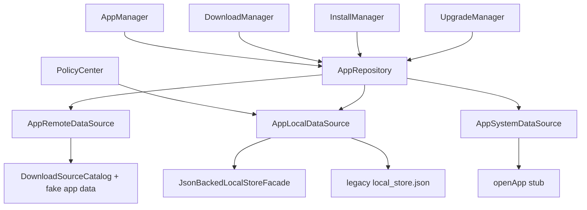
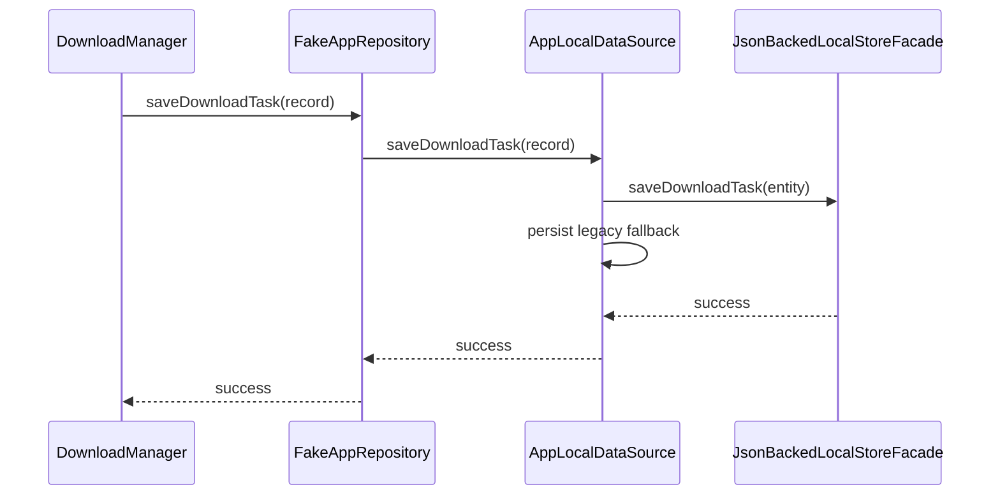
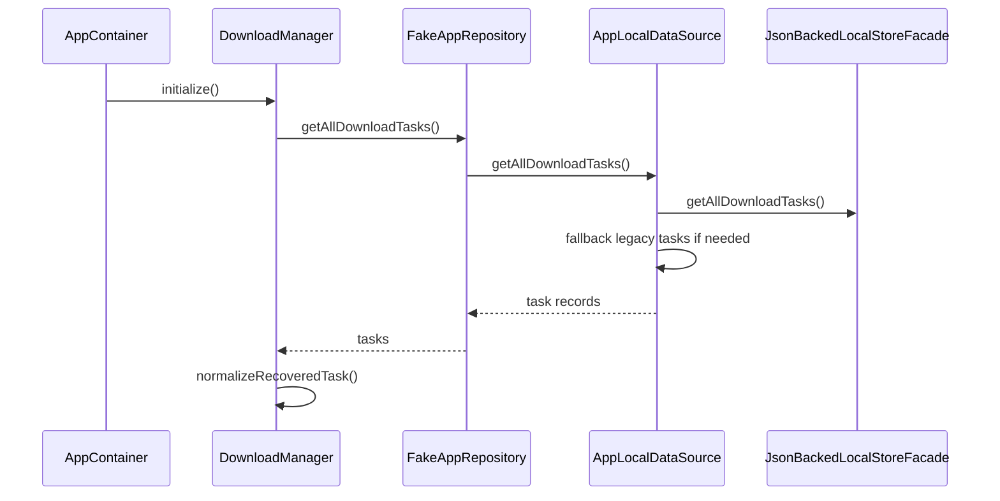

# Repository 架构与流程

## 1. 当前结论
Repository 是当前工程的数据聚合入口，但它的真实形态需要看清楚：

- 接口名是 `AppRepository`
- 当前实现名是 `FakeAppRepository`
- 它已经承担真实本地持久化聚合
- 但远端和系统能力仍然偏 fake / stub

当前已经具备：

- 统一远端应用数据入口
- 统一本地下载任务入口
- 统一 APK 路径入口
- 下载偏好持久化
- 策略设置持久化
- staged upgrade version 持久化
- 已安装应用本地记录
- 下载分片记录入口

当前仍然存在的边界：

- 远端应用数据仍是本地构造数据
- 系统数据源当前主要只暴露 `openApp()`，且实现仍是 stub
- 没有数据库，主要是 JSON 持久化
- 没有缓存策略和同步策略

准确定位应该是：

**统一数据入口已经成立，但它还不是成熟数据平台。**

---

## 2. Repository 架构图

---

## 3. Repository 核心关系图

---

## 4. 下载任务持久化流程图

这里有一个关键现实：

`AppLocalDataSource` 现在不是单纯写旧 `local_store.json`，而是优先接结构化 facade，同时保留 legacy fallback 兼容逻辑。

---

## 5. 冷启动恢复读取流程图

---

## 6. Repository 职责说明

### 6.1 `AppRepository`
负责：

- 对业务模块提供统一数据入口
- 屏蔽 remote / local / system 三类来源差异

关键接口：

- [AppRepository.kt](/home/didi/AI/CarAppStore_work/data/src/main/java/com/nio/appstore/data/repository/AppRepository.kt)

### 6.2 `FakeAppRepository`
负责：

- 聚合远端、本地、系统数据源
- 用统一接口向业务层提供应用、任务、偏好、策略、升级信息
- 把本地持久化细节收敛在仓库后面

关键实现：

- [FakeAppRepository.kt](/home/didi/AI/CarAppStore_work/data/src/main/java/com/nio/appstore/data/repository/FakeAppRepository.kt)

### 6.3 `AppLocalDataSource`
负责：

- 下载任务持久化
- 分片记录持久化
- APK 路径持久化
- 下载偏好持久化
- 策略设置持久化
- staged target version 持久化
- 已安装应用本地记录

关键实现：

- [AppLocalDataSource.kt](/home/didi/AI/CarAppStore_work/data/src/main/java/com/nio/appstore/data/datasource/local/AppLocalDataSource.kt)

### 6.4 `AppRemoteDataSource`
负责：

- 提供首页应用列表
- 提供应用详情
- 提供升级信息

但当前远端数据仍然是内置 fake 数据，不是实际网络 API。

### 6.5 `AppSystemDataSource`
负责：

- 当前只暴露 `openApp(packageName)`

但实现仍是 stub 级逻辑，不是真实系统拉起能力。

---

## 7. 当前 Repository 的价值

### 7.1 已具备

- 单一数据入口
- 本地持久化聚合
- 冷启动恢复支撑
- 任务、偏好、策略、升级目标版本统一承接

### 7.2 当前不足

- 远端数据不是实际网络
- 系统数据不是完整系统数据
- 没有数据库
- 没有缓存失效策略
- 没有离线同步
- 没有多账户隔离

---

## 8. 后续演进建议

1. 从 fake remote 演进到真实 API
2. 从 JSON 存储逐步演进到数据库
3. 拆分任务仓储、应用仓储、配置仓储
4. 强化系统数据源真实能力
5. 增加缓存、同步和冲突策略

---

## 9. 一句话总结

Repository 当前的真实形态可以总结为：

**它已经是统一数据入口，但现阶段是“真实本地持久化 + fake 远端 / fake 系统能力”的混合实现。**
