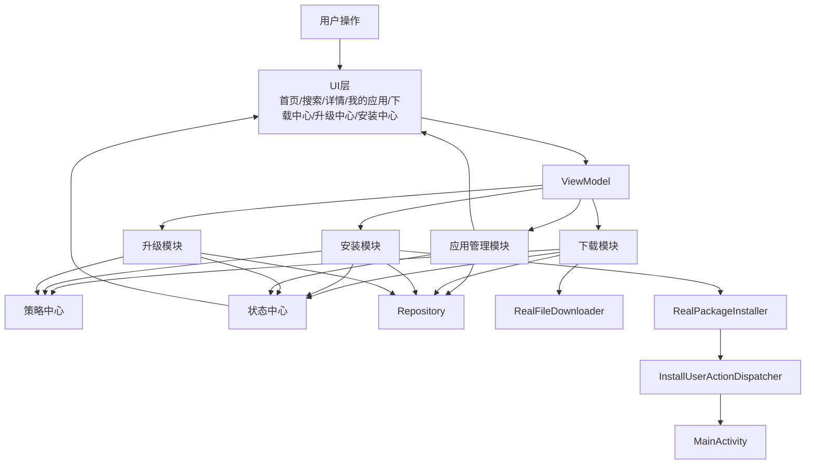
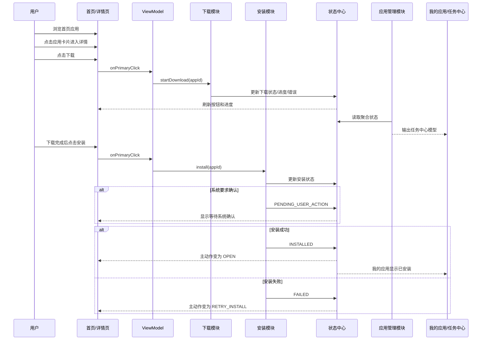
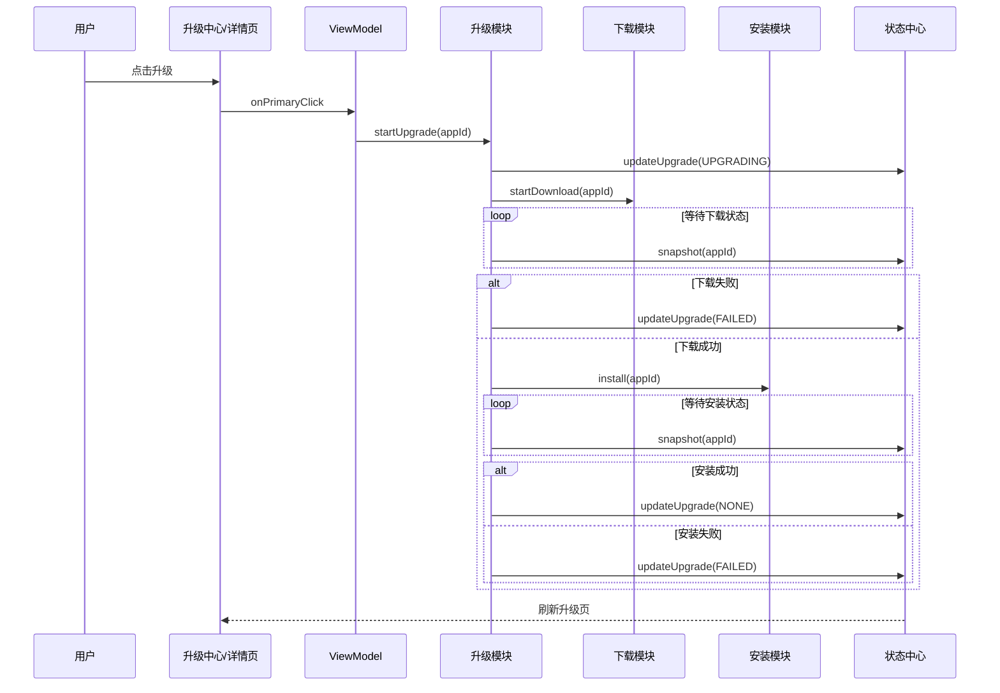
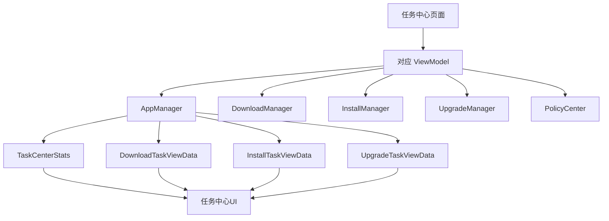

# 整体业务主链路总流程

## 1. 文档目的
这份文档从全局视角描述车载应用商店项目当前已经跑通的主业务链路，帮助团队理解：

- 用户从首页进入商店后的主路径
- 下载、安装、升级三条主链路如何串联
- 应用管理模块、状态中心、策略中心、Repository 分别处在什么位置
- 当前哪些能力已经是真实实现，哪些还处在工程化阶段

---

## 2. 整体业务主链路总架构图

全链路里最关键的分工是：

1. `DownloadManager / InstallManager / UpgradeManager` 负责业务执行。
2. `StateCenter` 负责统一页面运行态。
3. `AppManager` 负责把底层结果翻译成页面模型。
4. `Repository` 负责统一数据入口。

---

## 3. 用户主路径总览

从用户视角看，当前项目最重要的主路径是：

1. 首页浏览应用
2. 进入详情页
3. 点击下载
4. 下载完成后安装
5. 安装完成后打开
6. 在“我的应用”中查看状态变化
7. 在“升级中心”中进行升级
8. 在“下载中心 / 安装中心 / 升级中心”中集中处理任务

---

## 4. 首页 -> 详情页 -> 下载 -> 安装 主链路

---

## 5. 升级主链路

当前升级模块本质上是编排层，依赖下载和安装模块完成真实动作。

---

## 6. 任务中心主链路

当前项目中已经形成 3 类任务中心：

- 下载中心
- 安装中心
- 升级中心

这些页面的共性是：

- ViewModel 不直接拼接底层数据
- 都通过 `AppManager` 取任务视图模型
- 都通过 `StateCenter.observeAll()` 感知变化
- 顶部控制区本质上是在调用对应业务模块能力

### 统一任务中心聚合图

---

## 7. 当前主链路中的公共能力位置

### 7.1 应用管理模块

位置：

- 在 ViewModel 和 Repository / StateCenter 之间

职责：

- 把底层数据翻译成页面模型
- 聚合任务、统计和策略提示

### 7.2 状态中心

位置：

- 在下载、安装、升级三条执行链路中间

职责：

- 承接业务执行结果
- 输出统一 `AppState`
- 推导统一按钮态和状态文案

### 7.3 策略中心

位置：

- 在下载、安装、升级之前

职责：

- 统一做前置拦截
- 返回 allow / reject + reason

### 7.4 Repository

位置：

- 在业务模块和数据源之间

职责：

- 聚合 remote / local / system
- 提供任务记录、偏好、策略、版本、APK 路径等数据

---

## 8. 当前已跑通的业务主链路

### 已完成

- 首页展示应用列表
- 详情页触发下载
- 真实 HTTP 下载
- 下载完成后安装
- 真实 `PackageInstaller.Session` 安装
- 系统确认页拉起
- 我的应用查看状态变化
- 升级中心单个升级
- 升级中心批量升级入口
- 下载中心集中处理下载任务
- 安装中心集中处理安装任务
- 车机场景策略前置限制
- 冷启动恢复后的下载与安装状态修正

### 当前仍未完全平台化

- 下载任务运行时硬暂停 / 硬取消
- OEM 安装服务适配
- 升级差分包 / 强更 / 静默升级
- 远端真实 API 和系统真实能力的全面接入

---

## 9. 当前项目适合的阶段划分

### 第一阶段：基础业务闭环
已经完成：

- Repository 基础聚合
- 状态中心
- 下载主链路
- 安装主链路
- 应用管理聚合

### 第二阶段：升级与任务中心
已经完成：

- 升级编排
- 下载 / 安装 / 升级三个任务中心
- 统计和策略提示

### 第三阶段：真实能力接入
已经明显推进：

- 真实 HTTP 下载
- 真实安装 Session
- 结构化本地持久化

### 第四阶段：平台化增强
当前正在进入：

- 更强的任务调度
- 更强的系统能力接入
- 更完整的文档和工程治理

---

## 10. 当前整体判断

如果按当前代码而不是按早期文档判断：

- 下载：真实能力已接入，但还不是成熟下载平台
- 安装：真实 Session 已接入，但还不是成熟安装平台
- 升级：业务编排已跑通，但还是 orchestration 层
- 状态 / 策略 / 应用管理 / Repository：都已经形成稳定骨架

当前整体阶段更准确的说法是：

**主业务闭环已经跑通，工程已经进入“真实能力接入后的平台化增强阶段”。**
