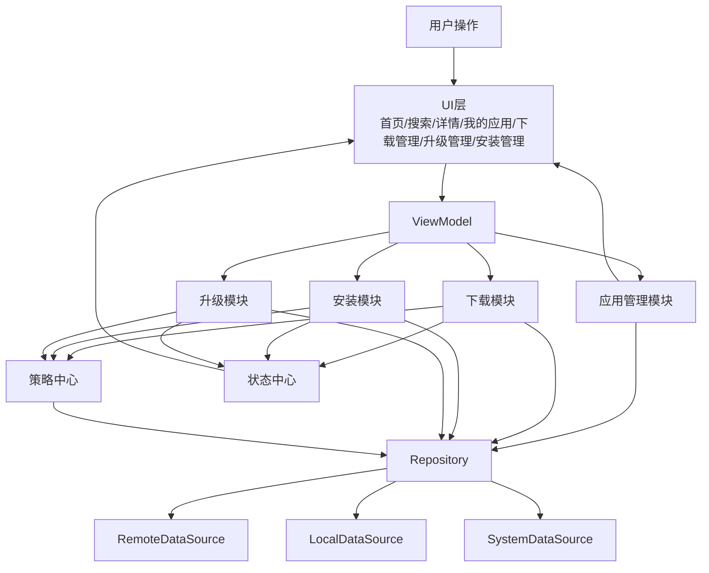
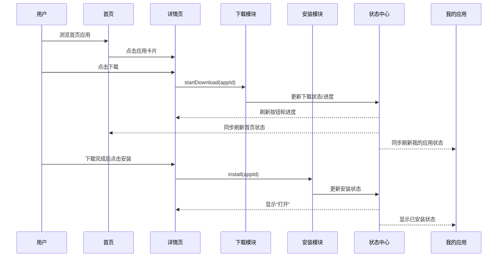
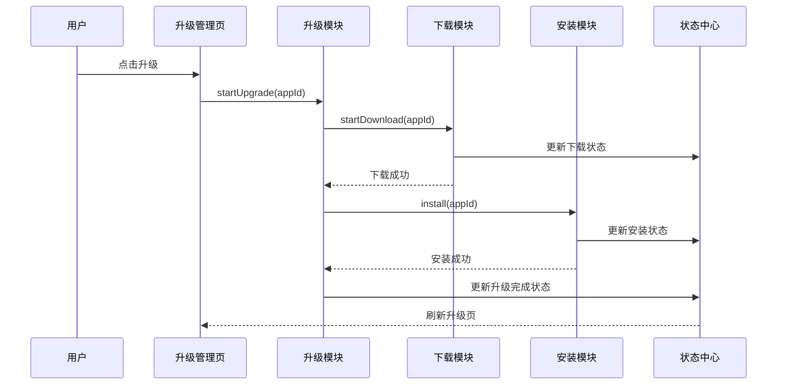
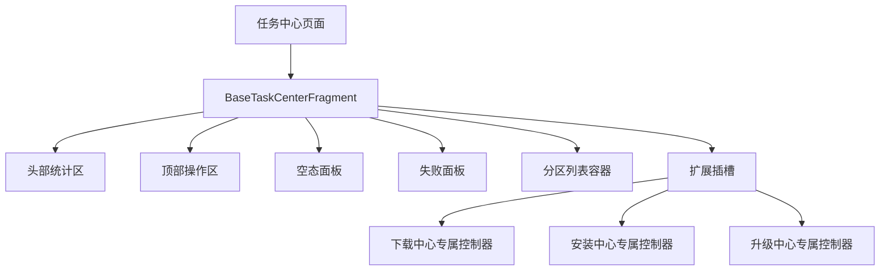

# 整体业务主链路总流程

## 1. 文档目的
这份文档从全局视角描述车载应用商店项目的主业务链路，帮助团队理解：

- 用户从首页进入商店的整体路径
- 下载、安装、升级三条主链路如何串联
- 状态中心、策略中心、Repository、应用管理模块分别在什么位置发挥作用
- 当前工程里已经跑通的链路有哪些
- 后续真实能力该接到哪一层

---

## 2. 整体业务主链路总架构图

---

## 3. 用户主路径总览

从用户视角看，当前车载应用商店最重要的几条主路径是：

1. 首页浏览应用
2. 进入详情页
3. 点击下载
4. 下载完成后安装
5. 安装完成后打开
6. 在“我的应用”中查看状态变化
7. 在“升级管理”中进行升级
8. 在“下载管理 / 安装管理”中集中处理任务

---

## 4. 首页 -> 详情页 -> 下载 -> 安装 主链路

---

## 5. 升级主链路

---

## 6. 任务中心主链路

当前项目中已经形成 3 类任务中心：

- 下载管理
- 升级管理
- 安装管理

这些页面的共性是：

- 都有顶部统计区
- 都有顶部操作区
- 都有空态面板
- 都有失败面板
- 都有分区列表容器
- 都开始继承统一的 `BaseTaskCenterFragment`

### 统一任务中心基座图

---

## 7. 当前主链路中的公共能力位置

### 7.1 状态中心
放在三条主链路中间层，负责承接：
- 下载状态
- 安装状态
- 升级状态
- 错误信息
- 按钮态

### 7.2 策略中心
放在下载、安装、升级之前，负责做前置决策：
- Wi-Fi / 蜂窝
- 驻车 / 行车
- 存储正常 / 不足

### 7.3 Repository
放在业务模块与数据源之间，负责：
- 远端应用数据
- 本地任务记录
- 偏好设置
- 策略设置
- 已安装信息
- staged upgrade version

### 7.4 应用管理模块
放在 ViewModel 和底层业务/数据之间，负责把底层数据整合成页面直接可用的视图模型。

---

## 8. 当前已跑通的业务主链路

### 已完成
- 首页展示应用列表
- 详情页触发下载
- 下载完成后安装
- 我的应用查看状态变化
- 升级管理页单个升级
- 升级管理页批量开始升级
- 下载管理中心集中处理下载任务
- 安装管理中心集中处理安装任务
- 车机场景策略前置限制
- 冷启动恢复后状态修正

### 未完全真实化
- 真实网络下载器
- 真实系统安装器
- 真正的 HTTP 断点续传
- 真正的系统安装回调
- 差分升级/静默升级

---

## 9. 当前项目适合的阶段划分

### 第一阶段：基础链路
已完成并明显超过
- Repository
- 状态中心
- 下载
- 安装
- 应用管理
- 简单 UI

### 第二阶段：升级链路
已完成并明显超过
- 升级模块
- 版本比较
- 可升级列表
- 一键升级
- 升级页 UI

### 第三阶段：策略能力
已完成主要业务闭环
- Wi-Fi 限制
- 行车限制
- 空间检查
- 自动续传/自动重试
- 页面策略提示

### 第四阶段：工程化增强
当前已经进行到这一阶段
- 任务中心统一基座
- 专属扩展区控制器
- docs 文档体系
- 公共组件抽象

---

## 10. 当前整体判断
如果按最早定的三阶段目标看：

- 第一阶段：完成
- 第二阶段：完成
- 第三阶段：核心完成

当前已经进入：

**第四阶段：工程化增强与真实能力落地准备阶段**
