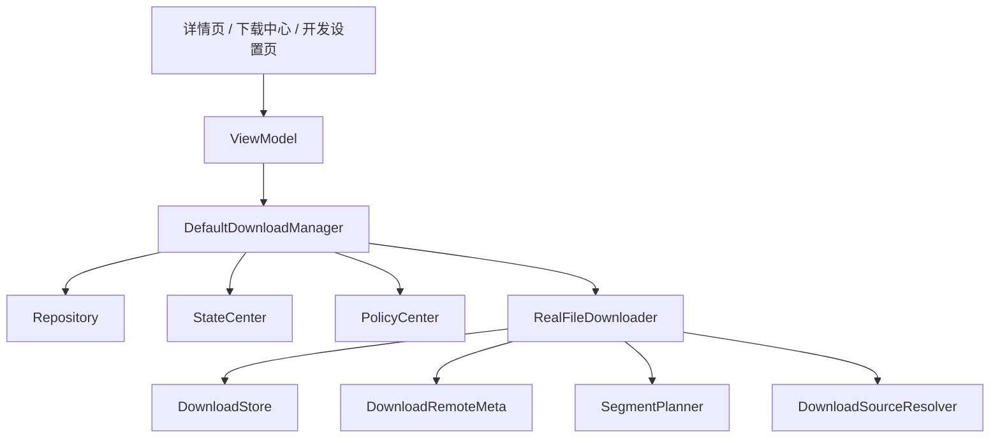
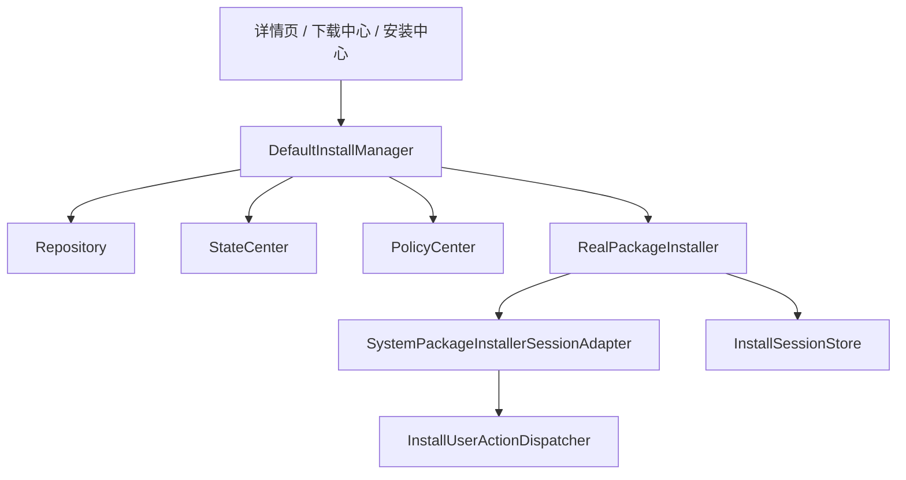

# 17. 已完成里程碑归档

> 本文档合并原 17/18/19/20 四份里程碑文档，记录 R1-R6 + D 全部已完成的关键能力和产出。

## 已完成里程碑总览

| 里程碑 | 内容 | 关键文件 | 测试覆盖 |
|--------|------|---------|---------|
| **R1** 真实下载 | HTTP下载、Range分段、校验、断点续传、ETag/Last-Modified | `RealFileDownloader.kt` | 12 tests |
| **R2** 真实安装 | PackageInstaller.Session、用户确认流、Session持久化 | `RealPackageInstaller.kt` | 1 test |
| **D** 统一数据层 | LocalStoreFacade、JsonBackedLocalStoreFacade、实体映射 | `data/local/` | 1 test |
| **R3** 执行控制 | IO中断(registerInterrupt)、网络异常处理、去重保护 | `DownloadExecutionControl.kt` | — |
| **R4** Repository真实化 | RealAppRepository、AppSystemDataSource接入PackageManager | `RealAppRepository.kt` | — |
| **R5** 数据层增强 | VersionedJsonStore: schema版本、迁移、ReentrantLock并发保护、原子写 | `VersionedJsonStore.kt` | 5 tests |
| **R6** 升级能力 | checkAllUpgrades、startBatchUpgrade串行批量、策略门控、失败重试 | `DefaultUpgradeManager.kt` | 9 tests |

## R1 真实下载器

### 架构

### 已具备能力

- **真实 HTTP 下载**: HEAD 探测、真实文件写入、远端长度识别、ETag / Last-Modified
- **断点续传与分片**: Range、分片下载模型、分片进度记录、合并产物、冷启动恢复
- **校验与失败归一化**: 长度校验、checksum 校验、失败码归一化、重试语义
- **执行控制 (R3)**: 活动任务管理、IO 级中断(registerInterrupt)、暂停/取消控制、去重保护
- **下载环境治理**: DEV / TEST / PROD 环境切换、mock 源与直连源策略

## R2 真实安装器

### 架构

### 已具备能力

- **真实安装会话**: create / write / commit 基本链路、Session 记录落盘、安装会话恢复
- **系统确认闭环**: PendingUserAction 中间态上抛、壳层统一拉起确认页、确认后继续等待最终结果
- **安装中心 Session 视角**: Session 列表展示、失败清理与重试

## D 统一数据层

### 已具备能力

- `LocalStoreFacade` + `JsonBackedLocalStoreFacade` 统一本地访问边界
- 结构化实体与 mapper（DownloadTaskEntity、InstallSessionEntity、SettingsEntity 等）
- 下载任务、安装会话、设置项、分片记录统一接入

## R3 执行控制深化

### 已具备能力

- `DownloadExecutionControl` 支持 pause / cancel 对底层执行的真实控制
- `registerInterrupt` 连接级 IO 中断
- 重复启动与并发冲突保护
- 更多失败分类与重试边界

## R4 Repository 真实化

### 已具备能力

- `RealAppRepository` 替代 `FakeAppRepository` 成为生产实现
- `AppSystemDataSource` 接入 PackageManager：openApp()、isPackageInstalled()、getInstalledVersion()、queryInstalledApps()
- `FakeAppRepository` 保留仅供测试使用

## R5 数据层增强

### 已具备能力

- `VersionedJsonStore`: schema version + migration
- ReentrantLock 并发写保护
- 原子写入（先写临时文件再重命名）
- 空文件 / 损坏文件自动恢复

## R6 升级能力深化

### 已具备能力

- `checkAllUpgrades()` — 批量检测所有已安装应用的升级
- `startBatchUpgrade()` — 串行执行批量升级，每步独立策略门控
- 升级失败可重试（StateReducer 回退到 UPGRADE 动作）
- staged upgrade 目标版本管理

## 当前边界

- 下载器还没有商用级下载调度、镜像源、后台 service 化
- 安装链路需要在真实设备上联调 OEM 差异
- 远端数据仍硬编码在 `AppRemoteDataSource`，未接入真实 API
- `DefaultPolicyCenter` 策略是静态快照，不响应实时网络/驻车状态变化
