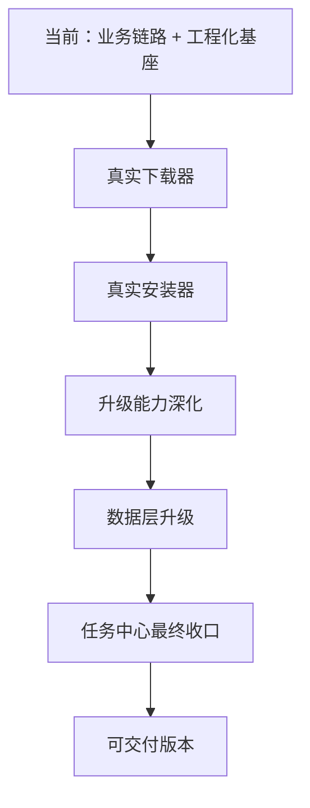

# 真实能力演进路线图

## 1. 文档目的
当前项目已经完成：

- 架构收敛
- 三阶段主目标
- 任务中心基座
- 页面与模块解耦
- 项目内文档体系

下一步如果要从“工程骨架 + 业务链路”继续演进到“更接近正式可交付项目”，最关键的是：

- 真实下载器
- 真实安装器
- 更完整的升级能力
- 数据持久化升级
- 任务中心最终收口

这份文档用来明确后续演进方向和优先级。

---

## 2. 当前能力层次判断

### 已经具备的层次
当前项目已经达到：

**业务链路完整 + 工程化基座较完整**

特点：
- UI 主干齐全
- 7 个业务模块边界清晰
- 下载/安装/升级链路已接通
- 状态中心 / 策略中心已接通
- 任务中心三页已基本统一
- docs 体系完整

### 仍待补的层次
当前还没完全进入：

**真实底层能力层**

这部分主要包括：
- 真正下载器
- 真正安装器
- 更真实的升级控制
- 更稳定的数据层

---

## 3. 演进总路线图

---

## 4. 演进阶段建议

## 阶段 R1：真实下载器
### 目标
把当前 `SimulatedFileDownloader` 演进成更接近真实能力的下载器。

### 建议内容
1. `RealFileDownloader`
2. HTTP Range 支持
3. 真正断点续传
4. 可选的分段下载
5. 下载错误分类更细
6. 下载校验链
7. 更真实的速度与耗时统计

### 完成后收益
- 下载模块不再只是流程模拟
- 可以真正验证恢复、重试、暂停/继续的质量

---

## 阶段 R2：真实安装器
### 目标
把当前 `SimulatedPackageInstaller` 演进成更接近系统能力的安装器。

### 建议内容
1. `RealPackageInstaller`
2. PackageInstaller Session 接入
3. 安装进度真实回调
4. 安装结果广播接入
5. 安装异常分类更细
6. 不同设备/OEM 安装适配

### 完成后收益
- 安装模块从“流程层”走向“系统层”
- 安装中心更有真实意义

---

## 阶段 R3：升级能力深化
### 目标
让升级能力不只是“下载 + 安装”的简单组合，而是更像正式商店升级系统。

### 建议内容
1. 差分升级 / 全量升级
2. 强制升级
3. 自动升级深化
4. 夜间升级 / 驻车升级窗口
5. 灰度升级
6. 升级失败回滚策略

### 完成后收益
- 升级中心更接近商用能力
- 策略中心与升级链路耦合更合理

---

## 阶段 R4：数据层升级
### 目标
让当前基于 JSON 的持久化能力升级为更稳的正式数据层。

### 建议内容
1. Local JSON -> Room/数据库
2. 仓储拆分
   - 任务仓储
   - 应用仓储
   - 配置仓储
3. 缓存失效策略
4. 离线恢复策略
5. 数据一致性修正

### 完成后收益
- 冷启动恢复更稳定
- 任务记录更可靠
- 后续功能扩展成本更低

---

## 阶段 R5：任务中心最终收口
### 目标
让下载中心、安装中心、升级中心从“统一基座”最终演进到“真正同一套任务中心系统”。

### 建议内容
1. 统一基座 Fragment 再抽象
2. 统一列表 item 模型
3. 统一任务筛选组件
4. 统一批量操作协议
5. 统一统计/空态/失败态风格
6. 统一专属扩展区协议继续深化

### 完成后收益
- 任务中心维护成本最低
- 新增任务中心类型时扩展最容易

---

## 5. 推荐优先级

### P0（最高优先）
1. 真实下载器
2. 真实安装器

### P1
3. 升级能力深化
4. 数据层升级

### P2
5. 任务中心最终收口
6. 更多运营/推荐/账号能力

---

## 6. 推荐实际顺序

### 顺序建议
1. R1 真实下载器
2. R2 真实安装器
3. R4 数据层升级
4. R3 升级能力深化
5. R5 任务中心最终收口

这样做的原因是：
- 下载和安装是所有主链路的底层基石
- 数据层升级能为后续升级能力和恢复能力打底
- 任务中心最终收口最好放在底层更稳之后

---

## 7. 当前最适合立即进入的下一阶段

结合当前项目进度，最适合的下一阶段是：

**R1：真实下载器**

因为当前项目的主要“非真实”部分，已经非常集中地体现在下载器上：
- 没有真正 HTTP Range
- 没有真正断点续传
- 没有真正分段下载

如果把 R1 做完，整个项目的真实度会明显上一个台阶。

---

## 8. 当前里程碑定义建议

### M1：三阶段主目标完成
已完成

### M2：任务中心与统一基座完成
当前基本完成到较高水平

### M3：真实下载器与真实安装器完成
后续关键里程碑

### M4：可交付版本
在 M3 + 数据层升级 + 升级能力深化后可达成

---

## 9. 当前建议
如果继续迭代，建议路线：

1. 先别再无限抽 UI 基座
2. 优先进入真实能力层
3. 最先做真实下载器
4. 再做真实安装器
5. 再回头做任务中心最终收口
