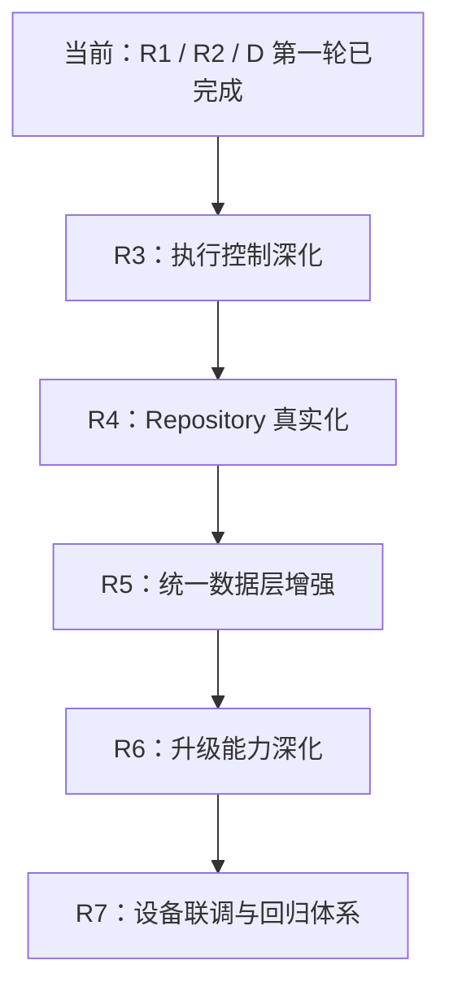

# 17. 真实能力演进路线图

## 1. 当前位置

这份路线图不再从“先做 R1、先做 R2”开始，因为这两个阶段已经落地。  
当前工程更准确的位置是：

**主链路已经具备真实下载与真实安装原型，接下来进入“把真实能力继续做深、把 fake/real 边界继续收窄”的阶段。**

## 2. 已完成的里程碑

### 已完成：R1 真实下载器

已经具备：

- `RealFileDownloader`
- HEAD 元数据探测
- Range 续传基础能力
- 分片下载与合并
- ETag / Last-Modified 探测
- 长度校验与 checksum 校验
- `DownloadStore` 元数据落盘
- 下载环境切换与 mock 兜底

### 已完成：R2 真实安装器第一轮

已经具备：

- `RealPackageInstaller`
- `PackageInstaller.Session` 适配
- 安装会话持久化
- 安装中心 Session 观察
- `PendingUserAction` 中间态
- 壳层统一拉起系统确认页
- 确认后继续等待最终成功/失败回调

### 已完成：D 统一数据层第一轮

已经具备：

- `LocalStoreFacade`
- 结构化实体与 mapper
- `JsonBackedLocalStoreFacade`
- 下载任务、安装会话、设置项统一接入

## 3. 现在真正要走的路线

## 4. 下一阶段说明

### 阶段 R3：执行控制深化

目标：

- 把下载和安装从“链路可运行”继续推进到“执行控制更稳”

建议内容：

1. 下载活动任务管理
2. 暂停/取消对底层执行的真实控制
3. 重复启动与并发冲突保护
4. 更多失败分类与重试边界

### 阶段 R4：Repository 真实化

目标：

- 逐步减少 fake 数据源占比，让业务入口保持不变但内部数据更真实

建议内容：

1. 真实远端应用列表和详情接口
2. 更完整的系统安装信息同步
3. remote / local / system 回写规则梳理

### 阶段 R5：统一数据层增强

目标：

- 把当前可用的结构化 JSON 方案推进到更稳的工程级存储

建议内容：

1. schema version
2. migration
3. 并发写保护
4. 事务语义或更强一致性
5. 评估 Room / SQLite

### 阶段 R6：升级能力深化

目标：

- 让升级模块从“下载 + 安装编排器”继续走向更完整的升级系统

建议内容：

1. 更丰富的升级状态
2. 自动升级和时间窗口
3. 升级失败策略
4. 批量升级治理

### 阶段 R7：设备联调与回归体系

目标：

- 让当前真实能力从“代码已接入”走向“设备上稳定可验证”

建议内容：

1. 真机/车机安装确认链路联调
2. 下载、安装、升级主链路回归清单
3. 自动化测试补齐

## 5. 当前优先级

### P0

- R3 执行控制深化
- R7 设备联调与回归体系

### P1

- R4 Repository 真实化
- R5 统一数据层增强

### P2

- R6 升级能力深化

## 6. 结论

当前最不该做的事，是继续把时间花在抽象更多 UI 外壳上。  
当前最该做的事，是把已经接进来的真实下载、真实安装和统一数据层继续做稳、做实、做可验证。
