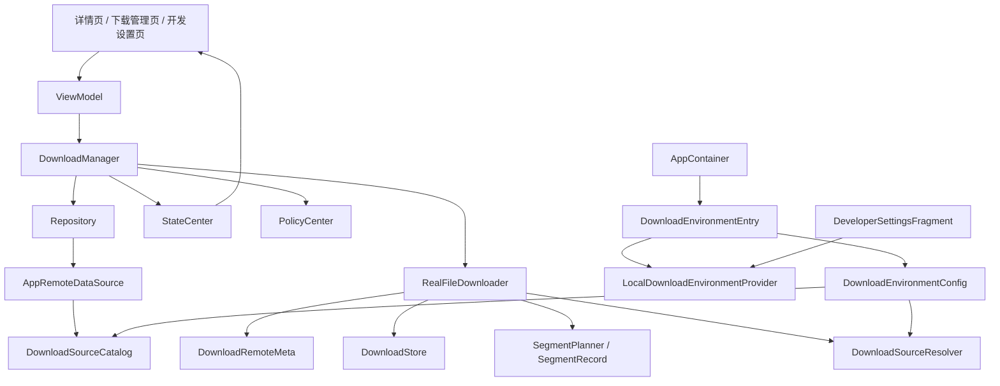

# R1 真实下载器与下载环境治理

## 1. 文档目的
这份文档合并了原先 R1 设计稿、R1 收口、真实下载源接入、`DownloadEnvironment` 配置入口，以及开发者设置页环境切换说明。

目标是让接手者只看一份文档，就能理解 R1 下载链路已经做到什么、下载源如何治理、环境切换入口在哪里、后续该从哪继续。

---

## 2. R1 的目标与边界

### 2.1 当前目标
R1 的核心目标是把下载能力从：

- `SimulatedFileDownloader`

推进到：

- `RealFileDownloader`
- 支持 HTTP 下载
- 支持 Range 续传骨架
- 支持 segment 模型
- 支持恢复与校验
- 支持下载源策略层
- 支持按环境切换下载源

### 2.2 暂不追求
这些能力不属于 R1 第一轮必做：

- 完整商用级下载调度
- 更复杂的 CDN / 镜像源切换
- 动态限速
- 更细的网络异常分类
- 全链路生产级压测
- 数据库存储替代 JSON

---

## 3. 当前总体架构

设计原则保持不变：

- `DownloadManager` 继续做编排者
- 真实下载器只负责下载执行
- 下载源决策从页面和编排层抽离
- 环境切换通过 provider/entry/config 注入，不在业务代码里写死

---

## 4. 当前已完成能力

### 4.1 下载执行层
已形成：

- `FileDownloader`
- `RealFileDownloader`
- `SimulatedFileDownloader`
- `DownloadRemoteMeta`
- `DownloadStore`
- `DownloadSegmentRecord`
- `DownloadTaskRecord` 增强字段

### 4.2 真实下载骨架
已具备：

- HEAD 元信息探测
- `Range: bytes=<offset>-` 续传基础能力
- segment-aware 下载模型
- 最小并发分段下载
- temp / meta / segment 落盘
- 基础长度校验
- 可选 hash 校验
- 冷启动恢复时利用 segment 信息恢复任务

### 4.3 下载源治理
已具备：

- `DownloadSourceCatalog`
- `DownloadSourceEntry`
- `DownloadSourcePolicy`
- `DownloadSourceDecision`
- `DownloadSourceResolver`

当前下载地址不再散落写在远端数据源里，而是通过 catalog 和 resolver 统一决策。

### 4.4 环境切换入口
已具备：

- `DownloadEnvironment`
- `DownloadEnvironmentConfig`
- `DownloadEnvironmentProvider`
- `LocalDownloadEnvironmentProvider`
- `DownloadEnvironmentEntry`

环境配置已从 `AppContainer` 内部硬编码，演进为可持久化、可切换的配置入口。

### 4.5 UI 入口
已具备：

- `feature-debug/DeveloperSettingsFragment`
- `fragment_developer_settings.xml`

页面支持：

1. 显示当前环境
2. 切到 DEV
3. 切到 TEST
4. 切到 PROD

切换后重新进入详情页或下载链路，即可看到新的下载源决策结果。

---

## 5. 当前环境策略

### DEV
- 允许 mock
- 允许回退模拟下载
- 适合本地开发与链路调试

### TEST
- 默认直连测试下载源
- 保留验证用途

### PROD
- 默认直连正式下载源
- 禁用 mock
- 面向真实交付场景

---

## 6. AppContainer 当前接法
`AppContainer` 当前会创建并装配：

1. `LocalDownloadEnvironmentProvider`
2. `DownloadEnvironmentEntry`
3. `DownloadEnvironmentConfig`
4. `DownloadSourceCatalog`
5. `DownloadSourceResolver`

这样环境切换会统一影响：

- 详情页拿到的下载地址
- 升级链路拿到的下载地址
- 下载器最终是否直连或回退模拟下载

---

## 7. 当前边界判断
R1 第一轮已经完成的结论是：

- 下载模块已经不是“纯模拟下载器”
- 已具备真实下载器可持续演进的骨架
- 下载源开始具备配置层与环境层
- 开发阶段已经有真实可操作的 UI 切换入口

但仍未完成：

- 真正生产级下载源验收
- 更强的分段调度
- 更稳的存储层升级
- 全链路 Gradle 编译与集成验证

---

## 8. 当前建议的后续方向
建议优先级：

1. 补齐 `gradlew` / 可用 `gradle`
2. 做真实 Gradle 编译验收
3. 验证 `RealFileDownloader` 与环境切换链路在现有多 module 工程中的稳定性
4. 再继续做下载器深化或回到真实安装器/统一数据层增强

---

## 9. 一句话总结
R1 已经把项目从“模拟下载链路”推进到了“真实下载器原型 + 下载源治理 + 环境切换入口”阶段，当前最缺的是基于真实构建环境做编译与集成验收。
