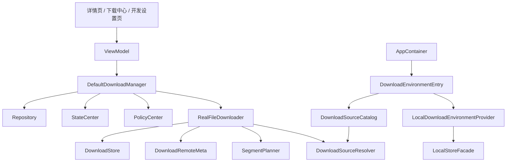

# 18. R1 真实下载器与下载环境治理

## 1. 当前结论

R1 已经不是“设计稿”阶段，而是已落地的真实下载器第一轮实现。  
现在读这份文档，重点不是“要不要做真实下载器”，而是“当前真实下载器已经做到哪里、边界还剩什么”。

## 2. 当前架构

## 3. 关键类职责

### 业务编排

- `DefaultDownloadManager`
  负责策略检查、任务创建、事件落盘、状态推进、自动恢复、自动重试

### 执行层

- `RealFileDownloader`
  负责真实下载执行
- `SimulatedFileDownloader`
  作为兜底实现

### 元数据与恢复

- `DownloadStore`
  负责 `meta.json` 和分片记录
- `DownloadRemoteMeta`
  负责远端探测结果
- `SegmentPlanner`
  负责分片规划

### 下载源治理

- `DownloadSourceCatalog`
- `DownloadSourceResolver`
- `DownloadEnvironmentEntry`
- `LocalDownloadEnvironmentProvider`

## 4. 当前已具备能力

### 4.1 真实 HTTP 下载

已具备：

- HEAD 探测
- 真实文件写入
- 远端长度识别
- ETag / Last-Modified 探测

### 4.2 断点续传与分片

已具备：

- Range 基础能力
- 分片下载模型
- 分片进度记录
- 合并产物
- 冷启动恢复时利用分片信息继续判断状态

### 4.3 校验与失败归一化

已具备：

- 长度校验
- checksum 校验
- 失败码归一化
- 重试语义

### 4.4 下载环境治理

已具备：

- DEV / TEST / PROD 环境切换
- mock 源与直连源策略
- 开发设置页入口

## 5. 当前主流程

1. 页面触发 `startDownload(appId)`
2. `DefaultDownloadManager` 做策略检查和任务记录
3. `RealFileDownloader` 探测远端元数据
4. `DownloadStore` 保存 meta 与 segment 信息
5. 执行分片下载并持续回调 `Running`
6. 业务层更新 `DownloadTaskRecord` 和 `StateCenter`
7. 合并文件并做长度/校验值确认
8. 保存 APK 路径并把状态切到 `COMPLETED`

## 6. 当前边界

这部分最容易被误读，当前确实还有明显边界：

- `pauseDownload()` / `cancelDownload()` 还没有完全做成底层执行级硬中断
- 任务级并发控制还不够强，重复触发仍有继续加强空间
- 还没有做到商用级下载调度、镜像源、后台 service 化
- 下载源本身的线上治理能力还比较轻

## 7. 继续演进时的优先顺序

1. 活动任务管理与执行中断能力
2. 重复下载和并发保护
3. 更强的失败恢复与网络异常分类
4. 设备侧稳定性验证

## 8. 一句话总结

R1 当前已经把下载模块从“模拟流程”推进到“真实下载器可运行”，下一步的重点不再是“有没有真实下载”，而是“如何让执行控制更稳、更强、更可恢复”。
