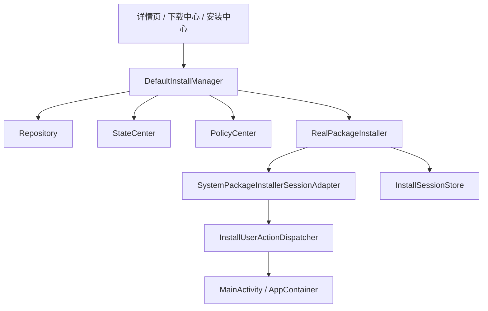

# 19. R2 真实安装器与安装中心 Session 能力收口

## 1. 当前结论

R2 已经完成第一轮闭环，而且这轮闭环现在包含了一个关键点：

**系统确认页拉起后，安装器不会提前结束，而会继续等待最终成功/失败结果。**

所以当前安装链路已经不是“只有会话骨架”，而是：

- 真实安装会话
- Session 持久化
- 系统确认 Intent 分发
- 确认后的最终结果回收

## 2. 当前架构

## 3. 关键类职责

### 执行层

- `RealPackageInstaller`
  负责真正的安装请求、会话写入、提交、回调收敛
- `PackageInstallerSessionAdapter`
  抽象系统安装会话适配层
- `SystemPackageInstallerSessionAdapter`
  当前系统实现
- `SimulatedPackageInstaller`
  兜底实现

### 会话层

- `InstallSessionStore`
  持久化安装会话记录
- `InstallSessionRecord`
  会话持久化模型
- `InstallSessionStatus`
  安装会话状态枚举

### 业务编排层

- `DefaultInstallManager`
  负责 APK 校验、策略判断、状态中心回写、失败清理

### 壳层分发

- `InstallUserActionDispatcher`
  把系统确认 Intent 从安装器分发到壳层统一拉起

## 4. 当前已具备能力

### 4.1 真实安装会话

已具备：

- `create / write / commit` 基本链路
- Session 记录落盘
- 安装会话恢复修正

### 4.2 系统确认闭环

已具备：

- `PendingUserAction` 中间态上抛
- 壳层统一监听并拉起确认页
- 确认之后继续等待最终安装结果

### 4.3 安装中心 Session 视角

已具备：

- Session 列表展示
- 摘要、筛选、失败态整理
- 失败清理与重试

## 5. 当前主流程

1. 页面触发 `install(appId)`
2. `DefaultInstallManager` 校验策略和 APK
3. `RealPackageInstaller` 创建并写入系统安装会话
4. 会话提交后如需系统确认，上抛 `PendingUserAction`
5. `InstallUserActionDispatcher` 把确认 Intent 交给壳层
6. 用户确认后，安装器继续等待最终系统回调
7. `DefaultInstallManager` 根据最终结果更新 `StateCenter`、Repository 和会话记录

## 6. 当前边界

- 真实设备和 OEM 差异仍需要继续联调
- 安装中心仍然偏任务和会话概览，没有更深的独立详情能力
- 更复杂的失败码分类和恢复策略仍可增强

## 7. 继续演进建议

1. 设备侧验证系统确认与最终回调
2. 强化 OEM 差异适配
3. 继续完善安装中心对中间态和失败态的表达
4. 补更多安装链路测试

## 8. 一句话总结

R2 当前已经把安装链路推进到“真实会话 + 系统确认 + 最终结果回收”的第一轮可运行状态，后续重点是设备侧验证和平台差异处理。
