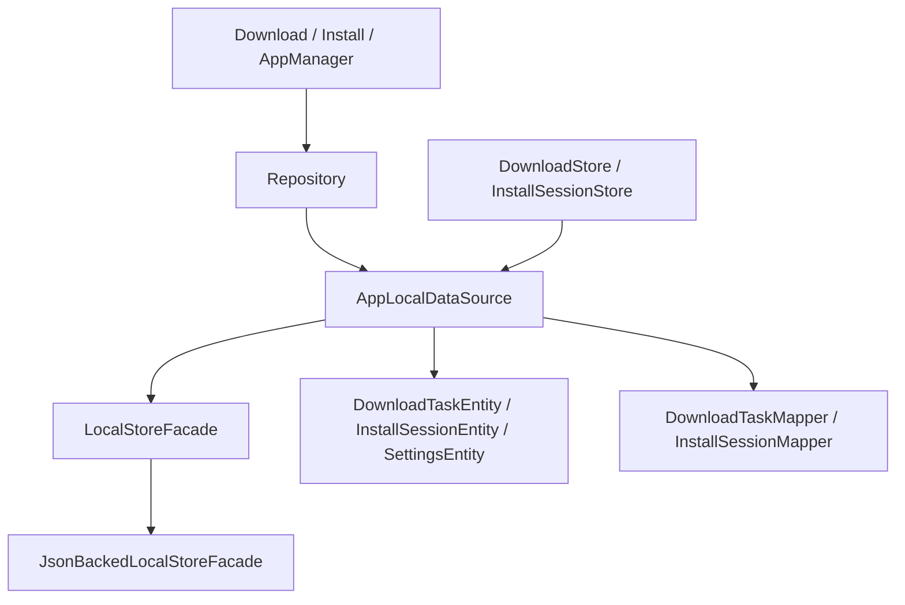

# 20. D 统一数据层设计、迁移与收口

## 1. 当前结论

D 阶段已经完成第一轮收口，核心价值是：

**本地结构化数据终于有了统一访问边界。**

它还不是最终数据库方案，但已经不再是各类 JSON、会话文件、偏好项完全分散读写的状态。

## 2. 当前结构

## 3. 关键对象

### facade

- `LocalStoreFacade`
- `JsonBackedLocalStoreFacade`

### 结构化实体

- `DownloadTaskEntity`
- `DownloadSegmentEntity`
- `DownloadArtifactRefEntity`
- `InstallSessionEntity`
- `InstalledAppEntity`
- `SettingsEntity`

### mapper

- `DownloadTaskMapper`
- `InstallSessionMapper`

### 数据源

- `AppLocalDataSource`

## 4. 当前已经接入的内容

### 下载相关

- 下载任务
- 分片记录
- APK 产物引用
- 下载偏好

### 安装相关

- 安装会话
- 安装恢复修正依赖的数据

### 设置与策略相关

- 下载环境
- 策略设置
- staged upgrade 等配置

## 5. 当前价值

这轮收口最大的意义不是“把所有数据都塞进一个文件”，而是：

- 业务层读取本地状态时有更稳定入口
- 本地实体与业务模型开始分离
- 继续升级为更强存储时有明确迁移落点

## 6. 当前边界

目前仍然没有完全解决：

- schema version
- migration
- 并发写保护
- 真正事务能力
- 更复杂查询能力
- Repository 完全只依赖统一 facade 的最终形态

## 7. 下一步建议

1. 增加 schema version
2. 增加 migration 能力
3. 增加写入一致性与并发保护
4. 评估 Room / SQLite 的必要性

## 8. 一句话总结

D 阶段已经把本地数据访问从“散落状态”推进到“有统一边界的结构化状态”，但它还是第一轮基础设施，不是最终形态。
